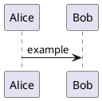

## What happened

<!-- One or two sentences. What did you do, what did PUML do, what should it have done? -->

## Minimal reproducible source

<!--
Paste the smallest `.puml` snippet that reproduces the issue.
If the input is a large file, attach it instead.
-->



## Command + version

```sh
$ puml --version
# (paste output)

$ puml <args> <input>
# (paste output, including stderr)
```

## What the output looks like (if it's a render bug)

<!--
Attach the broken PNG/SVG so we can see it. If it's an SVG, drag-drop a PNG screenshot
instead — GitHub doesn't render inline SVG attachments.
-->

| Got | Expected |
|-----|----------|
|     |          |

## Environment

- OS: <!-- e.g. macOS 14.3, Ubuntu 22.04, Windows 11 -->
- Architecture: <!-- e.g. x86_64, aarch64 -->
- Install method: <!-- cargo install / pre-built binary / built from source -->
- Surface: <!-- CLI / LSP / WASM / VS Code extension / Studio -->

## Additional context

<!-- Anything else? Workarounds, theories, related issues, links to PlantUML behavior -->
