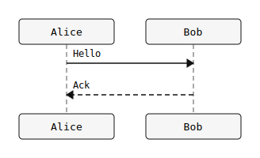
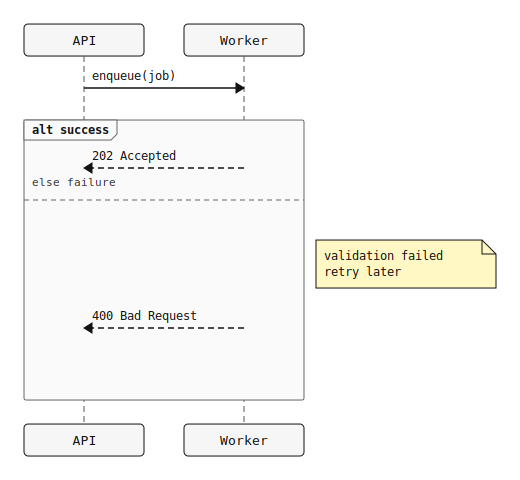

# puml

Fast, deterministic sequence-diagram rendering to SVG with a first-class polymorphic multi-language frontend (PicoUML, PlantUML, Mermaid), strict validation, and scriptable CLI modes.


## Why Sequence-Only

`puml` intentionally supports sequence diagrams only. Non-sequence families (state/class/etc.) are rejected so the parser, validator, layout, and SVG output stay predictable and testable.

Language and compatibility statement:
- PicoUML is a first-class canonical language surface for this engine.
- PlantUML support is a first-class 1:1 target for sequence workflows (subset status is tracked in the feature matrix).
- Mermaid support is first-class for the supported `sequenceDiagram` subset.

## Install And Dev

```bash
# clone + enter
git clone <your-fork-or-repo-url>
cd puml

# one-time dev setup
./scripts/setup.sh

# fast local loop (fmt + clippy + test)
./scripts/dev.sh

# full quality gate (fmt + clippy + test + llvm-cov + release build + bench gates)
./scripts/check-all.sh

# quick quality gate (skips coverage + release build, keeps quick bench gates)
./scripts/check-all.sh --quick
```

## CLI Usage (Explicit Modes)

```bash
# help
cargo run -- --help

# 1) FILE INPUT -> renders <input-stem>.svg
cargo run -- tests/fixtures/basic/hello.puml

# 2) STDIN INPUT (explicit '-') -> render SVG to stdout
cat tests/fixtures/basic/hello.puml | cargo run -- -

# 3) STDIN INPUT (implicit, no INPUT arg) -> render SVG to stdout
cat tests/fixtures/basic/hello.puml | cargo run --

# check-only mode (parse + normalize, no render output)
cargo run -- --check tests/fixtures/basic/hello.puml
cat tests/fixtures/basic/hello.puml | cargo run -- --check -

# batch docs/CI lint mode (repeatable inputs + globs)
cargo run -- --check --lint-input docs/examples/basic_hello.puml --lint-input docs/examples/groups_notes.puml
cargo run -- --check --lint-glob 'docs/**/*.md' --lint-report json

# dump pipeline JSON
cargo run -- --dump ast tests/fixtures/basic/hello.puml
cargo run -- --dump model tests/fixtures/basic/hello.puml
cargo run -- --dump scene tests/fixtures/basic/hello.puml

# multi-diagram mode (must be explicit)
cargo run -- --multi tests/fixtures/structure/multi_three.puml
cat tests/fixtures/structure/multi_three.puml | cargo run -- --multi -

# markdown fenced extraction mode (auto-enabled for .md/.markdown/.mdown files)
cargo run -- --from-markdown --check docs/sequence-notes.md

# machine-readable diagnostics
cargo run -- --check --diagnostics json tests/fixtures/invalid_single.puml

# LSP server (stdio)
cargo run --bin puml-lsp

# frontend + mode controls
cargo run -- --dialect auto --compat strict --determinism strict tests/fixtures/basic/hello.puml
cargo run -- --dialect plantuml --check tests/fixtures/basic/hello.puml

# stdin + include support
cat tests/fixtures/include/include_ok_child.puml | cargo run -- --check --include-root ./tests/fixtures/include -
```

## Asciicast-Style Example

```console
$ cat > hello.puml <<'PUML'
@startuml
Alice -> Bob: hello
@enduml
PUML
$ cargo run -- hello.puml
$ ls hello.svg
hello.svg
$ cargo run -- --check hello.puml
# exits 0 with no validation errors
```

## Rendered Examples

Canonical examples live in [`docs/examples/README.md`](docs/examples/README.md), with committed source/output pairs.
Supported primitive catalog page: [`docs/examples/supported_primitives.md`](docs/examples/supported_primitives.md).

Re-generate all committed examples:

```bash
for f in docs/examples/*.puml; do
  cargo run -- "$f"
done
```

### Basic Hello

Source: [`docs/examples/basic_hello.puml`](docs/examples/basic_hello.puml)



### Groups And Notes

Source: [`docs/examples/groups_notes.puml`](docs/examples/groups_notes.puml)



## CLI Contract

Inputs:
- `INPUT` file path
- `-` for stdin
- omitted `INPUT` reads stdin

Modes:
- default renders SVG
- `--check` parses + normalizes only
- `--lint-input INPUT` adds repeatable check/lint inputs (check mode only)
- `--lint-glob GLOB` adds repeatable glob-expanded check/lint inputs (check mode only)
- `--lint-report human|json` emits lint summary report format (default `human`)
- `--dump ast|model|scene` emits JSON
- `--multi` permits multiple diagrams/pages (required whenever input expands to more than one diagram/page)
- `--from-markdown` treats input as markdown and only extracts fenced diagram blocks
  supported markdown fence langs: `puml`, `pumlx`, `picouml`, `plantuml`, `uml`, `puml-sequence`, `uml-sequence`, `mermaid`
- `--diagnostics human|json` controls diagnostics output format (default `human`)
- `--dialect auto|plantuml|mermaid|picouml` selects frontend input dialect (default `auto`)
  `auto|plantuml`: parse PlantUML sequence syntax through the shared first-class pipeline
  `mermaid`: supports a first-class `sequenceDiagram` subset (participants + message arrows), with deterministic compatibility diagnostics for unsupported constructs
  `picouml`: canonical first-class language surface; explicit frontend selection is currently not implemented and returns a deterministic diagnostic
- `--compat strict|extended` sets semantic compatibility policy (default `strict`)
  `strict`: no ambient include-root fallback; stdin `!include` requires explicit `--include-root`
  `extended`: when `--include-root` is omitted, stdin `!include` falls back to current working directory
- `--determinism strict|full` sets determinism policy (default `strict`)
- `--include-root DIR` resolves `!include` when reading stdin

Outputs:
- single diagram from file writes `<input-stem>.svg`
- single diagram from stdin writes SVG to stdout
- multipage file inputs (`newpage`) write numbered files (`<stem>-1.svg`, `<stem>-2.svg`, ...)
- multipage stdin inputs require `--multi`; with `--multi`, stdout is a deterministic JSON array of `{name, svg}`
- `ignore newpage` collapses multipage splits and keeps single-output behavior
- multi diagram from stdin + `--multi` writes JSON array to stdout
  markdown stdin naming is deterministic: `snippet-<n>.svg` (or `snippet-<n>-<page>.svg` for multipage fences)
- markdown file outputs with `--multi` are deterministic snippet files:
  `<markdown-stem>_snippet_<n>.svg` (or `<markdown-stem>_snippet_<n>-<page>.svg` for multipage fences)
- `--output PATH` writes to that path for single diagrams, and numbered paths for multi
- lint/check batch mode always emits a lint summary report on `stdout`
  `human`: single summary line + failed file lines
  `json`: `{"schema":"puml.lint_report","schema_version":1,"summary":...,"files":[...]}`
- multi-file writes are transactional: failures do not leave partially updated numbered outputs

Exit codes:
- `0` success
- `1` validation or usage failure
- `2` I/O failure
- `3` internal failure

Diagnostics:
- source warnings/errors include `line`/`column` and caret snippets when source spans exist
- unsupported `skinparam` keys and `!theme` emit deterministic non-fatal warnings on `stderr`
- `--diagnostics json` emits `{"schema":"puml.diagnostics","schema_version":1,"diagnostics":[...]}` with stable fields:
  `code`, `severity`, `message`, `span`, `line`, `column`, `snippet`, `caret`
  lint mode (`--check` + lint inputs/globs) adds optional `file` per diagnostic entry and emits one aggregated JSON payload on `stderr`
- stream contract:
  `--check`/render/`--dump` payload outputs remain on `stdout`; diagnostics (human or json) are emitted on `stderr`
  lint/check batch mode keeps the same diagnostics behavior (`stderr`) and writes lint summary reports to `stdout`

## Benchmarks And Gates

Commands:

```bash
# full benchmark refresh (records trend artifacts)
./scripts/bench.sh

# quick profile
./scripts/bench.sh --quick

# enforce perf + binary-size gates
./scripts/bench.sh --enforce-gates
./scripts/bench.sh --quick --enforce-gates

# update mode baselines after explicit approval
./scripts/bench.sh --update-baseline
./scripts/bench.sh --quick --update-baseline
```

Gate thresholds:
- `full` (default): scenario mean `<= 250ms`, regression vs `docs/benchmarks/baseline_full.json` `<= 10%` with absolute delta floor `> 20ms`, binary size `<= 2,000,000` bytes
- `quick`: scenario mean `<= 350ms`, regression vs `docs/benchmarks/baseline_quick.json` `<= 20%` with absolute delta floor `> 30ms`, binary size `<= 2,500,000` bytes
- If the baseline file for the active mode is missing, regression checks are skipped and absolute + binary gates still apply.

Artifacts:
- raw run: `docs/benchmarks/latest.{md,csv,json}`
- deterministic trend report: `docs/benchmarks/latest_trend.{md,json}`
- mode baselines: `docs/benchmarks/baseline_{full,quick}.json`
- no-Java oracle placeholder baseline: `docs/benchmarks/parity_latest.json`

## Feature Matrix

| Area | Status | Notes |
|---|---|---|
| Sequence diagrams | Supported | Non-sequence families are rejected. |
| `@startuml` / `@enduml` blocks | Supported | Also accepts plain single-diagram text input. |
| Participants + aliases | Supported | `participant`, `actor`, `boundary`, `control`, `entity`, `database`, `collections`. |
| Messages + common arrows | Supported | Includes forms like `->`, `-->`, `<-` with optional labels. |
| Notes, groups, separators | Supported | Includes `alt`, `else`, `opt`, `loop`, `par`, `critical`, `break`, `group`, `end`, plus `...`, `||`, `newpage`. |
| Lifecycle/control statements | Supported | `activate`, `deactivate`, `create`, `destroy`, `return`, `autonumber`. |
| Metadata statements | Supported | `title`, `header`, `footer`, `caption`, `legend`, `hide footbox`, `show footbox`. |
| `skinparam` sequence styling subset | Supported | `maxmessagesize`, `footbox`/`sequenceFootbox`, `ArrowColor`/`SequenceArrowColor`, `SequenceLifeLineBorderColor` (and unprefixed alias), `ParticipantBackgroundColor`, `ParticipantBorderColor`, `NoteBackgroundColor`, `NoteBorderColor`, `GroupBackgroundColor`, `GroupBorderColor` (each also supports `Sequence...` alias). Color values are deterministic-safe tokens only: hex (`#rgb`, `#rgba`, `#rrggbb`, `#rrggbbaa`) or alphabetic names (canonicalized to lowercase). |
| Other `skinparam` keys | Accepted with warning | Deterministic `W_SKINPARAM_UNSUPPORTED`/`W_SKINPARAM_UNSUPPORTED_VALUE` warning; continues execution. |
| `!include`, `!define`, `!undef` | Supported (scoped) | Relative includes, simple define/undef substitution, cycle/depth guards. |
| Multi-diagram input | Guarded support | Requires explicit `--multi`. |

## LSP Baseline

`puml-lsp` includes a deterministic baseline for:
- diagnostics published on `didOpen`/`didChange`/`didSave` using the same `parse -> normalize` pipeline as the CLI
- completion for top-level sequence primitives plus arrow/lifecycle tokens
- hover documentation for directives and arrow forms

Contract notes:
- completion and hover do not render diagrams
- diagnostics preserve structured `code` when available from core diagnostics

## Autonomy Harness

Codex + Claude autonomous repo engineering entrypoints:

```bash
# harness-only (fastest confidence for agent-pack + MCP + parity invariants)
./scripts/harness-check.sh --quick

# harness-only (fastest confidence for agent-pack + MCP + parity invariants)
./scripts/harness-check.sh --quick

# VS Code scaffold smoke (LSP contract + extension build)
./scripts/vscode-smoke.sh

# ecosystem rollout closure check (LSP/VSCode/Studio/plugin contracts)
./scripts/ecosystem-rollout-check.sh --quick
./scripts/ecosystem-rollout-check.sh

# full autonomous quality chain

./scripts/autonomy-check.sh --quick
./scripts/autonomy-check.sh
```

Dry-run planning commands:

```bash
./scripts/harness-check.sh --dry
./scripts/autonomy-check.sh --dry
```

## Docs

- Developer flow: [`docs/codex-workflow.md`](docs/codex-workflow.md)
- Benchmark workflow: [`docs/benchmarks/README.md`](docs/benchmarks/README.md)
- Contribution guide: [`docs/contributing.md`](docs/contributing.md)
- Troubleshooting guide: [`docs/troubleshooting.md`](docs/troubleshooting.md)
- VS Code extension scaffold: [`extensions/vscode/README.md`](extensions/vscode/README.md)

## License

MIT. See [LICENSE](./LICENSE).
