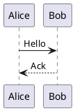
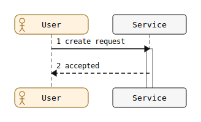

# puml

Rust-native, deterministic diagram rendering for people, docs, and agents.

[](Cargo.toml)
[](Cargo.toml)
[](LICENSE)
[](https://alliecatowo.github.io/puml/)
[](docs/audits/plantuml_parity_source_of_truth.md)
[](docs/benchmarks/README.md)

`puml` is the Rust renderer binary and engine: a no-Java, PlantUML-compatible diagram renderer. It parses diagram sources, lowers them through deterministic compiler stages, and emits SVG or PNG from a single CLI without needing a JVM, Graphviz install, or rendering server.

PlantUML is the compatibility target. PicoUML is our own language surface and superset path for diagrams that need to stay easy to author, diff, validate, and render in automation. Mermaid support is a frontend adapter for selected families, not a JavaScript runtime dependency.




## Why

Diagrams are still weirdly hard to keep in a codebase. PlantUML has the ecosystem and vocabulary, but the Java runtime, optional Graphviz dependency, and server-shaped workflows are friction for small tools, CI, WASM, and editor integrations. Mermaid is everywhere, but it is JavaScript-first and can be awkward for agents or non-browser tooling to validate with confidence.

`puml` exists to make diagram rendering feel like a normal compiler tool:

| Goal | What it means |
|---|---|
| Fast local loop | Rust CLI, deterministic output, no JVM or daemon required at runtime. |
| PlantUML-compatible path | Substantial current support, with broad compatibility as the mission rather than a finished drop-in claim. |
| Agent-readable diagnostics | Stable check, lint, markdown, dump, and diagnostics modes for automation and code review. |
| PicoUML home base | A smaller language surface that belongs to this project and can evolve around human and AI editing. |
| Docs-as-tests | `254` committed `.puml` sources and `258` committed `.svg` artifacts are used as regression evidence. |

## Install

Install from a checkout:

```bash
git clone https://github.com/alliecatowo/puml.git
cd puml
cargo install --path .
```

Or install directly from GitHub:

```bash
cargo install --git https://github.com/alliecatowo/puml.git
```

For development, run the repo setup once:

```bash
./scripts/setup.sh
./scripts/install-hooks.sh
```

## Quick Start

Render a diagram file to `hello.svg`:

```bash
cat > hello.puml <<'PUML'
@startuml
Alice -> Bob: Hello
Bob --> Alice: Ack
@enduml
PUML

puml hello.puml
```

Check without rendering:

```bash
puml --check hello.puml
```

Render from stdin:

```bash
cat hello.puml | puml - > hello.svg
```

Emit machine-readable pipeline data:

```bash
puml --dump ast hello.puml
puml --dump model hello.puml
puml --dump scene hello.puml
```

Use compatibility controls when you need them:

```bash
puml --dialect plantuml --compat strict --determinism strict hello.puml
puml --check design.picouml
puml --format png --dpi 192 hello.puml -o hello@2x.png
puml -txt hello.puml
puml --format utxt hello.puml -o hello.utxt
puml --from-markdown --check docs/examples/README.md
puml --check --lint-glob 'docs/**/*.md' --lint-report json
puml --no-url-includes --check hello.puml
```

## What Works Today

`puml` already supports a broad set of diagram families and CLI workflows. It is not perfect PlantUML parity yet; compatibility is tracked conservatively and tested continuously.

| Area | Current shape |
|---|---|
| Sequence diagrams | Broad support for participants, arrows, groups, notes, lifecycle, autonumber, metadata, and selected styling. |
| Core UML families | Class, object, use-case, component, deployment, state, activity, and timing render paths with partial PlantUML parity. |
| Planning and structure | Gantt, chronology, mindmap, WBS, nwdiag, Archimate, C4-style examples, and more. |
| Data and text families | JSON, YAML, EBNF, regex, math/LaTeX, SDL, Ditaa, and chart renderers. |
| Preprocessor | Deterministic support for many PlantUML preprocessor forms, includes, URL includes by default, macros, functions, loops, assertions, and stdlib imports. |
| Frontends | PlantUML is the compatibility target; `.picouml` files and `--dialect picouml` route through PicoUML; Mermaid support exists for selected families. |
| Outputs | Deterministic SVG by default; PNG rasterization is available through the same scene pipeline. `txt`, `atxt`, and `utxt` modes emit deterministic structural text for normalized diagram models. |
| Tool surfaces | CLI is primary; WASM and LSP integrations are emerging and kept close to the same parser/render pipeline. |

### Text Output Modes

PlantUML-style `-txt`, `-atxt`, and `-utxt` flags are accepted as aliases for `--format txt`, `--format atxt`, and `--format utxt`. The first version is intentionally structural rather than pixel-perfect PlantUML ASCII art: it lists metadata, participants or nodes, relations, events, and family-specific records from the normalized model. `txt` and `atxt` force ASCII-safe output for labels; `utxt` preserves Unicode labels and uses Unicode tree markers.

Remaining gaps: text mode does not yet reproduce PlantUML's exact ASCII-art layout, styling is summarized only when it carries model semantics, and SVG-only specialized pre-render shortcuts are bypassed in favor of normalized structural output.

For the detailed truth table, see the [PlantUML parity source of truth](docs/audits/plantuml_parity_source_of_truth.md), [frontend conformance matrix](docs/plantuml_frontend_conformance_matrix.md), and [oracle threshold notes](docs/oracle-thresholds.md).

## Examples

More examples live in the [example gallery](docs/examples/GALLERY.md) and on the [docs site](https://alliecatowo.github.io/puml/gallery/). The SVGs below are committed artifacts from this repository.

<details>
<summary>Sequence: groups and notes</summary>

Source: [`docs/examples/groups_notes.puml`](docs/examples/groups_notes.puml)


</details>

<details>
<summary>Sequence: lifecycle and autonumber</summary>

Source: [`docs/examples/lifecycle_autonumber.puml`](docs/examples/lifecycle_autonumber.puml)



</details>

<details>
<summary>Component diagram</summary>

Source: [`docs/examples/component/06_with_arrows.puml`](docs/examples/component/06_with_arrows.puml)


</details>

<details>
<summary>Gantt chart</summary>

Source: [`docs/examples/gantt/05_multi_task.puml`](docs/examples/gantt/05_multi_task.puml)


</details>

<details>
<summary>JSON projection</summary>

Source: [`docs/examples/json/03_nested.puml`](docs/examples/json/03_nested.puml)


</details>

## Documentation

| Link | Use it for |
|---|---|
| [Docs site](https://alliecatowo.github.io/puml/) | Guides, gallery, and the browser-based docs experience. |
| [Getting started guide](https://alliecatowo.github.io/puml/guide/getting-started/) | First run, common CLI flows, and basic examples. |
| [CLI guide](https://alliecatowo.github.io/puml/guide/cli/) | Runtime flags and command patterns. |
| [Syntax guide](https://alliecatowo.github.io/puml/guide/syntax/) | Supported language surface. |
| [Example corpus](docs/examples/README.md) | Committed examples used as executable documentation. |
| [Known limitations](docs/examples/KNOWN_LIMITATIONS.md) | Rough edges and feature-depth limits. |
| [Benchmarks](docs/benchmarks/README.md) | Performance gates and trend artifacts. |
| [Troubleshooting](docs/troubleshooting.md) | Diagnostics and common failure modes. |
| [Discussions setup](docs/discussions.md) | How to choose between issues and discussions. |

## Development

Useful local commands:

```bash
./scripts/dev.sh              # fmt + clippy + tests
./scripts/check-all.sh --quick
./scripts/check-all.sh        # full quality gate
./scripts/branch-protection.sh verify
./scripts/bench.sh --update-baseline
cargo run -- --help
cargo run -- --check docs/examples/basic_hello.puml
cargo run -- docs/examples/basic_hello.puml
```

Regenerate docs examples after renderer changes:

```bash
for f in docs/examples/*.puml; do cargo run -- "$f"; done
for f in docs/examples/*/*.puml; do [ -f "$f" ] && cargo run -- "$f"; done
```

See [CONTRIBUTING.md](CONTRIBUTING.md) and [docs/contributing.md](docs/contributing.md) for the full workflow.

## Autonomy Harness

This repo is intentionally set up for human plus agent development. The harness
commands below validate the agent pack, MCP smoke tests, docs gallery drift, and
the broader autonomous quality chain:

```bash
./scripts/harness-check.sh --quick
./scripts/harness-check.sh
./scripts/autonomy-check.sh --quick
./scripts/autonomy-check.sh
python3 ./scripts/parity_harness.py --fail-on-doc-drift --quiet
```

The detailed runbooks live in [docs/codex-workflow.md](docs/codex-workflow.md)
and [docs/autonomous-workflow-cookbook.md](docs/autonomous-workflow-cookbook.md).

## Project Status

This project is young, ambitious, and intentionally transparent. Some parts are polished; some are still sharp. PlantUML compatibility is a serious target with substantial implemented support, but the honest answer for any advanced construct is: check the audit table, try `puml --check`, and file the gap if it surprises you.

The repo has also been developed with heavy AI-agent assistance and swarm-style parallel work. That is part of the experiment: make the renderer deterministic enough that humans and agents can safely iterate on diagrams, docs, tests, and compatibility evidence together. Expect some rough edges in wording and organization as the project grows, and please help sand them down.

## Contributing

Forks, PRs, issues, and [discussions](https://github.com/alliecatowo/puml/discussions) are welcome. Good contributions include:

| Contribution | Examples |
|---|---|
| Compatibility fixtures | Small `.puml` examples that expose a PlantUML gap. |
| Renderer fixes | Layout, SVG fidelity, text bounds, styling, or deterministic output improvements. |
| Docs | Clearer examples, migration notes, troubleshooting, or gallery coverage. |
| Tooling | CLI ergonomics, LSP behavior, editor integration, WASM/site work, or benchmark improvements. |

Open an issue before large compatibility pushes so the work can be sliced cleanly. Start a discussion for questions, early ideas, showcases, parity reports that still need shaping, or AI-swarm workflow notes. Small docs and fixture PRs are very welcome without ceremony.

## License

MIT. See [LICENSE](LICENSE).
