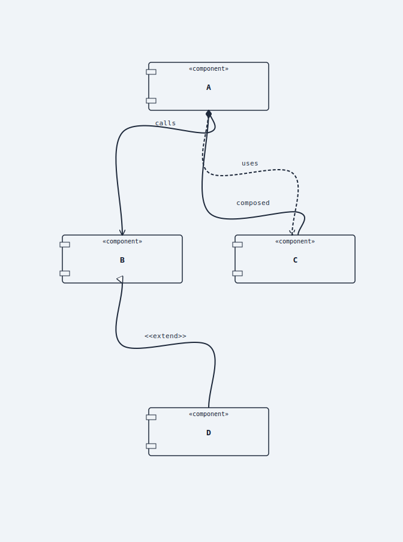
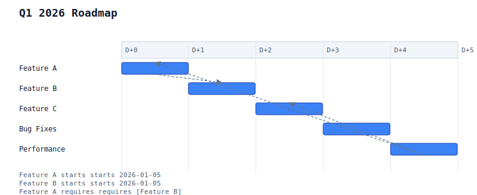
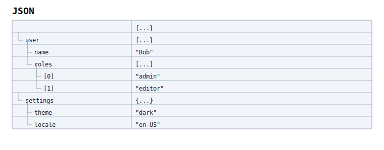

# puml

Fast, no-Java diagram rendering for PlantUML-compatible docs, CI, editors, and agents.

[](https://github.com/alliecatowo/puml/actions/workflows/main-gate.yml)
[](https://github.com/alliecatowo/puml/actions/workflows/pr-gate.yml)
[](https://github.com/alliecatowo/puml/actions/workflows/pages.yml)
[](Cargo.toml)
[](Cargo.toml)
[](LICENSE)
[](https://alliecatowo.github.io/puml/)

`puml` is a Rust diagram engine and CLI that turns PlantUML-compatible source into deterministic SVG or PNG. The goal is to make diagram rendering feel like a normal compiler tool: install one native binary, run it offline, commit the output, and let CI, editors, docs sites, and agents validate diagrams without a JVM, Graphviz install, browser runtime, or rendering server.

PlantUML compatibility is the main target. PicoUML is the project-owned language direction: a smaller, ergonomic superset surface that is easier to write, diff, validate, and repair. Mermaid and other inputs are also part of the roadmap through adapter frontends that compile into the same engine instead of adding separate renderers.

<p>
  <a href="docs/examples/groups_notes.puml"></a>
  <a href="docs/examples/component/06_with_arrows.puml"></a>
</p>
<p>
  <a href="docs/examples/gantt/05_multi_task.puml"></a>
  <a href="docs/examples/json/03_nested.puml"></a>
</p>

## Why This Exists

Diagrams belong in source control. They should be easy to review as text, quick to render locally, boring to run in CI, deterministic enough for snapshots, and precise enough for editors and AI agents to repair.

`puml` is built around that compiler-shaped workflow:

| Need | What puml provides |
|---|---|
| No-Java rendering | Native Rust CLI and library path; no JVM, Graphviz, browser, or server needed at runtime. |
| PlantUML-compatible docs | PlantUML source is the compatibility lane, with support tracked openly and conservatively. |
| Project language evolution | PicoUML gives the project a smaller, repair-friendly language surface while staying close to PlantUML. |
| More diagram inputs over time | Mermaid support exists for selected families today, and future inputs can plug into the same pipeline. |
| CI and editor automation | `--check`, JSON diagnostics, markdown fence extraction, pipeline dumps, and `puml-lsp`. |
| Reviewable output | SVG is the canonical render artifact; PNG is rasterized from SVG when needed. |

This is an ambitious open-source engine and an AI-driven swarm development project. Some pieces are already pleasant; some are still rough around the edges. Issues, discussions, forks, small fixtures, docs fixes, and PRs are all welcome.

## Quick Start

Install from GitHub:

```bash
cargo install --git https://github.com/alliecatowo/puml --bin puml
```

Or install from a checkout:

```bash
git clone https://github.com/alliecatowo/puml.git
cd puml
cargo install --path . --bin puml
```

Render your first diagram:

```bash
cat > hello.puml <<'PUML'
@startuml
Alice -> Bob: Hello
Bob --> Alice: Ack
@enduml
PUML

puml hello.puml
# wrote hello.svg
```

Validate without rendering:

```bash
puml --check hello.puml
```

Render from stdin or write PNG:

```bash
cat hello.puml | puml - > hello.svg
puml --format png --dpi 192 hello.puml -o hello@2x.png
```

Lint diagrams embedded in Markdown:

```bash
puml --from-markdown --check notes.md
```

## What Works Today

`puml` renders a broad docs-as-tests corpus across sequence, class, object, use-case, component, deployment, state, activity, timing, Gantt, chronology, mindmap, WBS, nwdiag, Archimate, C4-style, JSON, YAML, EBNF, regex, math, SDL, Ditaa, chart, theme, skinparam, preprocessor, and Creole examples.

That does not mean perfect PlantUML parity. The honest workflow is: run `puml --check`, render the construct you care about, compare output when visual compatibility matters, and file or fix gaps with a small fixture.

| Surface | Current framing |
|---|---|
| PlantUML | Primary compatibility target; many families render, advanced feature depth varies. |
| PicoUML | First-class project language direction via `@startpicouml`, `--dialect picouml`, and `picouml` fences. |
| Mermaid | Adapter frontend for selected families such as sequence, flowchart/graph, class, state, and ER. |
| Markdown | Supported fenced diagram extraction for docs linting and rendering. |
| WASM/site | Browser editor and docs gallery use the same renderer through `crates/puml-wasm`. |
| LSP/editor | `puml-lsp` and the VS Code extension live in this repo. |

Browse the [example gallery](docs/examples/GALLERY.md) or the [site gallery](https://alliecatowo.github.io/puml/gallery/). For deeper status, use [known limitations](docs/examples/KNOWN_LIMITATIONS.md), the [frontend conformance matrix](docs/plantuml_frontend_conformance_matrix.md), and the [PlantUML parity source of truth](docs/audits/plantuml_parity_source_of_truth.md).

<details>
<summary>More CLI examples</summary>

```bash
# Dialects and compatibility controls
puml --dialect plantuml --compat strict --determinism strict hello.puml
puml --dialect picouml --check design.picouml
puml --dialect mermaid input.mmd

# Pipeline inspection
puml --dump ast hello.puml
puml --dump model hello.puml
puml --dump scene hello.puml
puml --metadata hello.puml

# Text output modes
puml --format txt hello.puml
puml --format utxt hello.puml -o hello.utxt

# Markdown linting
puml --from-markdown --check notes.md
puml --check --lint-glob 'docs/**/*.md' --lint-report json

# Security posture for includes
puml --no-url-includes --check hello.puml

# Formatting
puml format hello.puml
puml format --check hello.puml
puml format --diff hello.puml
```

</details>

<details>
<summary>Frontend notes</summary>

PlantUML-compatible source is the default compatibility lane.

PicoUML inputs route through the same parser, model, layout, and renderer. Use `.picouml`, `@startpicouml` blocks, `--dialect picouml`, or `picouml` fenced code blocks. See the [PicoUML language baseline](docs/specs/picouml-language.md).

Mermaid support is an adapter path, not a JavaScript runtime dependency. Supported Mermaid inputs normalize into the shared pipeline; unsupported constructs should fail with deterministic diagnostics rather than silently switching renderers.

</details>

## Documentation

- [Docs site](https://alliecatowo.github.io/puml/) for the polished guide, browser editor, and live gallery.
- [Getting started](https://alliecatowo.github.io/puml/guide/getting-started/) for install, first render, editor setup, and markdown fences.
- [CLI reference](https://alliecatowo.github.io/puml/guide/cli/) for modes, flags, diagnostics, dialects, includes, outputs, and exit codes.
- [Syntax primer](https://alliecatowo.github.io/puml/guide/syntax/) for the shared language model.
- [All diagram families](https://alliecatowo.github.io/puml/guide/families/) for the current family map.
- [Developer guide](https://alliecatowo.github.io/puml/developer/) for architecture, pipeline, contributing, and specs.
- [Troubleshooting](docs/troubleshooting.md) for diagnostics and common failure modes.

## Development

One-time setup:

```bash
./scripts/setup.sh
./scripts/install-hooks.sh
```

Useful local loops:

```bash
./scripts/dev.sh
./scripts/check-all.sh --quick
cargo run -- --help
cargo run -- --check docs/examples/basic_hello.puml
cargo run -- docs/examples/basic_hello.puml
```

The static docs site lives in [site/](site/README.md). It mirrors `docs/examples/` into the gallery and mirrors `docs/specs/` into the developer reference pages.

<details>
<summary>Agent and swarm development context</summary>

This repo is deliberately friendly to human plus AI-agent development. The goal is to make diagram work measurable enough that parallel contributors can add fixtures, tighten diagnostics, improve layout, and update docs without guessing.

Useful harnesses:

```bash
./scripts/harness-check.sh --quick
./scripts/autonomy-check.sh --quick
python3 ./scripts/parity_harness.py --fail-on-doc-drift --quiet
```

Runbooks live in [docs/codex-workflow.md](docs/codex-workflow.md) and [docs/autonomous-workflow-cookbook.md](docs/autonomous-workflow-cookbook.md).

</details>

## Contributing

Open-source help is welcome: forks, PRs, issues, discussions, small docs fixes, tiny compatibility fixtures, renderer fixes, LSP/editor work, WASM/site improvements, and benchmark evidence all count.

- Use [issues](https://github.com/alliecatowo/puml/issues?q=is%3Aissue%20is%3Aopen) for reproducible bugs, compatibility gaps, regressions, and scoped tasks.
- Use [discussions](https://github.com/alliecatowo/puml/discussions) for questions, ideas, showcases, parity reports that need shaping, and AI-swarm workflow notes.
- Read [CONTRIBUTING.md](CONTRIBUTING.md) and [docs/contributing.md](docs/contributing.md) before larger changes.
- Open an issue before broad compatibility pushes so the work can be sliced clearly.

This project is young, transparent, and intentionally welcoming. A small failing diagram or a clear before/after render is often the most valuable contribution.

## License

MIT. See [LICENSE](LICENSE).
