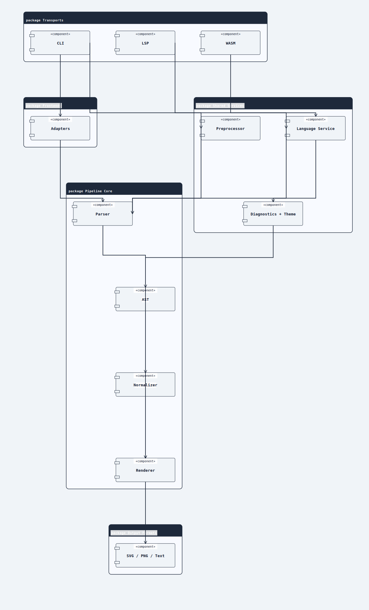
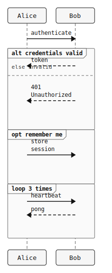
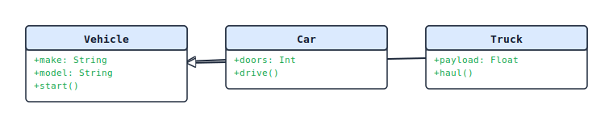
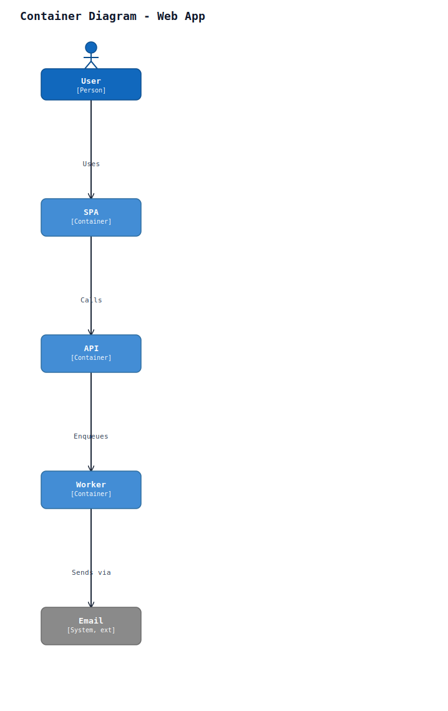
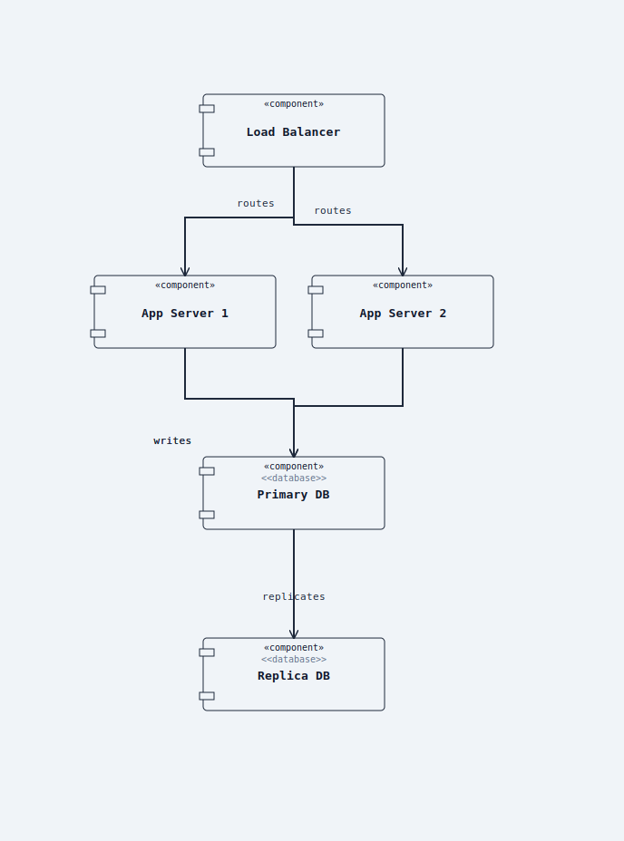

# puml

> **PlantUML diagrams. No Java. Native speed.**

[](https://github.com/alliecatowo/puml/actions/workflows/main-gate.yml)
[](https://github.com/alliecatowo/puml/actions/workflows/pr-gate.yml)
[](https://github.com/alliecatowo/puml/actions/workflows/pages.yml)
[](Cargo.toml)
[](LICENSE)
[](https://alliecatowo.github.io/puml/)

**puml** is a fast, offline-first PlantUML-compatible diagram renderer written in Rust.
Give it a `.puml` file and get a pixel-perfect SVG, PNG, or PDF out — no Java, no Node,
no network. It ships as a single static binary, a WebAssembly module for in-browser
editing, and a Language Server (LSP) for editor integration across 25+ diagram families.

<details>
<summary><b>How it works</b> — pipeline architecture</summary>

<br>



A request enters via one of three **transports** (CLI, LSP, WASM), passes through the
**preprocessor + language service**, hits the **pipeline core** (parser → AST →
normalizer → renderer), and exits as SVG / PNG / Text. The renderer is the only
component that knows about each diagram family's visual conventions; everything
upstream is family-agnostic AST.

</details>

---

## Gallery

<table>
  <tr>
    <td align="center">
      <a href="docs/examples/sequence/05_alt_opt_loop.puml">
        
      </a>
      <br><sub><b>Sequence</b></sub>
    </td>
    <td align="center">
      <a href="docs/examples/class/02_inheritance.puml">
        
      </a>
      <br><sub><b>Class</b></sub>
    </td>
    <td align="center">
      <a href="docs/examples/mindmap/03_with_colors.puml">
        
      </a>
      <br><sub><b>MindMap</b></sub>
    </td>
  </tr>
  <tr>
    <td align="center">
      <a href="docs/examples/gantt/05_multi_task.puml">
        
      </a>
      <br><sub><b>Gantt</b></sub>
    </td>
    <td align="center">
      <a href="docs/examples/c4/03_containers.puml">
        
      </a>
      <br><sub><b>C4 Container</b></sub>
    </td>
    <td align="center">
      <a href="docs/examples/component/04_deployment_style.puml">
        
      </a>
      <br><sub><b>Component</b></sub>
    </td>
  </tr>
</table>

[Browse all 25+ diagram families in the examples gallery →](docs/examples/GALLERY.md)

---

## Quick start

```bash
# 1. Install (see all install options below)
cargo install puml --bin puml

# 2. Write a diagram
cat > hello.puml <<'EOF'
@startuml
Alice -> Bob: Hello
Bob --> Alice: Ack
@enduml
EOF

# 3. Render
puml hello.puml               # writes hello.svg
puml --format png hello.puml  # writes hello.png
puml --check hello.puml       # lint without writing
```

Open `hello.svg` in any browser or SVG viewer. Done.

---

<details>
<summary><b>Install options (curl installer, Cargo, binary, Homebrew, npm, Docker)</b></summary>

### curl installer — fastest no-Rust path (Linux &amp; macOS)

```bash
curl -fsSL https://raw.githubusercontent.com/alliecatowo/puml/main/scripts/install.sh | sh
```

The installer:
- Auto-detects your platform (Linux x86-64/arm64, macOS Apple Silicon/Intel)
- Downloads the signed release tarball over HTTPS
- Verifies the SHA-256 checksum against the release's `SHA256SUMS` file
- Verifies the [cosign](https://docs.sigstore.dev/cosign/installation/) keyless signature when `cosign` is on your `PATH`
- Installs to `/usr/local/bin/puml` (or `~/.local/bin/puml` when `/usr/local/bin` is not writable)
- Runs `puml --version` as a self-test

**The installer never executes the downloaded binary during the install step.**

Options:

```bash
# Install a specific version
curl -fsSL .../install.sh | sh -s -- --version v0.2.1

# Install to a custom prefix
curl -fsSL .../install.sh | sh -s -- --prefix ~/.local

# Preview what would happen (no download, no install)
curl -fsSL .../install.sh | sh -s -- --dry-run

# Skip cosign (SHA-256 is always checked)
curl -fsSL .../install.sh | sh -s -- --no-verify-sig
```

See the [install guide](docs/install.md) for manual download steps and checksum
verification instructions.

### Pre-built binary — manual download

Download the latest release for your platform from the
[Releases page](https://github.com/alliecatowo/puml/releases):

| Platform | Archive | LSP Archive |
|---|---|---|
| Linux x86-64 | `puml-x86_64-unknown-linux-musl.tar.gz` | `puml-lsp-x86_64-unknown-linux-musl.tar.gz` |
| Linux arm64 | `puml-aarch64-unknown-linux-musl.tar.gz` | `puml-lsp-aarch64-unknown-linux-musl.tar.gz` |
| macOS (Apple Silicon) | `puml-aarch64-apple-darwin.tar.gz` | `puml-lsp-aarch64-apple-darwin.tar.gz` |
| macOS (Intel) | `puml-x86_64-apple-darwin.tar.gz` | `puml-lsp-x86_64-apple-darwin.tar.gz` |
| Windows x86-64 | `puml-x86_64-pc-windows-msvc.zip` | `puml-lsp-x86_64-pc-windows-msvc.zip` |

Each release also includes a `SHA256SUMS` file and per-archive `.cosign.bundle` files
for supply-chain verification.

Extract and place the `puml` binary on your `$PATH`.

### Homebrew (macOS / Linux)

```bash
brew install alliecatowo/tap/puml
```

### npm / npx — Node users

```bash
npx puml-cli hello.puml          # one-off, no install needed
npm install -g puml-cli          # global install
```

### Docker

```bash
docker run --rm -v "$PWD":/work ghcr.io/alliecatowo/puml:latest hello.puml
```

### Cargo — Rust toolchain

```bash
cargo install puml --bin puml
```

### Build from source

```bash
git clone https://github.com/alliecatowo/puml.git
cd puml
cargo build --release
./target/release/puml hello.puml
```

See the full [install guide](docs/install.md) for proxy settings, checksum verification,
and platform-specific notes.

</details>

---

<details>
<summary><b>Why puml — not PlantUML or Mermaid?</b></summary>

| | PlantUML | Mermaid | puml |
|---|---|---|---|
| Runtime | JVM required | Node + browser | Single static Rust binary |
| Offline | Yes (with Java installed) | No (needs browser) | Yes, always |
| Output | SVG, PNG, PDF | SVG (browser-rendered) | SVG, PNG, JPG, WebP, HTML |
| Determinism | Varies by JVM version | Varies by browser | Deterministic across platforms |
| CLI | Yes | Limited | Yes — designed as a compiler tool |
| LSP / editor | Third-party | Third-party | Built-in (`puml-lsp`) |
| WASM | No | Yes | Yes (`crates/puml-wasm`) |

**PlantUML** is the gold standard for feature breadth. Use it if you need full parity
today and can accept the JVM dependency.

**Mermaid** is great for quick diagrams embedded in GitHub Markdown and wikis. It needs
a browser runtime to render and does not produce diff-friendly offline artifacts.

**puml** is for teams that want diagrams in source control, reviewed as text, rendered
offline, and wired into CI and editors without installing Java or Node.

</details>

---

<details>
<summary><b>What diagram families are supported?</b></summary>

Around 25 families:

- **UML** — sequence, class, object, use case, component, deployment, state, activity, timing
- **Planning** — Gantt, chronology, WBS, MindMap
- **Structured data** — JSON, YAML, EBNF, regex, math, Salt wireframes
- **Architecture** — C4-style, Archimate, nwdiag
- **Other** — SDL, ditaa, chart

**PicoUML** is the project's own ergonomic dialect — a smaller, cleaner superset of
PlantUML syntax that is easier to write, diff, validate, and repair. Mermaid sequence
and flowchart inputs are also accepted via an adapter into the same renderer.

Browse the [examples gallery](docs/examples/GALLERY.md) for rendered output from every
family.

</details>

---

<details>
<summary><b>CLI, LSP, WASM, and VS Code details</b></summary>

### CLI

```bash
# Render
puml hello.puml                          # → hello.svg
puml --format png --dpi 192 hello.puml   # → hello.png at 2x
puml --format html hello.puml            # → hello.html (self-contained)

# Live re-render on save (pure polling, no extra dependencies)
puml --watch hello.puml                  # re-renders hello.svg on every mtime change
puml --watch hello.puml -o out.svg       # explicit output path

# Lint
puml --check hello.puml                  # exit 0 = valid
puml --from-markdown --check notes.md    # lint all fenced puml blocks in a Markdown file

# Preprocessor dump
puml --preproc hello.puml                # print source after !include / macro expansion

# Count nodes and edges
puml count hello.puml                    # → "4 nodes, 3 edges"
puml count --by-kind hello.puml          # → summary + per-kind breakdown

# Structural stats
puml stats hello.puml                    # AST node/edge/kind summary
puml stats --format json hello.puml      # machine-readable summary

# Raw content hash
puml hash hello.puml                     # deterministic FNV-1a raw-byte hash
puml hash --format base64 hello.puml     # base64-encoded hash bytes

# Pipeline inspection (for debugging and tooling)
puml --dump ast hello.puml
puml --dump model hello.puml
puml --dump scene hello.puml

# Environment inspection — show PUML-related env vars and their resolved values
puml env                  # human-readable table
puml env --format json    # machine-readable JSON (useful in CI scripts)
```

Full flag reference, dialect options, and exit codes: [CLI reference](https://alliecatowo.github.io/puml/guide/cli/)

### Language Server (LSP)

`puml-lsp` ships in this repo. It provides diagnostics, hover, completions, and semantic
tokens for any editor that speaks the Language Server Protocol (Neovim, Emacs, Helix,
Zed, and others via generic LSP config).

```bash
cargo install --git https://github.com/alliecatowo/puml --bin puml-lsp
```

Point your editor's LSP config at `puml-lsp` for `.puml` and `.picouml` files.

### WebAssembly

The renderer compiles to WebAssembly via `crates/puml-wasm`. The live browser editor at
[alliecatowo.github.io/puml/editor](https://alliecatowo.github.io/puml/editor) runs the
full pipeline client-side with no server.

### VS Code extension

A VS Code extension lives under `extensions/vscode/` in this repo. It wraps `puml-lsp`
and adds preview, syntax highlighting, and snippet support. *(Screenshot pending —
tracked separately.)*

</details>

---

<details>
<summary><b>PlantUML compatibility status</b></summary>

`puml` is PlantUML-compatible — not a claim of complete 1:1 parity. Many diagram
families render well today; some advanced features are partial and tracked openly.

Run `puml --check` on your files and compare output when pixel-perfect parity matters.
Current compatibility work is tracked through focused GitHub issues, executable
fixtures, and the roadmap in [`docs/parity-roadmap.md`](docs/parity-roadmap.md).

</details>

---

<details>
<summary><b>Project status and roadmap</b></summary>

`puml` is at v0.1.0 — young, ambitious, and developed with significant AI assistance.
Baseline rendering across all major diagram families landed in the parity blitz
(May 2025); advanced feature depth is an ongoing effort.

Active epics:
- [#88](https://github.com/alliecatowo/puml/issues/88) — Oracle conformance suite
- [#89](https://github.com/alliecatowo/puml/issues/89) — CI hardening
- [#399](https://github.com/alliecatowo/puml/issues/399) — Language service
- [#590](https://github.com/alliecatowo/puml/issues/590) — Renderer architecture and layout

See the [GitHub milestone view](https://github.com/alliecatowo/puml/milestones) for
what is planned next.

</details>

---

<details>
<summary><b>How it works</b></summary>

puml is structured as a three-layer pipeline:

- **Frontends** — PlantUML, PicoUML, and a Mermaid adapter translate source text into a
  shared internal format.
- **Pipeline core** — the preprocessor resolves `!include` directives and macros; the
  winnow-based parser produces a span-annotated AST; the normalizer detects the diagram
  family and builds a canonical model; the renderer emits deterministic SVG.
- **Transports** — the CLI binary, `puml-lsp`, and `puml-wasm` all drive the same
  pipeline. The `language_service` module provides hover, completion, semantic tokens, and
  diagnostics uniformly across all three surfaces.

Full breakdown with sequence, lifecycle, class, and parity diagrams:
[docs/architecture.md](docs/architecture.md)

</details>

---

<details>
<summary><b>Development setup</b></summary>

Prerequisites: Rust 1.78+ stable — [rustup.rs](https://rustup.rs)

```bash
git clone https://github.com/alliecatowo/puml.git
cd puml

# Build
cargo build --release

# Lint + test (required before any commit to main)
cargo fmt
cargo clippy --all-targets --all-features -- -D warnings
cargo test --release

# Render a diagram
./target/release/puml docs/examples/sequence/01_basic.puml -o /tmp/out.svg

# Regenerate the full PNG audit corpus (for visual QA)
python3 scripts/render_corpus.py --force

# Quick harness check
./scripts/harness-check.sh --quick
```

Read [CONTRIBUTING.md](CONTRIBUTING.md) for the full workflow, branch naming, commit
format, and CI gate requirements.

</details>

---

## Documentation

- [Install guide](docs/install.md)
- [Quickstart](docs/quickstart.md)
- [CLI reference](https://alliecatowo.github.io/puml/guide/cli/)
- [Comparison vs PlantUML / Mermaid](docs/comparison.md)
- [FAQ](docs/faq.md)
- [CI integration](docs/ci-integration.md)
- [Troubleshooting](docs/troubleshooting.md)
- [Examples gallery](docs/examples/GALLERY.md)
- [Architecture](docs/architecture.md)

## Contributing

Open a [GitHub issue](https://github.com/alliecatowo/puml/issues) for bugs,
compatibility gaps, or feature requests. Use
[Discussions](https://github.com/alliecatowo/puml/discussions) for questions and ideas.
Renderer fixes, fixture additions, and documentation improvements are especially
welcome. Read [CONTRIBUTING.md](CONTRIBUTING.md) before larger changes.

---

<sub>
<a href="CONTRIBUTING.md">Contributing</a> &nbsp;·&nbsp;
<a href="CODE_OF_CONDUCT.md">Code of Conduct</a> &nbsp;·&nbsp;
<a href="SECURITY.md">Security</a> &nbsp;·&nbsp;
<a href="LICENSE">MIT License</a>
</sub>
