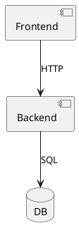
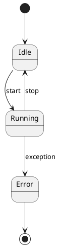
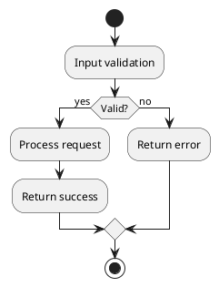

# puml-class-author

Write valid, readable class, component, state, and activity diagrams in `.puml` and enforce deterministic validation before completion.

## Required workflow
1. Draft or update `.puml` source starting with `@startuml` / `@enduml`.
2. Run `puml_check`.
3. If diagnostics are present, repair and re-run `puml_check`.
4. Only after `puml_check` passes, call `puml_render_svg` or `puml_render_png` to verify output visually.
5. Return source and rendered artifact/path.

## Diagram families and their key syntax

### Class diagrams
```puml
@startuml
class User {
  +id: Long
  +name: String
  -email: String
  +login(): Boolean
}
interface Repository
abstract class BaseEntity

User --|> BaseEntity         ' inheritance
User ..> Repository          ' dependency
User "1" o-- "N" Order       ' aggregation with multiplicity
@enduml
```
- Use `+` public, `-` private, `#` protected, `~` package
- Relationship arrows: `--|>` inherit, `..|>` implement, `--` association, `o--` aggregation, `*--` composition, `..>` dependency

### Component diagrams


### State diagrams


### Activity diagrams


## Hard rules
- Never claim completion if `puml_check` fails.
- Do not hand-edit SVG output.
- Use PascalCase for class/interface/enum names.
- Keep relationship labels short and verb-driven.
- Use `note` blocks sparingly; only when they improve clarity.
- Prefer explicit participant types over bare names.
