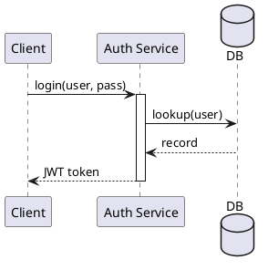

# puml-writing-guide

Reference guide for writing PUML diagrams correctly and idiomatically. Use this alongside the other diagram-family skills.

## Core structure

Every diagram is wrapped in `@startuml` / `@enduml`:

- Use `title` to name the diagram.
- `'` starts a single-line comment.
- `/'...'/ ` is a block comment.

---

## Supported diagram families

| Family | Key identifier inside `@startuml` |
|---|---|
| Sequence | `participant`, `actor`, `->`, `-->` |
| Class | `class`, `interface`, `abstract` |
| Component | `component`, `database`, `-->` |
| State | `state`, `[*] -->` |
| Activity | `start`, `:Action;`, `stop` |
| Mindmap | `@startmindmap` / `@endmindmap` |
| Timeline | `@starttimeline` / `@endtimeline` |
| Salt (wireframe) | `@startsalt` / `@endsalt` |

The renderer auto-detects the family from the keywords you use — you don't need to declare it.

---

## Sequence diagram quick reference



**Participant types:** `participant`, `actor`, `boundary`, `control`, `entity`, `database`, `collections`, `queue`

**Arrow styles:**
- `->` synchronous call
- `-->` dashed return
- `->>` async / fire-and-forget
- `->x` lost message
- `<->` bidirectional

**Groups:**
```puml
alt success
  A -> B : ok
else failure
  A -> B : error
end

loop 3 times
  A -> B : retry
end

opt when needed
  A -> B : optional call
end
```

**Notes:**
```puml
note left of A : left-side note
note right of B : right-side note
note over A, B : spanning note
```

**Lifecycle (activation bars):**
```puml
activate A
  A -> B : work
  activate B
  B --> A : done
  deactivate B
deactivate A
```

---

## Class diagram quick reference

**Relationships:**
| Syntax | Meaning |
|---|---|
| `A --|> B` | A extends B (inheritance) |
| `A ..|> B` | A implements B |
| `A --> B` | A uses B (dependency) |
| `A "1" o-- "N" B` | aggregation with multiplicity |
| `A *-- B` | composition |
| `A -- B : label` | association with label |

**Visibility modifiers:** `+` public, `-` private, `#` protected, `~` package

---

## Styling and skinparam

```puml
@startuml
skinparam backgroundColor white
skinparam defaultFontName Arial
skinparam sequence {
  ArrowColor DeepSkyBlue
  ParticipantBorderColor DeepSkyBlue
}
@enduml
```

---

## Preprocessor directives

```puml
!define SERVICE_COLOR #LightBlue
!include common/styles.puml

!if (%version() >= 2.0)
  ' conditional block
!endif
```
- `!define` declares a macro.
- `!include` imports another `.puml` file.
- URL includes are disabled by default in this toolchain; use file-based includes.

---

## Authoring workflow with MCP tools

Always follow this loop:
1. Draft `.puml` source.
2. `puml_check` — validates syntax and returns diagnostics.
3. Fix any errors reported and re-run `puml_check`.
4. `puml_render_svg` — renders to SVG (good for embedding in docs/web).
5. `puml_render_png` — renders to PNG base64 (good for visual spot-check).
6. `puml_render_file` — saves output to a path in the workspace.

**Never skip `puml_check` before rendering.** A diagram that renders with warnings will silently produce partial output.

---

## Common pitfalls

| Mistake | Fix |
|---|---|
| Participant name with spaces, no quotes | Quote it: `participant "My Service" as MS` |
| Long label text on an arrow | Use a short verb, move detail to a note |
| Nesting `alt`/`loop` too deeply (>3) | Break into sub-diagrams or combine branches |
| Using `-->>` when you mean `-->>`  | Check arrow syntax; `-->>` = dashed async |
| Missing `activate`/`deactivate` pairs | Always pair; unbalanced bars look wrong |
| Class attribute without visibility | Add `+`, `-`, `#`, or `~` prefix |

---

## Best practices

- **Aliases over long names.** `participant "Payment Gateway" as PG` keeps lines short.
- **Left to right, top to bottom.** Arrange participants in message order.
- **One concern per diagram.** Prefer 3-5 participants over 12.
- **Verb-driven labels.** `"process(order)"` is better than `"this is where processing happens"`.
- **Use groups to show branching logic** — `alt`, `opt`, `loop` add intent that prose can't.
- **Render and read the output.** Visual bugs are invisible in source; use `puml_render_png` to spot them.
