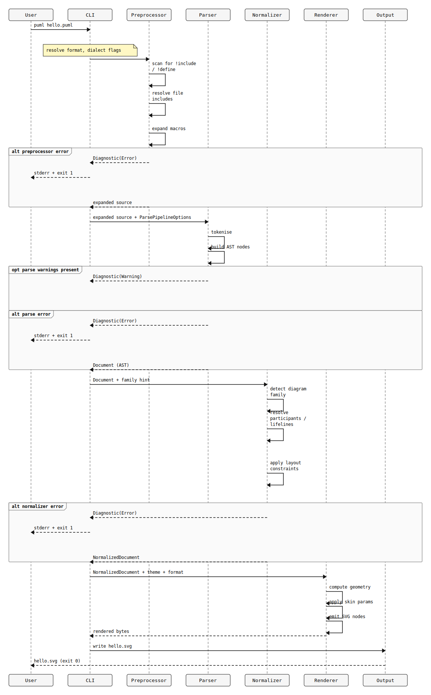
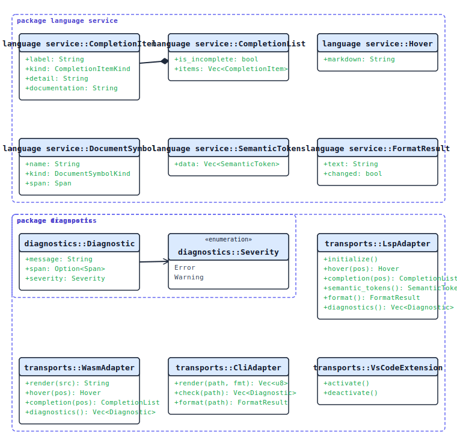
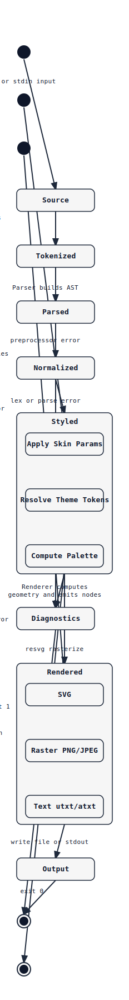
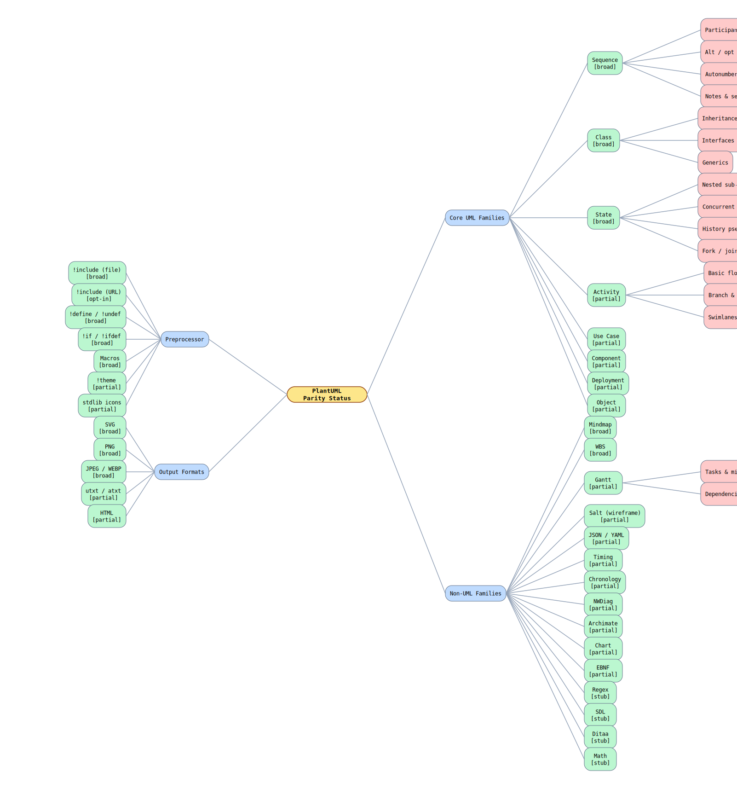

# PUML Architecture

This page documents the internal structure of `puml` using diagrams that were authored in PUML syntax itself — a self-hosting test that also serves as a visual stress test for the renderer. Each diagram is source-controlled as a `.puml` file in `docs/diagrams/` alongside its rendered SVG and PNG outputs.

---

## 1. Component overview

**What it shows.** The three-layer architecture: Frontends at the top, the Pipeline Core in the middle, and Transports at the bottom, with Shared Services on the side. Arrows trace data flow from source text through preprocessing, parsing, normalization, and rendering to output formats.

**Why it matters.** Every transport — CLI, LSP, WASM — drives the same pipeline. Adding a new frontend (e.g. a future Graphviz adapter) means implementing a translation layer that emits PlantUML-shaped text; the rest of the engine is untouched. This separation is enforced at the module level: `src/frontend/` contains all such adapters and nothing outside that directory performs dialect-specific translation.

**Key files.** `src/frontend/mermaid.rs`, `src/frontend/picouml.rs`, `src/parser.rs`, `src/normalize/`, `src/render/`, `src/theme.rs`, `src/diagnostic.rs`, `src/bin/puml-lsp.rs`, `crates/puml-wasm/`.

---

## 2. Request pipeline sequence

**What it shows.** The exact call sequence when a user runs `puml hello.puml`. Source text enters the CLI, flows through the preprocessor (include resolution, macro expansion), the parser (tokenize → AST), the normalizer (family detection → canonical model), and the renderer (geometry → SVG nodes), then is written to `hello.svg`. Error paths show where diagnostics are emitted and where the process exits non-zero.

**Why it matters.** The sequence makes the "compiler" mental model concrete. Each stage has a well-defined input type and output type; a failure at any stage emits a structured diagnostic and aborts. This means errors are always traceable to a source span, which is what makes `--check` mode, JSON diagnostics, and the LSP's inline error markers work correctly.

**Key files.** `src/main.rs`, `src/cli.rs`, `src/preproc/`, `src/parser.rs`, `src/normalize/mod.rs`, `src/render/mod.rs`.

---

## 3. Language service layer diagram

**What it shows.** The class hierarchy of `language_service` — the types used to represent completions, hover results, semantic tokens, format results, and diagnostics — and the transport adapter classes (LspAdapter, WasmAdapter, CliAdapter, VsCodeExtension) that wrap the core types for each surface. Arrows show which adapters return or emit which types.

**Why it matters.** All four surfaces (LSP, WASM browser editor, CLI `--check`, VS Code extension) share a single implementation of hover, completion, and diagnostics. A new editor integration should implement only a thin adapter that serializes/deserializes these types for its wire format — it does not need to re-implement any language-analysis logic.

**Simplification note.** The class diagram omits the `::` (double-colon) scope separator in package names because the parser currently splits names containing `::` at the `::` boundary, causing the second token to be interpreted as a nested package declaration. This is a known parser bug.

**Key files.** `src/language_service.rs`, `src/diagnostic.rs`, `src/bin/puml-lsp.rs`, `crates/puml-wasm/src/lib.rs`, `extensions/vscode/`.

---

## 4. Diagram family lifecycle state machine

**What it shows.** The state machine a single diagram traverses from raw source text to final output: Source → Tokenized → Parsed → Normalized → Styled (composite: SkinParams → ThemeTokens → Palette) → Rendered (composite: SVG → Raster/Text) → Output. Error transitions lead to the Diagnostics terminal state at any stage.

**Why it matters.** The composite `Styled` state shows that theme application is not a single step — skin parameters are resolved first, then mapped to theme token names, then the full color palette is computed. This ordering matters because later steps can reference tokens defined by earlier steps. The composite `Rendered` state shows that PNG and text output are projections of SVG, not independent render paths; this means rasterization bugs are isolated to the resvg layer and do not affect the SVG emitter.

**Simplification notes.** Inline `\n` line breaks in state transition labels trigger the mixed-family parser error `E_STATE_MIXED`; labels use spaces instead. Multi-line `note right of <state>` blocks are also unsupported in state diagrams and were omitted. Both are render bugs documented in the audit section below.

**Key files.** `src/preproc/`, `src/parser.rs`, `src/normalize/state.rs`, `src/theme.rs`, `src/render/state.rs`.

---

## 5. Parity status mindmap

**What it shows.** A mindmap of all diagram families and feature areas, annotated with their current implementation depth: `[broad]` (wide feature coverage), `[partial]` (core use cases work, advanced features missing), `[opt-in]` (available behind a flag), or `[stub]` (parser-detected but not rendered).

**Why it matters.** The honest status map is the single most useful communication tool for contributors and users. It sets expectations, identifies where help is most needed, and acts as a regression anchor — if a family moves backward in depth, that should be visible here.

**Key files.** `docs/internal/spec/plantuml-spec.md` (canonical support matrix), `docs/internal/spec/audit/` (per-chapter audits), `src/normalize/family.rs`, `src/parser/family.rs`.

---

## Render audit notes

These visual bugs were discovered while authoring and rendering the architecture diagrams:

| Diagram | Syntax attempted | Error / behavior | Verdict |
|---|---|---|---|
| `diagram-family-lifecycle.puml` | `\n` in state transition labels | `E_STATE_MIXED` — parser misinterprets `\n` as a family boundary | Input-level bug: avoid `\n` in state labels as workaround |
| `diagram-family-lifecycle.puml` | `note right of <state>` | `E_STATE_MIXED` / `E_STATE_UNSUPPORTED_SYNTAX` | Input-level bug: notes in state diagrams not yet supported |
| `architecture-overview.puml` | `skinparam packageStyle frame` | `W_SKINPARAM_UNSUPPORTED` warning (renders, but style not applied) | Visual quality degradation: package borders use default style |
| `language-service-layers.puml` | `skinparam classAttributeIconSize 0` | `W_SKINPARAM_UNSUPPORTED` warning (renders, but icons may appear) | Visual quality degradation: attribute icon suppression not applied |

SVG and PNG render outputs for all 5 diagrams are committed alongside the source files in `docs/diagrams/`.
