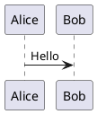

# CI integration

`puml` is designed to work as a compiler tool in CI pipelines. This page covers
ready-to-paste integration recipes for GitHub Actions, GitLab CI, and pre-commit hooks.

---

## Install options for CI

### Option A: Pre-built binary (fastest)

Download the pre-built binary from GitHub Releases — no compilation, ~5 seconds:

```bash
curl -Lo puml https://github.com/alliecatowo/puml/releases/latest/download/puml-linux-x86_64
chmod +x puml
mv puml /usr/local/bin/puml
```

Use this for environments where you control the runner and want maximum speed.

### Option B: cargo install (most portable)

```bash
cargo install puml --bin puml
```

Works on any platform with a Rust toolchain. ~1–2 minutes on first run (compiles from
source); subsequent runs use cargo's caching.

### Option C: Build from source (reproducible)

```bash
cargo install --git https://github.com/alliecatowo/puml --locked --bin puml
```

Pin `--rev <commit-sha>` for reproducible builds.

---

## GitHub Actions

### Lint all diagrams on pull request

Validate every `.puml` file on every PR. Fails if any diagram has a syntax error.

```yaml
name: Lint diagrams
on: [pull_request]

jobs:
  puml-check:
    runs-on: ubuntu-latest
    steps:
      - uses: actions/checkout@v4

      - name: Install puml (pre-built binary)
        run: |
          curl -Lo puml https://github.com/alliecatowo/puml/releases/latest/download/puml-linux-x86_64
          chmod +x puml
          sudo mv puml /usr/local/bin/puml

      - name: Check all diagrams
        run: |
          find . -name '*.puml' -not -path './target/*' \
            -exec puml --check {} +
```

### Lint with cargo install + caching

```yaml
name: Lint diagrams (cargo)
on: [pull_request]

jobs:
  puml-check:
    runs-on: ubuntu-latest
    steps:
      - uses: actions/checkout@v4

      - uses: dtolnay/rust-toolchain@stable

      - uses: Swatinem/rust-cache@v2
        with:
          shared-key: puml-ci

      - name: Install puml
        run: cargo install puml --bin puml

      - name: Check all diagrams
        run: |
          find . -name '*.puml' -not -path './target/*' \
            -exec puml --check {} +
```

### Render SVGs and commit them on push to main

Render all `.puml` files and commit the SVGs back to the repository when source
diagrams change.

```yaml
name: Render diagrams
on:
  push:
    branches: [main]
    paths:
      - '**/*.puml'

jobs:
  render:
    runs-on: ubuntu-latest
    permissions:
      contents: write
    steps:
      - uses: actions/checkout@v4

      - name: Install puml
        run: |
          curl -Lo puml https://github.com/alliecatowo/puml/releases/latest/download/puml-linux-x86_64
          chmod +x puml
          sudo mv puml /usr/local/bin/puml

      - name: Render all diagrams
        run: |
          find . -name '*.puml' -not -path './target/*' | while read f; do
            puml "$f"
          done

      - name: Commit rendered SVGs
        run: |
          git config user.name "github-actions[bot]"
          git config user.email "github-actions[bot]@users.noreply.github.com"
          git add '*.svg'
          git diff --staged --quiet || \
            git commit -m "chore(docs): render diagrams [skip ci]"
          git push
```

### Lint Markdown fenced code blocks

Validate `puml` code blocks embedded in Markdown files:

````markdown

````

```yaml
- name: Check Markdown diagram fences
  run: |
    find . -name '*.md' -not -path './target/*' \
      -exec puml --from-markdown --check {} +
```

### Machine-readable diagnostics for tooling

Use `--diagnostics json` to get structured output that scripts and CI systems can parse:

```yaml
- name: Check diagrams (JSON diagnostics)
  run: |
    find . -name '*.puml' -not -path './target/*' \
      -exec puml --diagnostics json --check {} + \
      | tee /tmp/puml-diagnostics.json
```

### Render to PNG for visual artifact upload

Render PNG artifacts and upload them so reviewers can inspect the output without
installing anything:

```yaml
name: Render diagram previews
on: [pull_request]

jobs:
  render-png:
    runs-on: ubuntu-latest
    steps:
      - uses: actions/checkout@v4

      - name: Install puml
        run: |
          curl -Lo puml https://github.com/alliecatowo/puml/releases/latest/download/puml-linux-x86_64
          chmod +x puml
          sudo mv puml /usr/local/bin/puml

      - name: Render to PNG
        run: |
          mkdir -p /tmp/diagrams
          find . -name '*.puml' -not -path './target/*' | while read f; do
            out="/tmp/diagrams/$(basename ${f%.puml}).png"
            puml --format png --dpi 150 "$f" -o "$out"
          done

      - name: Upload PNG artifacts
        uses: actions/upload-artifact@v4
        with:
          name: diagram-previews
          path: /tmp/diagrams/*.png
          retention-days: 7
```

---

## GitLab CI

### Lint on merge request

```yaml
puml-lint:
  stage: validate
  image: debian:bookworm-slim
  before_script:
    - apt-get update -qq && apt-get install -y curl
    - curl -Lo /usr/local/bin/puml
        https://github.com/alliecatowo/puml/releases/latest/download/puml-linux-x86_64
    - chmod +x /usr/local/bin/puml
  script:
    - find . -name '*.puml' -not -path './target/*' -exec puml --check {} +
  rules:
    - if: '$CI_PIPELINE_SOURCE == "merge_request_event"'
```

### Lint and render on main push

```yaml
puml-render:
  stage: build
  image: debian:bookworm-slim
  before_script:
    - apt-get update -qq && apt-get install -y curl
    - curl -Lo /usr/local/bin/puml
        https://github.com/alliecatowo/puml/releases/latest/download/puml-linux-x86_64
    - chmod +x /usr/local/bin/puml
  script:
    - find . -name '*.puml' -not -path './target/*' | while read f; do
        puml "$f"
      done
  artifacts:
    paths:
      - '**/*.svg'
    expire_in: 7 days
  rules:
    - if: '$CI_COMMIT_BRANCH == $CI_DEFAULT_BRANCH'
```

### With Rust toolchain (compile from source)

```yaml
puml-lint:
  stage: validate
  image: rust:1.88-slim
  script:
    - cargo install puml --bin puml
    - find . -name '*.puml' -not -path './target/*' -exec puml --check {} +
  cache:
    key: '$CI_JOB_NAME-cargo'
    paths:
      - $CARGO_HOME/registry/
      - target/
  rules:
    - if: '$CI_PIPELINE_SOURCE == "merge_request_event"'
```

---

## pre-commit hook

Run `puml --check` automatically before every commit.

### Using the pre-commit framework

Add to `.pre-commit-config.yaml`:

```yaml
repos:
  - repo: local
    hooks:
      - id: puml-check
        name: Validate PlantUML diagrams
        language: system
        entry: puml --check
        files: '\.puml$'
        pass_filenames: true
```

`puml` must be on your `$PATH`. Install it with `cargo install puml --bin puml` or
from the pre-built binary.

Install the hook:

```bash
pip install pre-commit
pre-commit install
```

### Manual git hook

If you don't use the pre-commit framework, add a hook directly:

```bash
cat > .git/hooks/pre-commit <<'EOF'
#!/usr/bin/env bash
set -e

# Find staged .puml files
staged=$(git diff --cached --name-only --diff-filter=ACMR | grep '\.puml$' || true)
if [ -z "$staged" ]; then
  exit 0
fi

echo "Checking staged .puml files..."
echo "$staged" | xargs puml --check
EOF
chmod +x .git/hooks/pre-commit
```

This hook only checks files staged for commit, making it fast even in large repos.

---

## Lint mode: `--check` flag

`--check` validates the diagram without writing any output files. Use it everywhere
you want validation without side effects.

```bash
puml --check hello.puml          # single file
puml --check docs/**/*.puml      # glob (shell expands)
find . -name '*.puml' | xargs puml --check   # all files
```

With `--diagnostics json`:

```bash
puml --diagnostics json --check hello.puml
```

Output format:

```json
{
  "file": "hello.puml",
  "diagnostics": [
    {
      "severity": "error",
      "line": 5,
      "column": 3,
      "message": "unexpected token 'foo'"
    }
  ]
}
```

Use `jq` to filter or count errors in scripts:

```bash
puml --diagnostics json --check hello.puml | jq '.diagnostics | length'
```

---

## Exit codes

| Code | Meaning |
|---|---|
| 0 | Success — diagram is valid (or rendered successfully) |
| 1 | Validation error — diagram has syntax or semantic errors |
| 2 | I/O error — file not found, permission denied, output path issue |
| 3 | Internal error — please report this as a bug |

Scripts and CI systems can use these exit codes reliably.

---

## Caching the puml binary in CI

To avoid downloading or compiling `puml` on every run, cache the binary:

### GitHub Actions (pre-built binary cache)

```yaml
- name: Cache puml binary
  id: cache-puml
  uses: actions/cache@v4
  with:
    path: ~/.local/bin/puml
    key: puml-${{ runner.os }}-v0.1.0

- name: Install puml if not cached
  if: steps.cache-puml.outputs.cache-hit != 'true'
  run: |
    curl -Lo ~/.local/bin/puml \
      https://github.com/alliecatowo/puml/releases/download/v0.1.0/puml-linux-x86_64
    chmod +x ~/.local/bin/puml

- name: Add to PATH
  run: echo "$HOME/.local/bin" >> $GITHUB_PATH
```

### GitHub Actions (cargo cache)

```yaml
- uses: Swatinem/rust-cache@v2
  with:
    shared-key: puml-cli
    cache-targets: false
    cache-on-failure: true
```

---

## Tips

- **Always use `--not -path './target/*'`** in `find` commands to skip the Rust build
  output, which may contain test fixtures that aren't meant to be linted.
- **Use `--from-markdown --check`** for Markdown files with embedded code blocks — it
  finds all `puml` fences and validates them in one pass.
- **Pin the binary version** in production CI to get reproducible results. Use a tagged
  release URL instead of `latest`.
- **Upload PNG artifacts on PRs** — reviewers who haven't installed `puml` can see the
  rendered output without any local setup.

---

## Further reading

- [Quickstart](quickstart.md)
- [Install guide](install.md)
- [FAQ: Can I use puml in GitHub Actions?](faq.md#can-i-use-puml-in-github-actions)
