# PicoUML Example Gallery

This gallery contains 148 canonical example diagrams across all supported (and planned)
diagram families. Families that produce SVG are linked with full markdown image/file
references. Families that are parse-only or not yet supported are listed as plain text.

SVG renders are produced with: `./target/release/puml <file>.puml`

See [KNOWN_LIMITATIONS.md](KNOWN_LIMITATIONS.md) for families that do not yet produce SVG output.

---

## Sequence Diagrams — 15 examples — full SVG render

| # | File | Description |
|---|---|---|
| 01 | [01_basic.puml](sequence/01_basic.puml) | Minimal two-participant hello |
| 02 | [02_participants.puml](sequence/02_participants.puml) | All participant kinds: actor, database, queue |
| 03 | [03_autonumber.puml](sequence/03_autonumber.puml) | Auto-numbered messages |
| 04 | [04_autonumber_format.puml](sequence/04_autonumber_format.puml) | Autonumber with start offset |
| 05 | [05_alt_opt_loop.puml](sequence/05_alt_opt_loop.puml) | Combined groups: alt, opt, loop |
| 06 | [06_par.puml](sequence/06_par.puml) | Parallel fragments with par/else/end |
| 07 | [07_notes.puml](sequence/07_notes.puml) | Notes: right of, over multiple |
| 08 | [08_ref.puml](sequence/08_ref.puml) | Reference fragment |
| 09 | [09_box.puml](sequence/09_box.puml) | Multi-participant diagram |
| 10 | [10_hide_footbox.puml](sequence/10_hide_footbox.puml) | Hide footbox directive |
| 11 | [11_activation.puml](sequence/11_activation.puml) | Activation bars: activate/deactivate |
| 12 | [12_create_destroy.puml](sequence/12_create_destroy.puml) | Create and destroy participants |
| 13 | [13_arrows.puml](sequence/13_arrows.puml) | Arrow variants: ->, ->>, -->, ->>x, ->o, <-> |
| 14 | [14_separator.puml](sequence/14_separator.puml) | Page separators with == text == |
| 15 | [15_large_diagram.puml](sequence/15_large_diagram.puml) | E-Commerce order flow (large diagram) |

### Rendered Samples

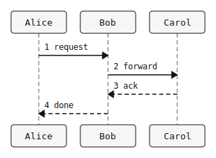

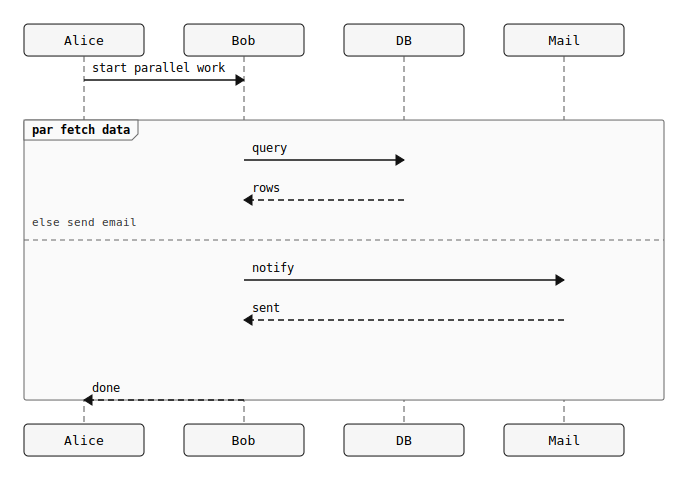
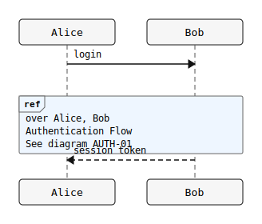
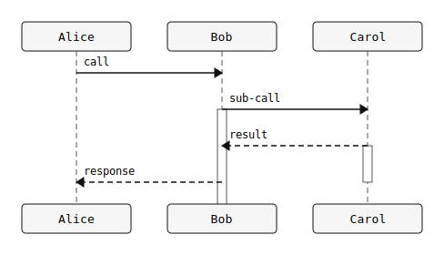
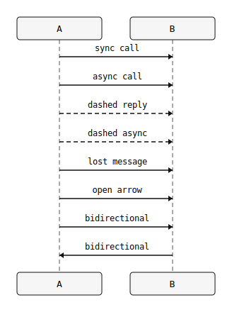
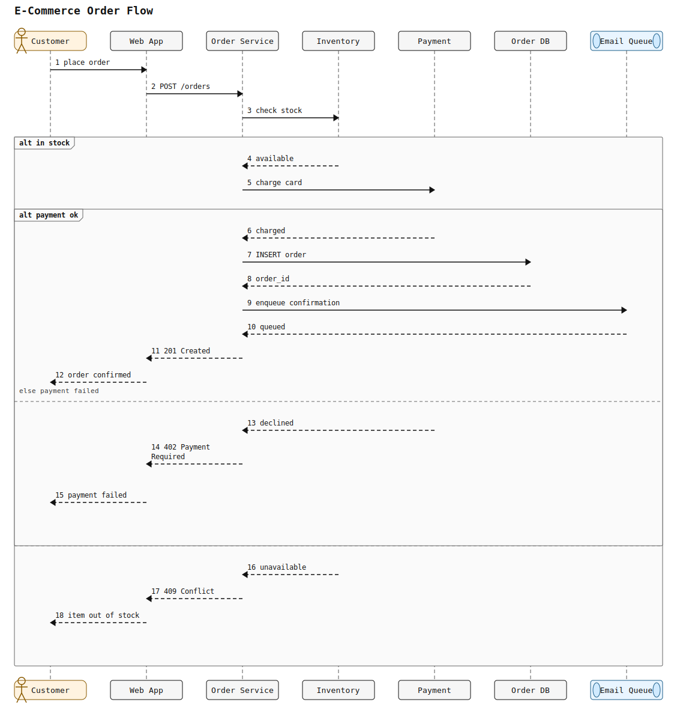

---

## Class Diagrams — 10 examples — stub SVG render

| # | File | Description |
|---|---|---|
| 01 | [01_basic.puml](class/01_basic.puml) | Simple two-class relation |
| 02 | [02_inheritance.puml](class/02_inheritance.puml) | Inheritance hierarchy with Vehicle/Car/Truck |
| 03 | [03_composition_aggregation.puml](class/03_composition_aggregation.puml) | Composition and aggregation |
| 04 | [04_dependency.puml](class/04_dependency.puml) | Dependency arrows |
| 05 | [05_visibility.puml](class/05_visibility.puml) | Member visibility (+/#/-/~) |
| 06 | [06_abstract_interface.puml](class/06_abstract_interface.puml) | Abstract class hierarchy |
| 07 | [07_stereotypes.puml](class/07_stereotypes.puml) | Stereotypes: controller, service, repository |
| 08 | [08_packages.puml](class/08_packages.puml) | Domain model (flat) |
| 09 | [09_static_modifiers.puml](class/09_static_modifiers.puml) | Static ({static}) members |
| 10 | [10_full_domain.puml](class/10_full_domain.puml) | Full e-commerce domain model |

### Rendered Samples

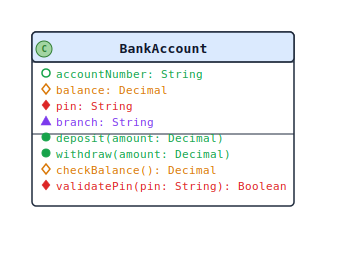
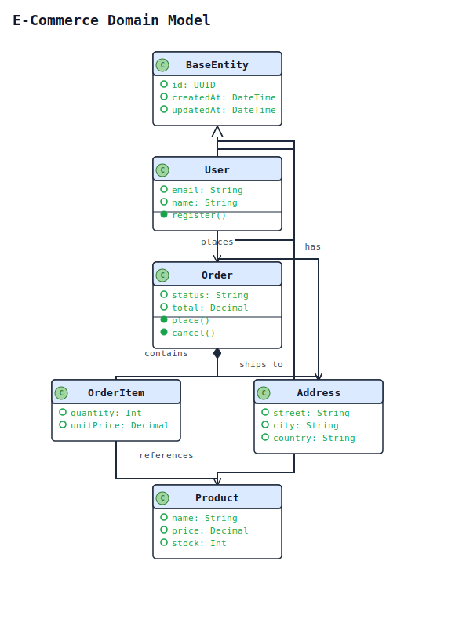

---

## Object Diagrams — 4 examples — stub SVG render

| # | File | Description |
|---|---|---|
| 01 | [01_basic.puml](object/01_basic.puml) | Two linked objects |
| 02 | [02_with_attributes.puml](object/02_with_attributes.puml) | Objects with attribute values |
| 03 | [03_with_links.puml](object/03_with_links.puml) | Server/database/cache link diagram |
| 04 | [04_with_stereotypes.puml](object/04_with_stereotypes.puml) | Objects with stereotypes |

### Rendered Samples

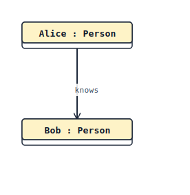

---

## Use Case Diagrams — 4 examples — stub SVG render

| # | File | Description |
|---|---|---|
| 01 | [01_basic.puml](usecase/01_basic.puml) | Simple two-usecase diagram |
| 02 | [02_with_actors.puml](usecase/02_with_actors.puml) | Shopping use case set |
| 03 | [03_extends_includes.puml](usecase/03_extends_includes.puml) | Extends and includes |
| 04 | [04_with_packages.puml](usecase/04_with_packages.puml) | Full use case diagram |

### Rendered Samples

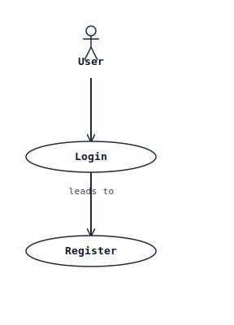
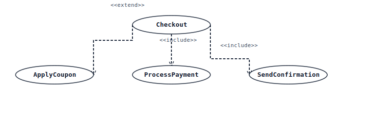

---

## State Diagrams — 8 examples — full SVG render

| # | File | Description |
|---|---|---|
| 01 | [01_basic.puml](state/01_basic.puml) | Minimal state machine |
| 02 | [02_transitions.puml](state/02_transitions.puml) | Document lifecycle with labeled transitions |
| 03 | [03_concurrent.puml](state/03_concurrent.puml) | Concurrent regions with || separator |
| 04 | [04_history.puml](state/04_history.puml) | History states [H] and [H*] |
| 05 | [05_fork_join_choice.puml](state/05_fork_join_choice.puml) | Fork, join, and choice pseudo-states |
| 06 | [06_entry_exit.puml](state/06_entry_exit.puml) | Entry/exit actions and internal transitions |
| 07 | [07_nested.puml](state/07_nested.puml) | Nested composite states |
| 08 | [08_full_machine.puml](state/08_full_machine.puml) | Complete order state machine |

### Rendered Samples

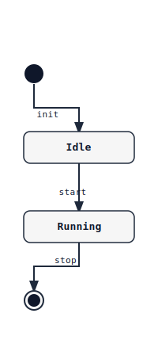
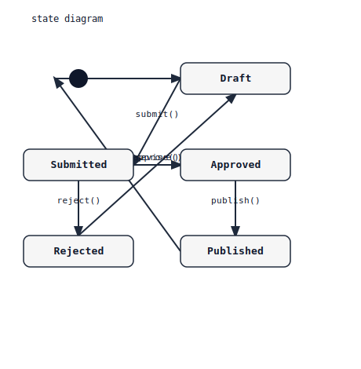
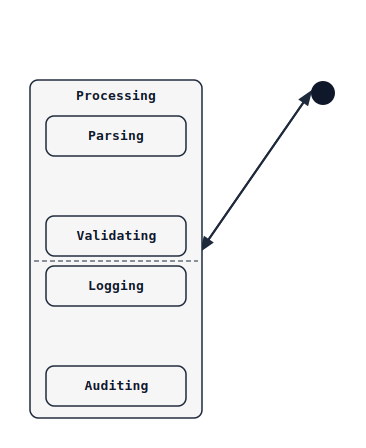

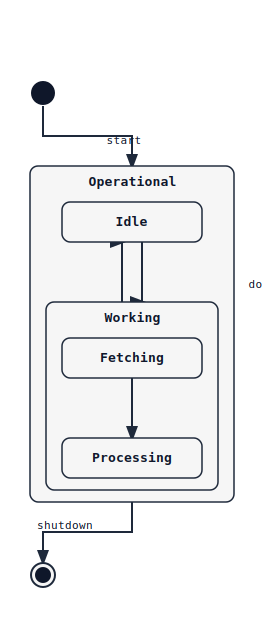
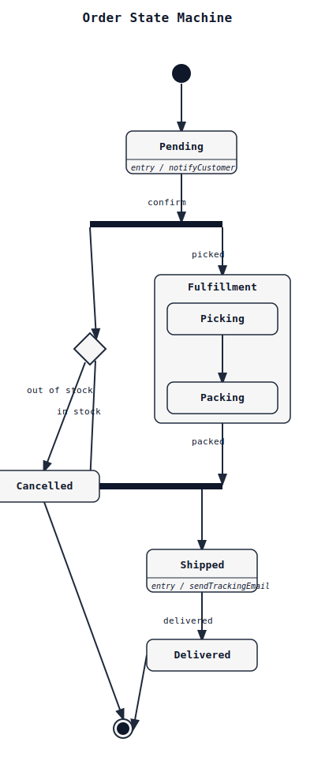

---

## Gantt Diagrams — 6 examples — timeline SVG render

| # | File | Description |
|---|---|---|
| 01 | [01_basic.puml](gantt/01_basic.puml) | Basic tasks with dates |
| 02 | [02_milestones.puml](gantt/02_milestones.puml) | Release milestones |
| 03 | [03_constraints.puml](gantt/03_constraints.puml) | Sprint with requires constraints |
| 04 | [04_dated.puml](gantt/04_dated.puml) | Dated event timeline |
| 05 | [05_multi_task.puml](gantt/05_multi_task.puml) | Q1 roadmap with dependencies |
| 06 | [06_with_legend.puml](gantt/06_with_legend.puml) | Annual project plan |

### Rendered Samples

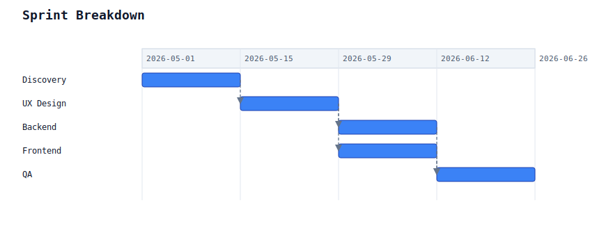

---

## Chronology Diagrams — 3 examples — timeline SVG render

| # | File | Description |
|---|---|---|
| 01 | [01_events.puml](chronology/01_events.puml) | Project milestone timeline |
| 02 | [02_timeline.puml](chronology/02_timeline.puml) | Phase-based timeline |
| 03 | [03_release_history.puml](chronology/03_release_history.puml) | Software release history |

### Rendered Samples

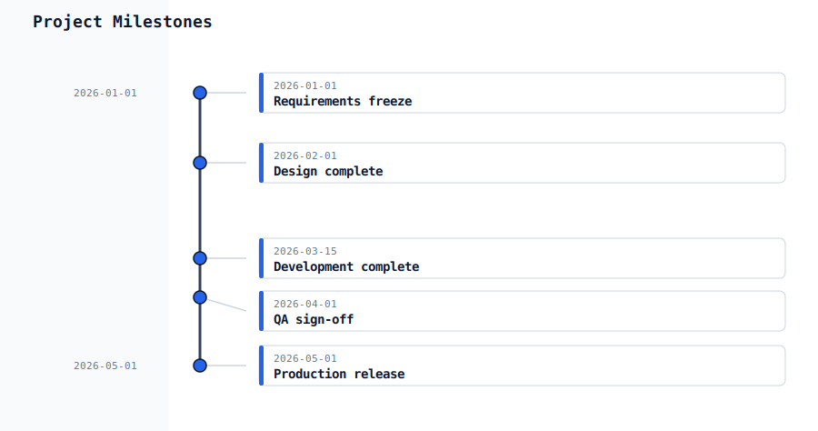
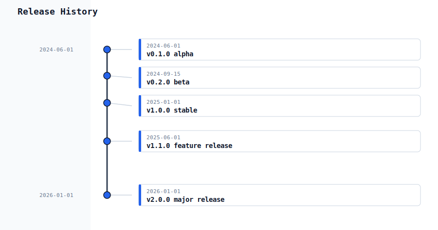

---

## Themes — 10 examples — full SVG render

Only `plain` and `spacelab` themes are built-in. Examples demonstrate both.

| # | File | Description |
|---|---|---|
| 01 | [01_plain.puml](themes/01_plain.puml) | Plain theme basic sequence |
| 02 | [02_spacelab.puml](themes/02_spacelab.puml) | Spacelab theme basic sequence |
| 03 | [03_plain_sequence.puml](themes/03_plain_sequence.puml) | Plain theme full sequence |
| 04 | [04_spacelab_complex.puml](themes/04_spacelab_complex.puml) | Spacelab with alt/else groups |
| 05 | [05_plain_class.puml](themes/05_plain_class.puml) | Plain theme class diagram |
| 06 | [06_spacelab_state.puml](themes/06_spacelab_state.puml) | Spacelab theme state diagram |
| 07 | [07_no_theme_default.puml](themes/07_no_theme_default.puml) | Default theme (no !theme) |
| 08 | [08_plain_with_groups.puml](themes/08_plain_with_groups.puml) | Plain theme with alt/else |
| 09 | [09_plain_notes.puml](themes/09_plain_notes.puml) | Plain theme with notes |
| 10 | [10_spacelab_box.puml](themes/10_spacelab_box.puml) | Spacelab with multiple participants |

### Rendered Samples

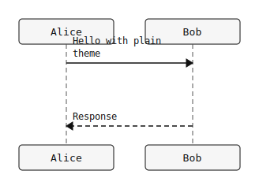
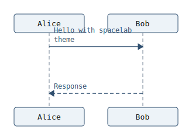
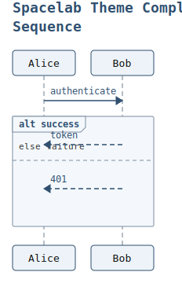
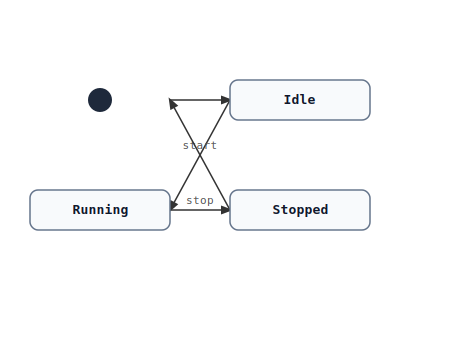

---

## Skinparams — 8 examples — full SVG render

| # | File | Description |
|---|---|---|
| 01 | [01_arrow_color.puml](skinparams/01_arrow_color.puml) | arrowColor skinparam |
| 02 | [02_participant_colors.puml](skinparams/02_participant_colors.puml) | participantBackgroundColor + participantBorderColor |
| 03 | [03_note_colors.puml](skinparams/03_note_colors.puml) | noteBackgroundColor + noteBorderColor |
| 04 | [04_group_colors.puml](skinparams/04_group_colors.puml) | groupBackgroundColor + groupBorderColor |
| 05 | [05_lifeline_border.puml](skinparams/05_lifeline_border.puml) | lifelineBorderColor |
| 06 | [06_footbox.puml](skinparams/06_footbox.puml) | footbox hide via skinparam |
| 07 | [07_maxmessagesize.puml](skinparams/07_maxmessagesize.puml) | maxMessageSize |
| 08 | [08_combined.puml](skinparams/08_combined.puml) | Multiple skinparams combined |

### Rendered Samples

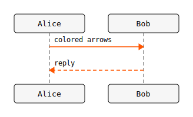
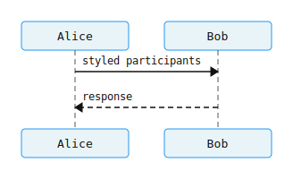
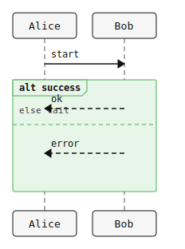
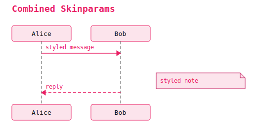

---

## Preprocessor — 6 examples — full SVG render

| # | File | Description |
|---|---|---|
| 01 | [01_define.puml](preprocessor/01_define.puml) | !define macro substitution |
| 02 | [02_if_conditional.puml](preprocessor/02_if_conditional.puml) | !if / !elseif / !else / !endif |
| 03 | [03_while_loop.puml](preprocessor/03_while_loop.puml) | !while / !endwhile counter |
| 04 | [04_function.puml](preprocessor/04_function.puml) | !function / !endfunction |
| 05 | [05_procedure.puml](preprocessor/05_procedure.puml) | !procedure, !assert, Echo |
| 06 | [06_variables.puml](preprocessor/06_variables.puml) | !$var and ?= default assignment |

### Rendered Samples

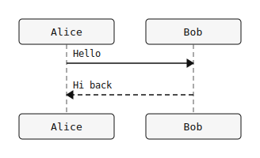
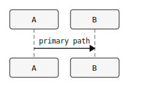
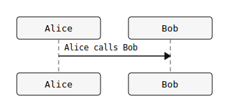
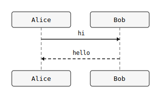

---

## Creole Formatting — 4 examples — full SVG render

| # | File | Description |
|---|---|---|
| 01 | [01_bold_italic.puml](creole/01_bold_italic.puml) | Bold, italic, underline, strikethrough |
| 02 | [02_color_size.puml](creole/02_color_size.puml) | HTML color/size/font tags in messages |
| 03 | [03_multiline.puml](creole/03_multiline.puml) | Multiline note blocks |
| 04 | [04_monospace.puml](creole/04_monospace.puml) | Backtick code in labels |

### Rendered Samples

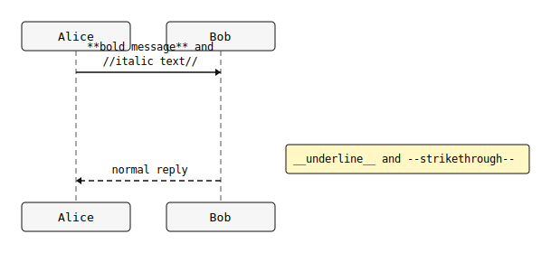
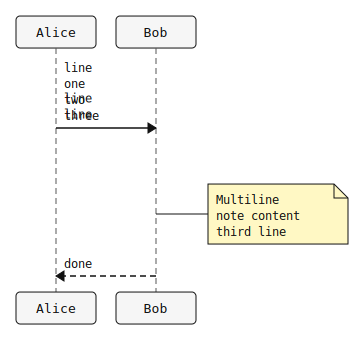

---

## Parse-Only Families (no SVG output yet)

The following families are recognized by the parser but the renderer is not yet
implemented. Source files are in their respective directories. See
[KNOWN_LIMITATIONS.md](KNOWN_LIMITATIONS.md) for details.

### Component Diagrams — 6 files in `component/`

| # | Source file | Description |
|---|---|---|
| 01 | `component/01_basic.puml` | Simple frontend/backend |
| 02 | `component/02_interfaces.puml` | With interface declarations |
| 03 | `component/03_packages.puml` | Grouped by packages |
| 04 | `component/04_deployment_style.puml` | Deployment-style component diagram |
| 05 | `component/05_with_notes.puml` | Service gateway diagram |
| 06 | `component/06_with_arrows.puml` | Various arrow types |

### Deployment Diagrams — 4 files in `deployment/`

| # | Source file | Description |
|---|---|---|
| 01 | `deployment/01_nodes.puml` | Web/app/db node diagram |
| 02 | `deployment/02_databases.puml` | App with PostgreSQL and Redis |
| 03 | `deployment/03_cloud.puml` | EC2, RDS, S3, Lambda |
| 04 | `deployment/04_mixed.puml` | Full production topology |

### Activity (Old Style) — 4 files in `activity_old/`

| # | Source file | Description |
|---|---|---|
| 01 | `activity_old/01_basic.puml` | (*) --> "Init" basic flow |
| 02 | `activity_old/02_swimlanes.puml` | Swimlane layout |
| 03 | `activity_old/03_colored.puml` | Color-coded activities |
| 04 | `activity_old/04_mixed.puml` | Mixed old-style syntax |

### Activity (New Style) — 6 files in `activity_new/`

| # | Source file | Description |
|---|---|---|
| 01 | `activity_new/01_basic.puml` | start/stop/action |
| 02 | `activity_new/02_if_else.puml` | Conditional branching |
| 03 | `activity_new/03_fork.puml` | Fork/join parallel flows |
| 04 | `activity_new/04_while.puml` | While loop |
| 05 | `activity_new/05_repeat.puml` | Repeat/until loop |
| 06 | `activity_new/06_partition.puml` | Partitioned activity |

### Timing Diagrams — 4 files in `timing/`

| # | Source file | Description |
|---|---|---|
| 01 | `timing/01_concise.puml` | Concise timeline |
| 02 | `timing/02_robust.puml` | Robust timeline |
| 03 | `timing/03_clock.puml` | Clock signal |
| 04 | `timing/04_binary.puml` | Binary signals |

### MindMap Diagrams — 4 files in `mindmap/`

| # | Source file | Description |
|---|---|---|
| 01 | `mindmap/01_basic.puml` | Simple mindmap |
| 02 | `mindmap/02_multi_level.puml` | Technology stack mindmap |
| 03 | `mindmap/03_with_colors.puml` | Branch map |
| 04 | `mindmap/04_learning_map.puml` | Learning Rust mindmap |

### WBS Diagrams — 4 files in `wbs/`

| # | Source file | Description |
|---|---|---|
| 01 | `wbs/01_basic.puml` | Simple work breakdown |
| 02 | `wbs/02_with_tasks.puml` | E-commerce platform WBS |
| 03 | `wbs/03_checkboxes.puml` | Sprint tasks with [x]/[ ] checkboxes |
| 04 | `wbs/04_multi_level.puml` | Software development WBS |

---

## Families Not Yet in Parser

The following diagram types are not yet parsed. Source files are provided as
syntax reference only. See [KNOWN_LIMITATIONS.md](KNOWN_LIMITATIONS.md).

### Salt (UI Wireframes) — 4 files in `salt/`

`salt/01_basic_widgets.puml`, `salt/02_frame.puml`, `salt/03_separator.puml`, `salt/04_tabs.puml`

### JSON Diagrams — 3 files in `json/`

`json/01_object.puml`, `json/02_array.puml`, `json/03_nested.puml`

### YAML Diagrams — 3 files in `yaml/`

`yaml/01_mapping.puml`, `yaml/02_sequence.puml`, `yaml/03_nested.puml`

### NwDiag — 3 files in `nwdiag/`

`nwdiag/01_single_net.puml`, `nwdiag/02_multiple_nets.puml`, `nwdiag/03_with_groups.puml`

### ArchiMate — 3 files in `archimate/`

`archimate/01_layered.puml`, `archimate/02_with_relations.puml`, `archimate/03_with_junctions.puml`

### Regex — 3 files in `regex/`

`regex/01_character_classes.puml`, `regex/02_repetition.puml`, `regex/03_alternation.puml`

### EBNF — 3 files in `ebnf/`

`ebnf/01_simple_grammar.puml`, `ebnf/02_optional_repetition.puml`, `ebnf/03_complex.puml`

### Chart — 4 files in `chart/`

`chart/01_bar.puml`, `chart/02_line.puml`, `chart/03_pie.puml`, `chart/04_multi_series.puml`

### Math/LaTeX — 2 files in `math/`

`math/01_simple.puml`, `math/02_complex.puml`

### SDL — 2 files in `sdl/`

`sdl/01_basic_process.puml`, `sdl/02_with_transitions.puml`

### Ditaa — 2 files in `ditaa/`

`ditaa/01_simple_ascii.puml`, `ditaa/02_components.puml`

---

## Coverage Summary

| Family | Count | SVG Rendered | Render Type |
|---|---|---|---|
| sequence | 15 | 15 | Full SVG |
| class | 10 | 10 | Stub SVG |
| object | 4 | 4 | Stub SVG |
| usecase | 4 | 4 | Stub SVG |
| state | 8 | 8 | Full SVG |
| gantt | 6 | 6 | Timeline SVG |
| chronology | 3 | 3 | Timeline SVG |
| themes | 10 | 10 | Full SVG |
| skinparams | 8 | 8 | Full SVG |
| preprocessor | 6 | 6 | Full SVG |
| creole | 4 | 4 | Full SVG |
| component | 6 | 0 | Parse only |
| deployment | 4 | 0 | Parse only |
| activity (old) | 4 | 0 | Parse only |
| activity (new) | 6 | 0 | Not supported |
| timing | 4 | 0 | Parse only |
| mindmap | 4 | 0 | Parse only |
| wbs | 4 | 0 | Parse only |
| salt | 4 | 0 | Not supported |
| json | 3 | 0 | Not supported |
| yaml | 3 | 0 | Not supported |
| nwdiag | 3 | 0 | Not supported |
| archimate | 3 | 0 | Not supported |
| regex | 3 | 0 | Not supported |
| ebnf | 3 | 0 | Not supported |
| chart | 4 | 0 | Not supported |
| math | 2 | 0 | Not supported |
| sdl | 2 | 0 | Not supported |
| ditaa | 2 | 0 | Not supported |
| **Total** | **148** | **78** | |
