# PUML Visual Gallery

This gallery is the human browse view for the rendered example corpus. Each row
links to a source diagram and its committed SVG render, so it is useful both as
product documentation and as a quick visual smoke pass.

Current corpus snapshot:

- `269` source diagrams under `docs/examples/`
- `273` committed SVG renders under `docs/examples/`
- `44` fixtures in `tests/visual_regression/manifest.json`
- `30` reviewed PNG baselines under `tests/visual_baselines/`

Visual regression coverage is intentionally smaller than the gallery. The
gallery shows what users can browse; the manifest and PNG baselines show which
examples are executable visual gates.

## Featured Renders

| Family | Preview | Source and SVG | What It Shows |
|---|---:|---|---|
| Sequence | 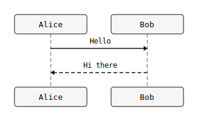 | [source](sequence/01_basic.puml) / [svg](sequence/01_basic.svg) | Participants, messages, and the default sequence layout. |
| Class |  | [source](class/02_inheritance.puml) / [svg](class/02_inheritance.svg) | Class members, inheritance arrows, and multi-node graph layout. |
| Activity | 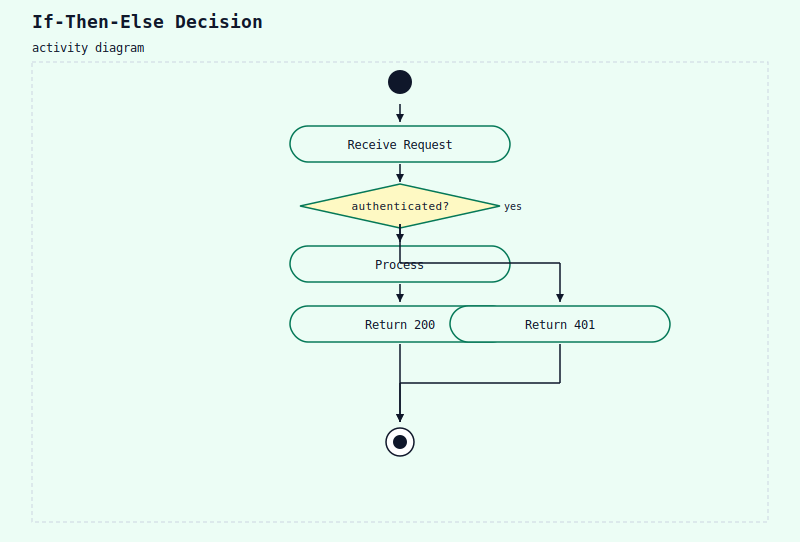 | [source](activity/02_if_then_else.puml) / [svg](activity/02_if_then_else.svg) | Decision branches and terminal flow labels. |
| State | 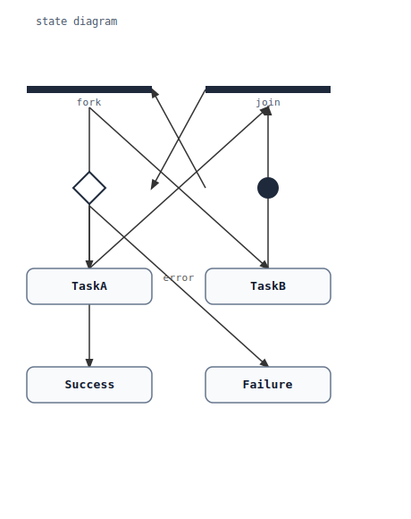 | [source](state/05_fork_join_choice.puml) / [svg](state/05_fork_join_choice.svg) | Fork, join, choice, and transition label rendering. |
| Component | 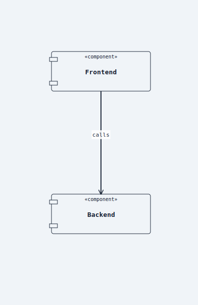 | [source](component/01_basic.puml) / [svg](component/01_basic.svg) | Components, interfaces, and component-to-component relations. |
| Deployment | 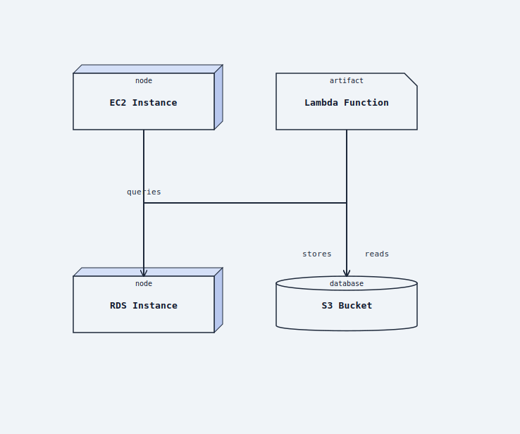 | [source](deployment/03_cloud.puml) / [svg](deployment/03_cloud.svg) | Cloud, database, bucket, and function deployment nodes. |
| C4 | 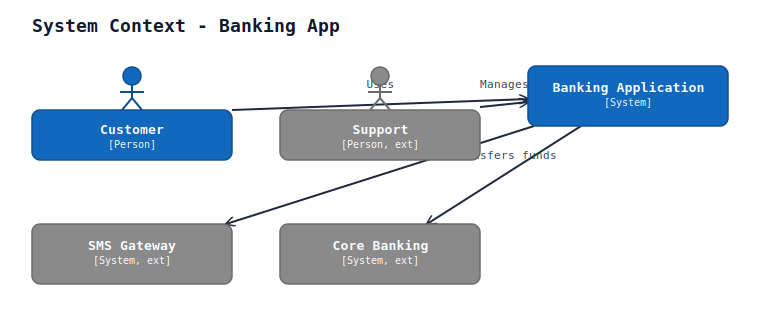 | [source](c4/01_context.puml) / [svg](c4/01_context.svg) | Persons, systems, external systems, and labeled relationships. |
| Timing | 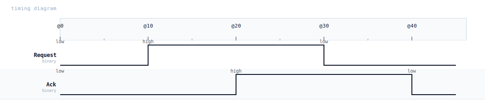 | [source](timing/04_binary.puml) / [svg](timing/04_binary.svg) | Binary timing states and signal transitions. |
| Gantt | 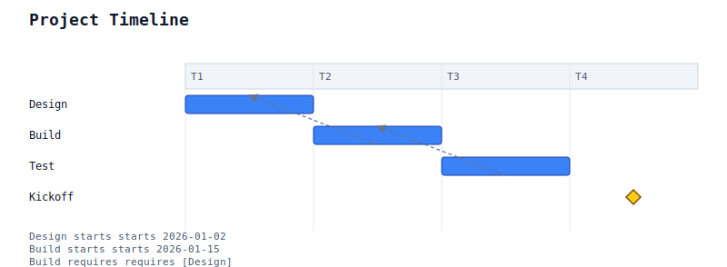 | [source](gantt/01_basic.puml) / [svg](gantt/01_basic.svg) | Tasks, milestones, dates, and project timeline rendering. |
| Mindmap |  | [source](mindmap/01_basic.puml) / [svg](mindmap/01_basic.svg) | Radial tree layout for mindmap nodes. |
| WBS | 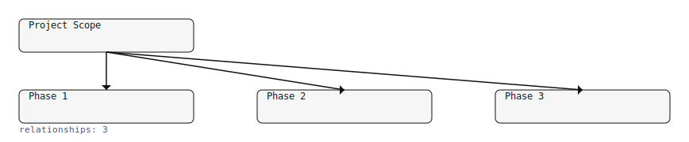 | [source](wbs/01_basic.puml) / [svg](wbs/01_basic.svg) | Work breakdown tree hierarchy. |
| JSON | 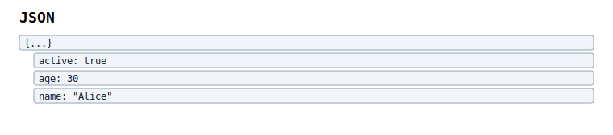 | [source](json/01_object.puml) / [svg](json/01_object.svg) | Structured object rendering for data diagrams. |
| Network | 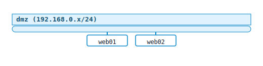 | [source](nwdiag/01_single_net.puml) / [svg](nwdiag/01_single_net.svg) | Network block layout and node labels. |
| SDL | 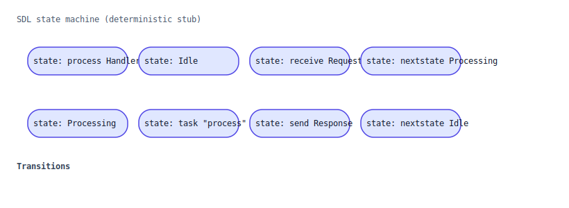 | [source](sdl/02_with_transitions.puml) / [svg](sdl/02_with_transitions.svg) | SDL states and transitions. |
| Chart | 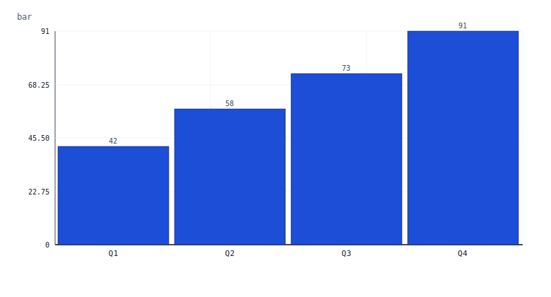 | [source](chart/01_bar.puml) / [svg](chart/01_bar.svg) | Bar chart axes, labels, and values. |
| Chen ER | 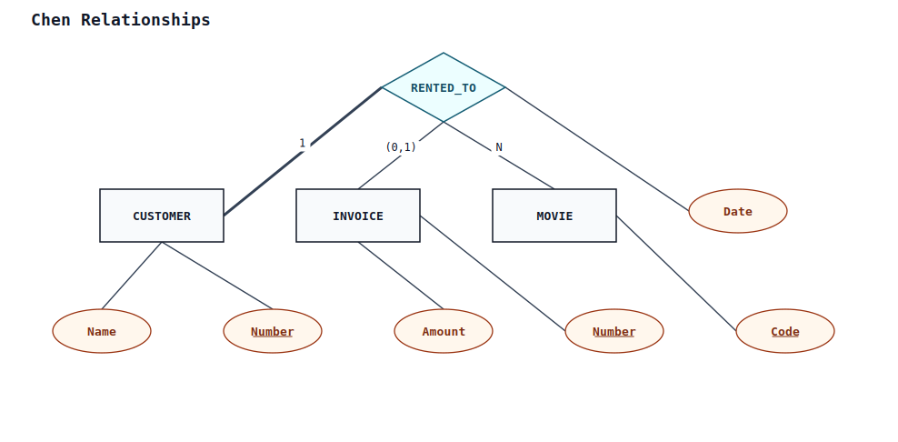 | [source](chen/03_relationships.puml) / [svg](chen/03_relationships.svg) | Chen-style entities, relationships, and attributes. |

## Browse By Family

| Family | Examples | Start Here | Gallery Role | Visual Gate Status |
|---|---:|---|---|---|
| [Sequence](sequence/) | 29 | [01_basic](sequence/01_basic.puml) / [svg](sequence/01_basic.svg) | Message flows, groups, themes, lifecycle, and nested refs. Theme variants live in [26_theme_gallery](sequence/26_theme_gallery.puml) (5-slice multi-block). | 3 PNG baselines; 1 high-risk manifest fixture deferred to #1113. |
| [Class](class/) | 23 | [02_inheritance](class/02_inheritance.puml) / [svg](class/02_inheritance.svg) | Classes, members, packages, generics, and relation varieties. Design + architecture patterns consolidated into [17_design_patterns](class/17_design_patterns.puml) (9-slice multi-block) and [21_architecture_patterns](class/21_architecture_patterns.puml) (4-slice multi-block). | 2 PNG baselines; compactness/header cases deferred to #594/#1113. |
| [Object](object/) | 6 | [01_basic](object/01_basic.puml) / [svg](object/01_basic.svg) | Objects, attributes, links, stereotypes, and map-like anchors. | 1 PNG baseline. |
| [Use Case](usecase/) | 8 | [01_basic](usecase/01_basic.puml) / [svg](usecase/01_basic.svg) | Actors, use cases, boundaries, include/extend, and styles. | 1 PNG baseline; multi-boundary routing case deferred to #1113. |
| [Component](component/) | 11 | [01_basic](component/01_basic.puml) / [svg](component/01_basic.svg) | Components, interfaces, packages, notes, ports, and stereotypes. | 2 PNG baselines; port/header routing case deferred to #1113. |
| [Deployment](deployment/) | 8 | [03_cloud](deployment/03_cloud.puml) / [svg](deployment/03_cloud.svg) | Nodes, cloud resources, databases, Kubernetes, and mixed elements. | 2 PNG baselines; nested cloud/Kubernetes cases deferred to #1113. |
| [C4](c4/) | 12 | [01_context](c4/01_context.puml) / [svg](c4/01_context.svg) | Context, container, component, SaaS, and landscape examples. | 1 PNG baseline; broader C4 baseline coverage tracked by #739. |
| [State](state/) | 13 | [05_fork_join_choice](state/05_fork_join_choice.puml) / [svg](state/05_fork_join_choice.svg) | State machines, history, forks, joins, nested states, and style blocks. | 2 PNG baselines; nested composite fixture deferred to #1113. |
| [Activity](activity/) | 18 | [02_if_then_else](activity/02_if_then_else.puml) / [svg](activity/02_if_then_else.svg) | Activity flows, decisions, forks, loops, partitions, and swimlanes. | 2 PNG baselines; lane ownership cases deferred to #1113. |
| [Activity New](activity_new/) | 9 | [01_basic](activity_new/01_basic.puml) / [svg](activity_new/01_basic.svg) | New-syntax activity flow and partition examples. | Manifest coverage only; lane/note fixture deferred to #1113. |
| [Activity Old](activity_old/) | 4 | [01_basic](activity_old/01_basic.puml) / [svg](activity_old/01_basic.svg) | Legacy activity syntax examples. | No PNG baseline yet. |
| [Timing](timing/) | 10 | [04_binary](timing/04_binary.puml) / [svg](timing/04_binary.svg) | Concise, robust, binary, clock, and manual-axis timing diagrams. | 2 PNG baselines; richer message-arrow baseline tracked by #434. |
| [Gantt](gantt/) | 10 | [01_basic](gantt/01_basic.puml) / [svg](gantt/01_basic.svg) | Tasks, constraints, lags, holidays, milestones, and critical path. | 1 PNG baseline. |
| [Chronology](chronology/) | 5 | [05_calendar_depth](chronology/05_calendar_depth.puml) / [svg](chronology/05_calendar_depth.svg) | Event timelines, eras, bracket annotations, and calendar precision. | No PNG baseline yet. |
| [Mindmap](mindmap/) | 7 | [01_basic](mindmap/01_basic.puml) / [svg](mindmap/01_basic.svg) | Tree-style mindmaps, colors, depth, and multiline labels. | 1 PNG baseline. |
| [WBS](wbs/) | 7 | [01_basic](wbs/01_basic.puml) / [svg](wbs/01_basic.svg) | Work breakdown trees, checkboxes, arrows, and themes. | 1 PNG baseline. |
| [Salt](salt/) | 5 | [01_basic_widgets](salt/01_basic_widgets.puml) / [svg](salt/01_basic_widgets.svg) | Wireframe widgets, frames, separators, tabs, and settings forms. | No PNG baseline yet. |
| [JSON](json/) | 4 | [01_object](json/01_object.puml) / [svg](json/01_object.svg) | Structured JSON object and array rendering. | 1 PNG baseline. |
| [YAML](yaml/) | 3 | [01_mapping](yaml/01_mapping.puml) / [svg](yaml/01_mapping.svg) | Structured YAML mappings, sequences, and nesting. | No PNG baseline yet. |
| [Network](nwdiag/) | 4 | [01_single_net](nwdiag/01_single_net.puml) / [svg](nwdiag/01_single_net.svg) | Network diagrams, groups, icons, and multiline host labels. | 1 PNG baseline. |
| [Archimate](archimate/) | 3 | [01_layered](archimate/01_layered.puml) / [svg](archimate/01_layered.svg) | Archimate layers, relations, and junctions. | 1 PNG baseline. |
| [Regex](regex/) | 3 | [03_alternation](regex/03_alternation.puml) / [svg](regex/03_alternation.svg) | Regex character classes, repetition, and alternation diagrams. | 1 PNG baseline. |
| [EBNF](ebnf/) | 3 | [02_optional_repetition](ebnf/02_optional_repetition.puml) / [svg](ebnf/02_optional_repetition.svg) | Grammar productions, optional branches, and repetitions. | 1 PNG baseline. |
| [Math](math/) | 2 | [02_complex](math/02_complex.puml) / [svg](math/02_complex.svg) | TeX-like math rendering examples. | 1 PNG baseline. |
| [Ditaa](ditaa/) | 2 | [01_simple_ascii](ditaa/01_simple_ascii.puml) / [svg](ditaa/01_simple_ascii.svg) | ASCII box diagrams rendered as structured SVG. | 1 PNG baseline. |
| [Chart](chart/) | 6 | [01_bar](chart/01_bar.puml) / [svg](chart/01_bar.svg) | Bar, line, pie, stacked, and multi-series charts. | 1 PNG baseline; multi-series line fixture deferred to #1113. |
| [SDL](sdl/) | 2 | [02_with_transitions](sdl/02_with_transitions.puml) / [svg](sdl/02_with_transitions.svg) | SDL process states and transitions. | 1 PNG baseline. |
| [Chen ER](chen/) | 4 | [03_relationships](chen/03_relationships.puml) / [svg](chen/03_relationships.svg) | Chen-style ER entities, attributes, weak entities, and relationships. | No PNG baseline yet. |
| [Creole](creole/) | 5 | [01_bold_italic](creole/01_bold_italic.puml) / [svg](creole/01_bold_italic.svg) | Text markup: bold, italic, color, size, multiline, and monospace. | No PNG baseline yet. |
| [Skinparams](skinparams/) | 20 | [08_combined](skinparams/08_combined.puml) / [svg](skinparams/08_combined.svg) | Skinparam color, font, note, group, lifeline, and alignment examples. | No PNG baseline yet. |
| [Themes](themes/) | 8 | [theme_sunlust](themes/theme_sunlust.puml) / [svg](themes/theme_sunlust.svg) | Built-in theme previews and theme interactions. Multi-theme overview lives in [theme_showcase](themes/theme_showcase.puml) (6-slice multi-block). | 1 PNG baseline through the manifest. |
| [Sprites](sprites/) | 6 | [02_openiconic](sprites/02_openiconic.puml) / [svg](sprites/02_openiconic.svg) | Built-in sprite and icon rendering. | No PNG baseline yet. |
| [Preprocessor](preprocessor/) | 6 | [01_define](preprocessor/01_define.puml) / [svg](preprocessor/01_define.svg) | Defines, conditionals, loops, functions, procedures, and variables. | No PNG baseline yet. |
| [Stdlib](stdlib/) | 1 | [01_inventory](stdlib/01_inventory.puml) / [svg](stdlib/01_inventory.svg) | Bundled stdlib inventory and include discovery. | No PNG baseline yet. |
| Top-level sequence examples | 6 | [basic_hello](basic_hello.puml) / [svg](basic_hello.svg) | Introductory sequence examples and supported primitive showcases. | No PNG baseline yet. |

## Visual Coverage Notes

- `tests/visual_regression/manifest.json` is the semantic visual manifest. It
  renders selected examples and checks labels/text, including high-risk cases
  whose PNG baselines are intentionally deferred.
- `tests/visual_baselines/` contains reviewed PNG snapshots. These are the
  stronger pixel-regression gates and should only move after PNG inspection.
- #434 tracks canonical PNG baseline coverage for `timing`, `nwdiag`,
  `archimate`, `regex`, `ebnf`, `math`, and `ditaa`.
- #739 tracks broader PNG baseline coverage for `component`, `deployment`, `c4`,
  `usecase`, and `object` examples.
- #594 tracks the larger visual-quality gate: compactness, label placement,
  routing, and corpus-level invariants.

When adding a new visual gate, prefer a concise manifest fixture plus a reviewed
PNG baseline. If the current output has known geometry debt, keep the manifest
fixture and link the deferred PNG baseline to the owning issue instead of
blessing a weak render.
