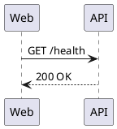

# Docs Examples Corpus

This markdown is the canonical top-layer docs parity source for `scripts/parity_harness.py`.

## Canonical Pages

- [Top-level corpus](README.md)
- [Sequence canonical examples](sequence/README.md)
- [Supported primitives matrix](supported_primitives.md)

## Linked Source Files

- [basic_hello.puml](basic_hello.puml) -> [basic_hello.svg](basic_hello.svg)
- [groups_notes.puml](groups_notes.puml) -> [groups_notes.svg](groups_notes.svg)
- [lifecycle_autonumber.puml](lifecycle_autonumber.puml) -> [lifecycle_autonumber.svg](lifecycle_autonumber.svg)
- [supported_primitives_participants_messages.puml](supported_primitives_participants_messages.puml) -> [supported_primitives_participants_messages.svg](supported_primitives_participants_messages.svg)
- [supported_primitives_lifecycle_structure.puml](supported_primitives_lifecycle_structure.puml) -> [supported_primitives_lifecycle_structure.svg](supported_primitives_lifecycle_structure.svg)
- [supported_primitives_styling_groups_notes.puml](supported_primitives_styling_groups_notes.puml) -> [supported_primitives_styling_groups_notes.svg](supported_primitives_styling_groups_notes.svg)
- [supported_primitives.md](supported_primitives.md)

## Inline Snippet

The harness also discovers fenced snippets and expects an artifact named `<markdown-stem>_snippet_<n>.svg`.

