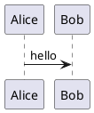
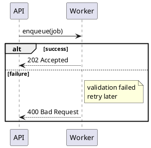
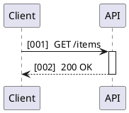

# Sequence Canonical Examples

Canonical sequence examples with committed source and rendered SVG artifacts.

## Basic Hello

Source: [basic_hello.puml](../basic_hello.puml)
Rendered: [basic_hello.svg](../basic_hello.svg)

## Groups Notes

Source: [groups_notes.puml](../groups_notes.puml)
Rendered: [groups_notes.svg](../groups_notes.svg)

## Lifecycle Autonumber

Source: [lifecycle_autonumber.puml](../lifecycle_autonumber.puml)
Rendered: [lifecycle_autonumber.svg](../lifecycle_autonumber.svg)

## Sequence Parity Slice

The renderer now covers this deterministic PlantUML-compatible vertical slice:
uncommon slanted/open/lost-found sequence arrows, Creole inline styling in
message/note/ref text, quoted rich autonumber formats such as
`autonumber 7 2 "<b>REQ-000</b>"`, multi-target `note over A, C` placement that
spans the participant range, and teoz-style parallel labels that reserve stable
space before the next message row.

Fixture: `tests/fixtures/e2e/sequence_parity_vertical_slice.puml`.
