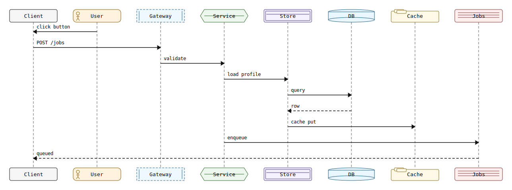
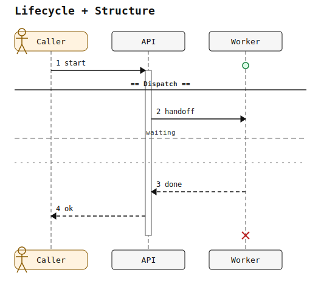
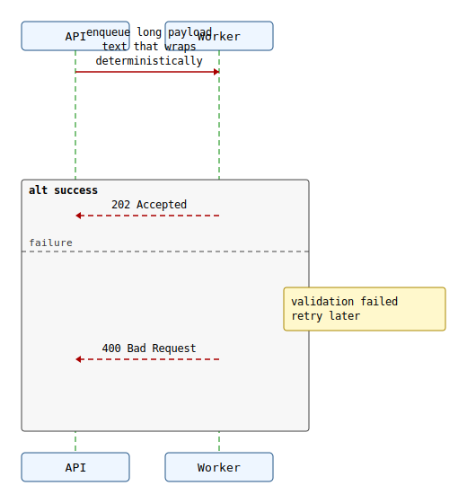

# Supported Sequence Primitives

This page is a docs-as-tests index for currently exercised sequence primitives.
Each example links source and rendered SVG artifacts committed in-repo.
These examples are coverage seeds for the currently exercised sequence subset,
not an exhaustive claim of full PlantUML sequence parity and not the canonical
support matrix. See
[`docs/internal/parity/plantuml_parity_source_of_truth.md`](../internal/parity/plantuml_parity_source_of_truth.md)
for canonical implemented/partial/missing status.

## Participants And Messages

Source: [supported_primitives_participants_messages.puml](supported_primitives_participants_messages.puml)
Rendered: [supported_primitives_participants_messages.svg](supported_primitives_participants_messages.svg)

## Lifecycle And Structure

Source: [supported_primitives_lifecycle_structure.puml](supported_primitives_lifecycle_structure.puml)
Rendered: [supported_primitives_lifecycle_structure.svg](supported_primitives_lifecycle_structure.svg)

## Styling, Groups, And Notes

Source: [supported_primitives_styling_groups_notes.puml](supported_primitives_styling_groups_notes.puml)
Rendered: [supported_primitives_styling_groups_notes.svg](supported_primitives_styling_groups_notes.svg)

