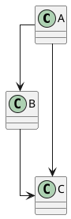

# Edge routing — the three modes

Status: implemented (Stage 2 of the renderer refactor, refs #1331).

PUML mirrors PlantUML's three global edge-routing modes, selected by
`skinparam linetype <value>`. The mode is per-diagram (not per-edge) and
applies to every Graphviz-style family — class, object, usecase,
component, deployment, ArchiMate, C4. Bespoke families (sequence,
activity new-syntax, state, timing, mindmap, WBS, salt) draw their own
geometry and are unaffected by this knob.

## The three modes

| Mode | `skinparam linetype` | Upstream Graphviz | Geometry we emit |
|---|---|---|---|
| **`Splines`** (default) | unset *or* `splines` | `splines=true` | `<path d="M … C …"/>` cubic Bézier curve smoothed through the routed waypoints |
| `Polyline` | `polyline` | `splines=polyline` | `<polyline points="…"/>` straight segments through the routed waypoints |
| `Ortho` | `ortho` | `splines=ortho` | `<polyline points="…"/>` right-angle elbows (the orthogonal channel-router's native output) |

All three modes share the **same waypoint set** computed by the
orthogonal channel router in `src/render/graph_layout/router.rs`. The
difference is purely in how those waypoints are rendered:

- **`Splines`** runs the waypoints through a centripetal Catmull-Rom-style
  cubic Bézier interpolation (tension `0.5`) — see
  `src/render/edge_smoothing.rs`. Endpoints are pinned exactly to the
  routed source/target ports so arrowheads still anchor cleanly. Three
  collinear waypoints degenerate to a straight Bézier (no wiggle).
- **`Polyline`** emits the integer waypoints as a `<polyline>` body
  unchanged.
- **`Ortho`** emits the same waypoints; visually identical to `Polyline`
  in our current router because the channel router already produces
  right-angle waypoints. The two modes diverge later if/when we add a
  diagonal-segment polyline variant (#TBD).

## How to switch

Accepted values (case-insensitive):

| Token | Mode |
|---|---|
| `splines`, `spline`, `curve`, `curved` | `Splines` |
| `polyline`, `poly`, `straight` | `Polyline` |
| `ortho`, `orthogonal` | `Ortho` |

Unknown values silently fall back to `Splines` (matches upstream
PlantUML's behavior: `getDotSplines()` defaults to `DotSplines.SPLINES`
when the value isn't one of the recognized tokens).

## Why we changed the default

PUML pre-Stage-2 produced orthogonal polylines for every edge — i.e.
the equivalent of `splines=ortho` was the only mode we shipped.
Upstream PlantUML's default is `splines=true`, which produces smooth
B-spline curves. Allie's reference screenshots in #1331 show the
upstream default (sweeping arcs for long feedback edges, near-straight
for short adjacent edges); the Stage 2 work makes that our default too.

This is a visual change for the entire Graphviz-routed corpus.
Baselines and snapshots blessed during Stage 2 reflect the new default.

## What's NOT in scope for Stage 2

- Per-edge routing classification (back-edge / cancellation / exception
  → smooth, everything else → ortho). Upstream PlantUML doesn't do
  this; the spline interpolator naturally produces big arcs for long
  edges and tight curves for short ones.
- Routing for bespoke families (sequence self-message D-shape, state
  self-transition, activity back-edge). Those have their own per-family
  arc emitters that don't go through `EdgeRouting`.
- Edge labels following the curved path. Labels still anchor on the
  underlying polyline midpoint or longest segment, which sits very
  close to the smoothed curve for typical waypoint patterns.

## Where the code lives

- `src/render/graph_layout/router/contract.rs` — `EdgeRouting` enum and
  `parse_linetype` value parser.
- `src/render/graph_layout/router.rs` — re-exports `EdgeRouting` to the
  rest of the renderer.
- `src/render/edge_smoothing.rs` — Catmull-Rom-style smoothing and the
  `edge_geometry_attr` dispatch helper.
- `src/model/family.rs` — `FamilyDocument::edge_routing` field carries
  the per-document mode.
- `src/normalize/family/extended.rs` and `src/normalize/family/stub.rs`
  — intercept `skinparam linetype` during family normalization.
- `src/render/family/class_relations.rs` and
  `src/render/family/box_grid_edges.rs` — consult the mode and dispatch
  emission.
- `tests/edge_routing_modes.rs` — end-to-end tests, one per mode plus
  case-insensitivity and unknown-value fallback.

## See also

- `docs/internal/architecture/edge-curve-research-2026-05-29.md` —
  research that motivated this design, with upstream Java references
  and the per-family verdict.
- #1331 — Stage 2 tracking issue.
- #590 — renderer architecture and layout epic.
