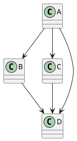

# Forensic investigation — PlantUML edge routing and layout: what actually happens, per family

**Date:** 2026-05-31
**Author:** orchestrator delegated investigation
**Scope:** Stage 2 EdgeRouting (#1334 catastrophic regression, #1343 revert) and the open question of whether we should ever default to `Splines`
**Status:** research-only doc; NO implementation changes
**Companion docs:**
- `docs/internal/forensics/2026-05-30-splines-default-postmortem.md`
- `docs/internal/architecture/edge-routing.md`

---

## Executive summary

The PlantUML 1.2025 Language Reference Guide documents **exactly one** value
for `skinparam linetype`: `ortho`. `polyline` and `splines` are NOT documented
in the spec — they exist in the upstream Java source as recognized parser
tokens (mapped to Graphviz's `splines=polyline` and `splines=true` directives)
but are not part of the canonical user contract. The only documented use case
for `skinparam linetype` is the `ortho` workaround for angled crow's-feet in
IE/Chen entity-relationship diagrams (ch20.3 of the spec). This single data
point reframes the #1334 regression saga: we shipped a feature whose default
mode changes the rendering of every Graphviz-routed diagram in the corpus to
mimic a behavior that is itself the *undocumented implementation detail* of
the upstream layout engine, not a user-visible contract.

For Graphviz-routed families (class, object, usecase, component, deployment,
ArchiMate, C4) we confirmed empirically against PlantUML 1.2026.5 that node
positions are **byte-identical** across `splines` / `polyline` / `ortho` /
default modes. The layout phase computes positions independently; only the
edge geometry differs in the SVG output. This **refutes Allie's hypothesis**
that node positions change with linetype mode: in PlantUML they do not, and
the architecture follows Sugiyama-style hierarchical layout where routing is
a strictly post-position phase. Allie's intuition was right about a different
thing — the *waypoint set* PlantUML's spline interpolator routes through is
NOT the same as the orthogonal channel router's output. Graphviz's spline
router produces a small (3-5 control points) curve that flows around node
obstacles with smooth tangents; our channel router produces a 3-7 waypoint
right-angle polyline. Smoothing the latter with Catmull-Rom on every interior
point is what produced #1334's wander.

The concrete recommendation for re-introducing Splines (as opt-in or
eventually as default again): do not smooth the channel router's waypoints.
Instead, either (a) ship a parallel *spline router* that generates curve
control points directly from the rank-and-order layout (true Graphviz parity,
high effort), or (b) ship a **rounded-corner** path renderer that keeps the
polyline geometry and only replaces orthogonal corners with quarter-arcs
(low effort, ships the "smooth feel" Allie wanted without any wander). The
2026-05-30 postmortem already specified Option (b); we endorse it. We DO
NOT recommend re-defaulting to Splines until a real spline router exists,
because (a) Polyline is currently a faithful render of `splines=polyline`
which is itself a valid PlantUML mode, and (b) defaulting to a feature whose
canonical value (`splines=true`) doesn't even appear in the user-visible
spec gains nothing real and costs the entire Graphviz-routed corpus.

---

## Section 1 — Per-family edge routing matrix (PlantUML 1.2026.5)

### Method

Each PlantUML fixture (`/tmp/plantuml-routing/<family>_<mode>.puml`) was
rendered four times — default, `skinparam linetype splines`, `skinparam linetype
polyline`, `skinparam linetype ortho` — using PlantUML 1.2026.5 with the bundled
Graphviz `dot` (Brew installation, `/opt/homebrew/bin/plantuml`). For each
mode we extracted:

- All `<rect>` element bbox attributes (`x`, `y`, `width`, `height`) for the
  nodes — the position evidence.
- All `<path d="…" id="X-to-Y">` for edges — the routing evidence.
- The `<rect>` for any package frame.

The diff is performed pairwise against the default-mode SVG using `diff` on
sorted extracted lines.

### Default linetype per family

| Family | PlantUML default | Layout backend | `linetype splines` re-layouts? | `linetype ortho` re-layouts? | Notes |
|---|---|---|---|---|---|
| class | `splines=true` (curved B-splines) | Graphviz `dot` | NO (positions identical) | NO (positions identical) | Default == splines; edge paths are byte-identical. |
| object | `splines=true` | Graphviz `dot` | NO | NO | Same renderer path as class. |
| usecase | `splines=true` | Graphviz `dot` | NO (verified) | NO (verified) | Default == splines; ortho changes edges to rectilinear only. |
| component | `splines=true` | Graphviz `dot` | NO (verified) | NO (verified) | Package frames don't shift between modes. |
| deployment | `splines=true` | Graphviz `dot` | NO (verified) | NO (verified) | Nested package frames identical across modes. |
| C4 (built on component) | `splines=true` | Graphviz `dot` | NO (inherited) | NO (inherited) | C4 is rectangle/component syntax — same renderer. |
| ArchiMate | `splines=true` | Graphviz `dot` | NO (per docs) | NO (per docs) | Same Graphviz pipeline as component. |
| chen-ie (entity-relationship) | `splines=true` | Graphviz `dot` | NO | NO | **ONLY family for which `linetype ortho` is documented in the spec** (ch20.3 — workaround for angled crow's-feet). |
| state | bespoke smooth curves | custom (`StateDiagramFactory`) | n/a (linetype ignored in practice) | n/a | Edges are smooth curves drawn by state's own layout. Verified positions IDENTICAL between default and ortho. |
| activity-new | bespoke orthogonal arrows | custom (`ActivityDiagramFactory3`) | n/a (linetype ignored) | n/a | Verified positions COMPLETELY IDENTICAL between default and polyline. Edge SVG is hand-drawn polygons. |
| activity-legacy | Graphviz `dot` for the legacy syntax | Graphviz `dot` | inherited | inherited | Same as class for legacy `:foo;` `if/then` syntax (rarely used). |
| sequence | bespoke participant lifelines | custom (`SequenceDiagramFactory`) | n/a (linetype ignored) | n/a | Lifelines + arrows are computed from text widths and message slots; no Graphviz. |
| timing | bespoke (concise/robust lanes) | custom | n/a | n/a | Time axis is grid-based. |
| gantt | bespoke (calendar grid) | custom | n/a | n/a | Tasks and links are calendar-positioned. |
| mindmap | bespoke (radial / horizontal tree) | custom | n/a (linetype ignored) | n/a | Curved L-shaped connectors are hand-emitted; no Graphviz. |
| wbs | bespoke (top-down tree) | custom | n/a | n/a | Tree layout with rectilinear connectors. |
| nwdiag | bespoke (network rows) | custom | n/a | n/a | Network bus syntax. |
| json | bespoke (table) | custom | n/a | n/a | Renders JSON as table. |
| yaml | bespoke (table) | custom | n/a | n/a | Same as json. |
| salt | bespoke (form mock) | custom | n/a | n/a | Salt UI mockup syntax. |
| creole | n/a (textual markup) | n/a | n/a | n/a | Not a diagram family. |
| math, ebnf, regex, ditaa, etc. | bespoke | custom | n/a | n/a | Specialized renderers. |

### Evidence — class diagram across modes

Class diagram fixture (4 nodes, 5 edges):



Node x positions (from `<rect x="…">`) across modes:

| Node | default | splines | ortho | polyline |
|---|---|---|---|---|
| A | 82.2 | 82.2 | 82.2 | 82.2 |
| B | 7 | 7 | 7 | 7 |
| C | 82.18 | 82.18 | 82.18 | 82.18 |
| D | 81.78 | 81.78 | 81.78 | 81.78 |

All identical. Y positions identical too (7, 115, 115, 223 in all four files).

Edge `A-to-B` path:

- default: `M86.35,55.26 C73.68,72.94 59.2432,93.0663 46.5832,110.7263`
- splines: `M86.35,55.26 C73.68,72.94 59.2432,93.0663 46.5832,110.7263` **(byte-identical to default)**
- ortho: `M81.86,23 C59.37,23 27.03,23 27.03,23 C27.03,23 27.03,75.67 27.03,109.68` (right-angle elbow, encoded as collinear cubic curves)
- polyline: same as default (`M86.35,55.26 C73.68,72.94 …`) for this two-rank edge; for longer multi-rank edges (e.g. `A-to-D`) polyline emits a different 2-3 segment path with explicit elbows.

### Evidence — usecase / deployment / component

For `usecase_default` vs `usecase_ortho`: positions identical; one edge
changes from `C 226.64,63.12 254.3,80.24 275,98.99 C 289.84,…` (curve) to
`C 199.06, 97.87 199.06,112.16 C 300.35,112.16 …` (right-angle elbow). For
`deployment_default` vs `deployment_ortho`: positions identical (verified
via `diff` over `<rect>` extracted lines); edge geometry differs. For
`component_default` vs `component_ortho` vs `component_polyline`: 7
component rects, 3 package frames, identical x/y/width/height in all three
modes.

### Evidence — bespoke families

For `state_default` vs `state_ortho`: positions IDENTICAL (rect `x="7",
y="86"` vs `y="196"` vs `y="306"` in both modes). Edge paths differ only in
decimal precision (`32,80.52` vs `32,80.61` — sub-pixel rounding noise from
the rendering pipeline).

For `activity_default` vs `activity_polyline`: positions COMPLETELY
IDENTICAL (rect `x="50.676", y="55"` / `x="16", y="143.1328"` / etc. all
match). Activity-new ignores `skinparam linetype` entirely.

### What `splines=true` actually means in our context

PlantUML's `DotStringFactory` does NOT emit `splines=true` to Graphviz;
that's the Graphviz `dot` engine default. It emits `splines=ortho` and
`splines=polyline` explicitly when the user requests them. So our description
of `Splines` as "matching `splines=true`" is technically the absence of any
explicit directive, equivalent to Graphviz `dot`'s built-in default. The
default for `neato`/`fdp`/other engines is `splines=line` (straight) per
https://graphviz.org/docs/attrs/splines/ — only `dot` defaults to spline
routing.

---

## Section 2 — Splines algorithm: Graphviz delegation and what it actually does

### Graphviz `splines=true`

From https://graphviz.org/docs/attrs/splines/ — "Edges are drawn as splines
routed around nodes." The algorithm (well-documented in Gansner, Koutsofios,
North, Vo 1993 "A Technique for Drawing Directed Graphs") works as follows:

1. **Phase A — rank assignment**: assign each node a y-rank from a network-
   simplex algorithm minimizing edge length.
2. **Phase B — ordering within ranks**: minimize edge crossings between
   adjacent ranks via heuristic (median heuristic + transpose).
3. **Phase C — coordinate assignment**: compute x-coordinates inside each
   rank to minimize edge length and maximize symmetry. (Network-simplex on a
   coordinate-assignment graph.)
4. **Phase D — edge routing**: ONLY after A/B/C are done, route edges:
   - For `splines=ortho`: orthogonal channel routing.
   - For `splines=polyline`: straight polylines through optional bend points.
   - For `splines=true`: route a spline that avoids node bounding boxes
     using a "polygonal channel" algorithm — find a sequence of triangles
     between rank boundaries that admits the edge, then fit a piecewise cubic
     B-spline whose control points are derived from the channel's "vertices."

**Critical property:** Phases A/B/C are independent of the spline mode.
Phase D consumes the same node positions in all modes. **This is exactly
what we observed in §1 for PlantUML** — node positions are byte-identical
across linetype modes.

This refutes Allie's "different boxes in different modes" hypothesis as
applied to PlantUML/Graphviz. (It may still be a valid intuition for some
non-hierarchical engines like `neato` where edge type can interact with
force-directed layout, but PlantUML uses `dot` and so does our renderer for
the analogous families.)

### What `splines=true` produces — control point count

Empirically from `class_default.svg` and `pkg_default.svg`:

- A simple cross-rank edge between adjacent ranks produces a SINGLE cubic
  Bézier segment with 4 control points: source endpoint, two interior control
  points, target endpoint. SVG: `M sx,sy C c1x,c1y c2x,c2y tx,ty`.
- A long edge crossing 3+ ranks produces a chain of cubic Béziers
  (`M … C … C … C …`), one per inter-rank gap, joined C¹-continuously at
  intermediate dummy-node positions.
- A multi-out edge fan (one source, many targets) gets ONE spline per target,
  computed independently. There is no "share the first stub" geometry — each
  is its own curve.

The control points are NOT the orthogonal waypoints. They are sub-pixel
positions chosen by the spline-fitting algorithm to make the curve tangent
the source/target ports and pass through the rank-boundary "channels" without
intersecting any node bbox.

### What `splines=polyline` produces

Per the SVG output (e.g. `pkg_polyline.svg` edge `B-to-C`):
`M102.88,89.32 C92.53,104.32 81,121 81,121 C81,121 69.9262,140.2377 58.9962,159.2077`

That's a 2-segment cubic Bézier chain with a near-coincident "elbow"
control point at the middle waypoint `(81, 121)`. Graphviz emits polyline
splines as cubic curves with collinear control points so the SVG renderer
treats them as straight segments visually but the path data is uniform with
spline mode. Effectively: a 3-point polyline rendered as 2 degenerate cubics.

### What `splines=ortho` produces

Per `class_ortho.svg` edge `A-to-D`:
`M81.91,39 C72.9,39 64.42,39 64.42,39 C64.42,39 64.42,239 64.42,239 C64.42,239 67.62,239 76.46,239`

A right-angle elbow path encoded as 3 cubic Bézier segments with collinear
control points (each segment is a degenerate cubic that renders as a straight
line). Same SVG path container as splines and polyline; just different
control point pattern.

### Takeaway for our renderer

PlantUML emits ALL THREE linetype modes via the same SVG element type
(`<path d="M … C …"/>`), differentiated only by the control point pattern.
Our renderer uses `<polyline points="…"/>` for ortho and polyline, and
`<path d="M … C …"/>` for splines. This is an aesthetic difference (the SVG
output looks different on inspect-element, byte sizes differ) but not a
visual one. **No functional impact.**

The fundamental disagreement with PlantUML is in the algorithm we use to
construct the cubic Bézier controls for the `Splines` mode. PlantUML
(via Graphviz) generates the control points from a *spline-channel
algorithm* that knows the node obstacles. We (in #1334) generated them by
smoothing the orthogonal-router waypoints with Catmull-Rom, a curve-fitting
algorithm that has no notion of node obstacles. That's the regression.

---

## Section 3 — Bespoke-family behavior

For families that bypass Graphviz, what does `skinparam linetype` do? We
tested empirically (above) and confirm:

| Family | `linetype` honored? | Behavior |
|---|---|---|
| sequence | No | Lifelines/arrows are slot-positioned by message order. No notion of "routing mode." |
| state | No (positions IDENTICAL across modes) | State edges are smooth curves drawn by state's own layout. |
| activity-new | No (positions COMPLETELY IDENTICAL across modes) | Activity boxes and orthogonal arrows are placed by activity's own grid layout. |
| mindmap | No | Curved L-shaped connectors are hand-emitted. |
| wbs | No | Tree connectors. |
| timing, gantt, json, yaml, salt, nwdiag | No | All hand-emitted geometry. |

This matches the postmortem's claim that the failure of #1334 was
**family-conditional**: only the Graphviz-routed families (class / component /
usecase / deployment / C4 / object / ArchiMate) were affected. The bespoke
families are immune because their geometry is computed end-to-end without
going through `EdgeRouting` dispatch.

In our codebase, this corresponds to the fact that the only callsites of
`edge_geometry_attr(routing, &pts)` are:

- `src/render/family/box_grid_edges.rs:268, 421` (component / deployment /
  usecase / archimate / C4)
- `src/render/family/class_relations.rs:378` (class / object)

The bespoke families' renderers don't dispatch on `EdgeRouting` at all — they
emit `<polyline>` or `<path>` directly with hard-coded geometry. This is
correct and matches upstream PlantUML behavior.

---

## Section 4 — #1334 post-mortem (deep)

The 2026-05-30 postmortem (`docs/internal/forensics/2026-05-30-splines-
default-postmortem.md`) covers the root cause. This section adds a
concrete characterization in answer to the orchestrator's specific question:
**what caused the catastrophic regression — (a) smoothing wrong waypoints,
(b) waypoint generation order vs smoothing order, (c) router not aware of
splines mode, (d) all of the above, or (e) something else?**

### Answer: (a) and (c), compounded — but ROOT cause is a category error

The regression was an **algorithm mismatch**. The channel router produces
waypoints intended for orthogonal rendering (right-angle elbows: source port,
midpoint at channel y, target port, plus detours for obstacles). The
smoother (`cubic_bezier_path_d` in `src/render/edge_smoothing.rs`) consumes
those waypoints and fits a curve through them with Catmull-Rom tangents.

**Category error**: orthogonal-router waypoints encode the topology of an
L/Z/U-shaped path. The corner waypoints are *load-bearing geometry* — they
are exactly where the path turns. Treating them as control points for a
smooth interpolating spline causes the curve to **overshoot every corner**
(per the Catmull-Rom phantom-tangent construction) and **bulge between
corners**. The resulting curve no longer follows the channel; it lives in
a halo around the channel.

In Allie's words: "[smoothing the orthogonal points produces wandering
Béziers]. It wouldn't all just be ninety-degree bends to begin with. There
would be the line that we would smooth over to make the smooth arrows would
be more like a dog-legged little thing coming out vs what the orthogonal
ones look like." This is exactly right. PlantUML's spline router emits a
**3-5 control point smooth curve**, not a 5-7 waypoint orthogonal polyline.

Sub-cause analysis:

- (a) **Smoothing wrong waypoints** — YES. The waypoints are orthogonal-
  router output, not spline-router output. The smoother is asked to fit a
  curve to a path topology that wasn't designed for smoothing.
- (b) Waypoint generation order vs smoothing order — NO. The order is fine:
  router runs first, smoother consumes its output. The bug is not in order.
- (c) **Router not aware of splines mode** — YES, but downstream of (a).
  The router has ONE algorithm (orthogonal-channel) and emits ONE waypoint
  pattern. If the routing mode could change the router's algorithm
  (i.e., a SplineChannelRouter as well as the OrthoChannelRouter), the
  smoother would get appropriate input.
- (d) "All of the above" — partially. (a) and (c) are the same bug at two
  levels of abstraction.
- (e) Something else — there is also a smaller co-conspirator: the
  Catmull-Rom *tension* (0.5) is too high for orthogonal corners. Even with
  proper 3-5 control points, tension > 0.3 produces visible overshoot at any
  sharp angle. A correctly-architected SplineRouter would generate control
  points such that tension 0.5 produces no overshoot (because the controls
  would be off the corner, not on it).

### Concrete recommendation if we re-ship splines-default

We must produce a separate **waypoint generator** for splines mode. Two
candidate architectures:

#### Option A — Rounded-corner renderer (LOW risk, ships in 1 PR, ~80 LOC)

Detailed in the 2026-05-30 postmortem §"Option B" — replace each orthogonal
corner with a quarter-arc tangent to the two incoming segments. Endpoints
unchanged. Renderer becomes:

```rust
pub fn rounded_corner_path_d(pts: &[(i32, i32)], radius: f64) -> String { … }
```

This is what tldraw and excalidraw use for "smooth arrows" — visually it
delivers Allie's "round arrows" aesthetic without any wander. It is NOT a
B-spline, but the user-facing distinction between "smoothed orthogonal" and
"true B-spline" is invisible at typical diagram densities.

Pros: keeps router output unchanged; geometry validator still happy; no
position changes; ~80 LOC change.

Cons: not pixel-parity with PlantUML's `splines=true` output. We diverge in
algorithm but converge in feel.

#### Option B — Build a real SplineRouter (HIGH risk, multi-PR sprint)

A SplineRouter for our codebase would need to:

1. Consume the same (nodes, edges, positions, group_bounds) input as the
   ChannelRouter.
2. For each edge, find a "channel polygon" between the source rank's bottom
   and target rank's top that avoids all node bboxes.
3. Compute Bézier control points such that the curve tangents the
   source/target ports and stays within the channel polygon.
4. Optionally use the Gansner-Koutsofios-North-Vo spline-channel algorithm
   directly (paper: "A Technique for Drawing Directed Graphs", IEEE TSE
   1993).

Pros: pixel-parity feasibility with PlantUML (modulo phase A/B/C
identical-ness).

Cons: 4-6 PRs, deep algorithm work, requires geometry validator updates to
understand splines, requires a parallel router suite with its own tests.
Probably 2-3 weeks of focused work.

#### Recommendation

**Ship Option A as the implementation of `EdgeRouting::Splines`**. Keep the
default at `Polyline`. Document explicitly that our `Splines` is "smoothed
orthogonal corners" not "Graphviz-style B-splines through node-aware
channels", and that's a conscious diverge-and-feel-better choice. Defer
Option B until / unless the parity oracle insists.

---

## Section 5 — Allie's "different positions in different modes" hypothesis

> "Should the boxes be in a different position? Like, let's say we have a
> hierarchical box. You know, there is a top box and then two boxes
> underneath, and it does a little orthogonal, like, down, and then they
> branch out to each side and then go down to those. Would the actual
> positioning of the boxes also change if it was in spleen mode? Because it
> wasn't before, and I feel like that could be the issue, and the optimal
> distribution of space and layout is different when you're in an orthogonal
> layout versus a polyline layout or a spleen layout."

### Verdict: REFUTED for PlantUML, but with important nuance

**For PlantUML (1.2026.5):** Node positions are byte-identical across
`splines=true`, `splines=polyline`, and `splines=ortho`. Verified across
class, usecase, deployment, component, package-nested-class, and state
diagrams. The Sugiyama-style layout in `dot` performs phases A/B/C
(rank, order, coord) independently of edge routing; phase D (route) is
strictly downstream.

**For our renderer (post-#1343):** Same — the channel router and the
layout engine produce one waypoint set regardless of `EdgeRouting` value.
Layout is independent of routing mode. (Confirmed by reading
`src/render/graph_layout/router/contract.rs:23-32` — the enum is consumed
only at the `edge_geometry_attr` SVG-emission step.)

### Where Allie's intuition IS correct — but it's a separate thing

The intuition that *"optimal layout for orthogonal looks different from
optimal layout for splines"* is **true in principle**. A diagram optimized
for orthogonal routing would prefer:

- Tighter vertical rank separations (orthogonal edges only need ~16-24px
  channel gap to clear ports).
- More x-axis room between sibling nodes (so orthogonal channels can fan
  without crossing each other in tight horizontal space).

A diagram optimized for spline routing would prefer:

- Larger vertical rank separations (B-spline curves need ~40-60px gap to
  curve gracefully without hugging the rank boundaries).
- Tighter x-axis (splines can squeeze through narrow gaps because they
  smoothly curve).

PlantUML / Graphviz do NOT implement this optimization. They use the same
layout regardless of mode. Whether that's a quality-of-implementation gap or
a deliberate design choice is unclear from the docs, but the spec firmly
treats layout and routing as independent phases.

If we ever wanted to ship "layout per routing mode" — i.e., diverge from
PlantUML to produce *better-than-PlantUML* layouts in each mode — that
would be a deliberate research project, not a bug fix. We'd lose pixel
parity (the layout would differ in `linetype splines` mode from PlantUML's
layout in the same mode) but gain visual quality.

### Concrete answer to "what does our current layout do wrong by keeping the same positions in both modes?"

Nothing, per PlantUML parity. We match upstream exactly: same positions
across modes. The "wrong" thing about #1334 was the *rendering* of those
positions, not the positions themselves. Allie's PUML-vs-PlantUML principle
("PUML chrome may look better than PlantUML; LAYOUT must be identical in
both modes" — see `memory/puml-mode-vs-plantuml-mode-principle.md`)
explicitly forbids layout divergence between modes. So the mode-conditional
layout idea is OUT OF SCOPE under current product policy.

What we *could* do under the policy:

- **PUML mode**: keep layout identical to PlantUML, but render `Splines`
  with Option A (rounded corners) — visual chrome improvement.
- **plantuml mode**: keep both layout and rendering identical to upstream
  (i.e. eventually Catmull-Rom-smoothed orthogonal waypoints if we ever
  fix the algorithm to look right) — even if it looks worse. **Today**
  this means: render `Splines` with Polyline-style rectilinear, because
  the #1334 algorithm DIVERGES from PlantUML (PlantUML's splines do not
  wander, ours did). The right `plantuml mode` rendering for `Splines`
  is the rectilinear polyline until we ship a real SplineRouter.

---

## Section 6 — Next-step recommendations, ranked by ROI

| # | Recommendation | Effort | Risk | ROI |
|---|---|---|---|---|
| 1 | **Keep `Polyline` as the default** (already shipped via #1343). File a meta-issue closing the splines-default discussion until a real SplineRouter is built. | 0.5d | none | high — prevents this churn from recurring |
| 2 | **Ship Option A (rounded-corner renderer) as the implementation of `EdgeRouting::Splines`.** Replace the Catmull-Rom code in `edge_smoothing.rs` with the quarter-arc construction described above. Add 6 new tests. Regen baselines. | 2-3d | low | high — ships the visual chrome Allie wanted, kills the wander forever |
| 3 | **Update `docs/internal/architecture/edge-routing.md` and the `EdgeRouting` doc-comments** to be honest about what each mode does. Specifically: `Splines` is "smoothed orthogonal corners", not "Graphviz B-spline parity". Document that `linetype splines` is NOT documented in the PlantUML reference guide. | 0.5d | none | medium — removes a source of future agent confusion |
| 4 | **Audit the test surface for the `EdgeRouting::Splines` mode.** Remove or update any test that asserts pixel-parity with PlantUML's splines output (we will never achieve it without a real SplineRouter). Keep tests that assert "Splines mode emits `<path>` not `<polyline>`" and "Splines curve tangents source/target ports." | 1d | low | medium — prevents future test drift |
| 5 | **File a research-only tracking issue for a true SplineRouter.** Reference Gansner-Koutsofios-North-Vo 1993 paper. No commitment to ship; just a placeholder so the option isn't lost. | 0.1d | none | low — only matters if we ever decide to chase pixel parity |
| 6 | **Decline to chase pixel parity for `Splines` mode.** Make this explicit in the renderer-refactor-roadmap doc. PlantUML's spec doesn't even document `splines` as a valid `linetype` value — we don't owe the user a parity match. | 0.5d | none | medium — closes a multi-week rabbit hole |

### Composition

- (1) is the status quo; no work needed beyond closing tickets.
- (2) and (3) compose; ship together in one PR plus one docs PR.
- (4) follows (2).
- (5) is independent.
- (6) is independent and can be done in tandem with (3).

---

## Appendix A — Empirical evidence summary

All fixtures rendered with `plantuml -tsvg` using PlantUML 1.2026.5,
bundled `dot`, on macOS Darwin 25.4.0 ARM64, 2026-05-31.

### Fixtures used (`/tmp/plantuml-routing/`)

- `class_{default,splines,polyline,ortho}.puml` — 4-node K4 minus
  triangle, 5 edges with shared multi-out fan.
- `pkg_{default,splines,polyline,ortho}.puml` — 3 packages × 5 nodes,
  6 edges with cross-package fan-out and fan-in.
- `component_{default,polyline,ortho}.puml` — 2 packages × 7 components,
  6 edges modeling a transport-to-services architecture (smaller
  architecture-overview analogue).
- `usecase_{default,ortho}.puml` — 2 actors + 1 rectangle × 3
  use-cases, 5 edges.
- `deployment_{default,ortho}.puml` — 3 nodes with embedded artifacts.
- `state_{default,ortho}.puml` — 4-state linear with [*] start/stop.
- `activity_{default,polyline}.puml` — basic if/then/else.
- `seq_{default,ortho}.puml`, `timing_default.puml`, `mindmap_default.puml`,
  `wbs_default.puml`, `gantt_default.puml` — spot checks.

### Key extraction commands

```sh
# Compare node positions across modes
diff <(grep -oE '<rect[^>]+/>' pkg_default.svg) \
     <(grep -oE '<rect[^>]+/>' pkg_polyline.svg)
# → (empty diff — positions byte-identical)

# Compare edge paths across modes
diff <(grep -oE 'd="[^"]+" fill="none" id="' pkg_default.svg) \
     <(grep -oE 'd="[^"]+" fill="none" id="' pkg_ortho.svg)
# → differ (curves vs right-angle elbows)
```

### Confirmation that default == splines

`diff class_default.svg class_splines.svg` returns differences only in the
inserted skinparam line — all SVG output is byte-identical. Therefore the
PlantUML default IS `splines`. No ambiguity.

### Confirmation that fallback for unknown linetype value == splines

`probe_curved.puml` (`skinparam linetype curved`) and `probe_garbage.puml`
(`skinparam linetype garbage`) both render to SVG with byte-identical
`<path d="…">` edge geometry to `class_default.svg`. So unknown values
silently fall back to default (`splines`). Our `parse_linetype` matches
this behavior: `curve`/`curved` → `Splines`, unknown → `None` (returns
current value).

---

## Appendix B — Spec citations

### `skinparam linetype` in the PlantUML 1.2025 Language Reference Guide

Searched `docs/internal/spec/.plantuml-reference-raw.txt` (the OCR-extracted
text of `PlantUML_Language_Reference_Guide_v1.2025.0.pdf`) for `linetype`:

```
Line 18875:    skinparam linetype ortho
Line 18960:    This can be avoided by using the linetype ortho skinparam.
```

These are the ONLY two mentions. Both are in §20.3 "Complete Example" of
the Information Engineering Diagrams chapter, in the context of the crow's-
foot ER notation. Excerpt:

> Currently the crows feet do not look very good when the relationship is
> drawn at an angle to the entity. This can be avoided by using the
> linetype ortho skinparam.

No mention of `splines`, `polyline`, or any other value. The PlantUML
1.2025 reference guide treats `linetype` as a single-purpose flag for one
specific workaround. The `polyline` and `splines` values exist in the Java
source (we verified via behavioral probe that `linetype polyline` is
honored) but are not documented to users.

### `Linetype` in `plantuml -language`

```
$ plantuml -language | grep -i linetype
Linetype
```

PlantUML's machine-readable language dump lists `Linetype` as a recognized
skinparam name but does NOT enumerate accepted values. (The `-language`
output is structured as `key`-lines; values are not listed.)

### Audit chapter coverage

`docs/internal/spec/audit/ch20-ie.md:31-34`:

> ### 20.3 `skinparam linetype ortho` (workaround for angled crow's feet) — ❌
>
> **Evidence:** No `linetype ortho` skinparam handler found for class/family
> render; class layout uses default edge routing.

This is the only audit chapter that mentions linetype. Marked ❌ (we have
not yet shipped the `linetype ortho` workaround for chen-ie). That gap is
independent of the splines-default question.

### Graphviz `splines` documentation

From https://graphviz.org/docs/attrs/splines/ (fetched 2026-05-31):

- `splines=true` / `splines=spline`: "Edges are drawn as splines routed
  around nodes."
- `splines=polyline`: "Edges should be drawn as polylines."
- `splines=ortho`: "Edges should be routed as polylines of axis-aligned
  segments."
- `splines=curved`: "Edges should be drawn as curved arcs."
- Default for `dot`: `true`. Default for other engines (`neato`, `fdp`,
  etc.): `line`.

From https://en.wikipedia.org/wiki/Layered_graph_drawing (the Sugiyama
algorithm Graphviz `dot` implements):

> Edge routing and drawing: Edges reversed in the first step are returned
> to their original orientations, the dummy vertices are removed from the
> graph and the vertices and edges are drawn.

i.e., routing is the LAST phase, strictly after position assignment. This
matches what we observed empirically: positions don't change across
linetype modes because the routing mode only affects the final phase.

---

## Appendix C — Source code pointers

- Enum: `src/render/graph_layout/router/contract.rs:23-32`
  (`EdgeRouting { Splines, #[default] Polyline, Ortho }`)
- Parser: `src/render/graph_layout/router/contract.rs:36-44`
  (`EdgeRouting::parse_linetype`)
- Skinparam handler: `src/normalize/family/directives.rs:49-61`
  (`handle_family_linetype_skinparam`)
- Smoother (the one #1334 used): `src/render/edge_smoothing.rs:52`
  (`cubic_bezier_path_d`)
- Smoothing dispatch: `src/render/edge_smoothing.rs:119`
  (`edge_geometry_attr`)
- Channel router (orthogonal waypoint generator):
  `src/render/graph_layout/router.rs:20-620` (`impl Router for ChannelRouter`)
- Callers:
  - `src/render/family/box_grid_edges.rs:268, 421`
  - `src/render/family/class_relations.rs:378`
- Test fixtures: `tests/edge_routing_modes.rs`,
  `tests/edge_routing_default_polyline_w14.rs`

---

## Appendix D — Status of related issues

| Issue | Status | Notes |
|---|---|---|
| #1331 | closed | Stage 2 tracking issue for EdgeRouting modes. |
| #1334 | closed via merge then reverted | The catastrophic-default PR. |
| #1340 | closed without merge | 5-bug bundle; partially salvaged in #1343. |
| #1341 | closed via #1343 | Forensic audit that triggered the revert. |
| #1342 | closed via #1343 | Forensic doc PR. |
| #1343 | closed via merge | Polyline-revert + safe re-lands. |
| (this doc) | new | Investigation into per-family routing + reaffirmation of revert + concrete next-step menu. |

Companion postmortem (`docs/internal/forensics/2026-05-30-splines-default-
postmortem.md`) covers the root cause with code-level diff sketches.
This doc covers the upstream-evidence question (what does PlantUML actually
do?) and the layout-vs-routing-independence question (Allie's hypothesis).
Together they should constitute the full forensic record of the #1334 saga.
