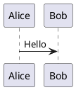

# Quickstart: your first diagram in 5 minutes

This guide walks you from zero to a rendered, embedded diagram. No Java. No Node. One
binary.

---

## Prerequisites

- `puml` installed — see [install.md](install.md) if you haven't done that yet.
- A terminal and a text editor.

Verify your install:

```bash
puml --version
```

---

## Step 1: Write a sequence diagram

Create a file called `hello.puml`:

```bash
cat > hello.puml <<'EOF'
@startuml
title Hello from puml

Alice -> Bob: Hello
Bob --> Alice: Ack

note right of Bob
  This is a note.
end note
@enduml
EOF
```

Or open it in your editor and paste this content. The `@startuml` / `@enduml` markers
are required — they delimit the diagram block.

---

## Step 2: Render to SVG

```bash
puml hello.puml
```

This writes `hello.svg` next to the source file. Open it in any browser or SVG viewer:

```bash
# Linux
xdg-open hello.svg

# macOS
open hello.svg

# Or just drag it into a browser tab
```

SVG is the default format because it's vector (scales to any size), text-based (diffs
cleanly in git), and renders inline in GitHub Markdown and most static site generators.

### Output to a specific file

```bash
puml hello.puml -o /tmp/my-diagram.svg
```

Use `-o -` to write to stdout (useful for piping into another tool):

```bash
puml hello.puml -o - | rsvg-convert --format pdf > hello.pdf
```

For PlantUML-compatible stdin/stdout rendering, use `--pipe`:

```bash
cat hello.puml | puml --pipe > hello.svg
```

To inspect include and macro expansion without rendering, use `--preproc`:

```bash
puml --preproc hello.puml
```

---

## Step 3: Render to PNG

```bash
puml --format png hello.puml
```

Writes `hello.png` at 96 DPI by default. For high-DPI screens (retina, 4K):

```bash
puml --format png --dpi 192 hello.puml
```

Other raster formats:

```bash
puml --format jpg hello.puml    # JPEG
puml --format webp hello.puml   # WebP
```

---

## Step 4: Embed in Markdown

Drop the rendered SVG into any Markdown file:

```markdown
## System architecture


```

GitHub renders SVG inline in Markdown. Commit both `hello.puml` and `hello.svg` to
your repo — reviewers see the diagram rendered in the PR diff view, and the source
`.puml` file is what you edit.

For HTML output (self-contained, embeddable anywhere):

```bash
puml --format html hello.puml
# → hello.html, SVG embedded inline, no external dependencies
```

---

## Step 5: Validate without rendering

Use `--check` to lint a diagram without writing any output:

```bash
puml --check hello.puml
```

Exit code 0 = valid. Exit code 1 = parse or validation error, with a diagnostic on
stderr. This is the mode to use in CI and pre-commit hooks.

Check all diagrams in a directory at once:

```bash
find . -name '*.puml' | xargs puml --check
```

---

## A richer example: class diagram

```bash
cat > library.puml <<'EOF'
@startuml
title Library system

class Book {
  +String title
  +String author
  +String isbn
  +borrow(patron: Patron): Receipt
}

class Patron {
  +String name
  +String cardNumber
  +List<Book> borrowed
}

class Receipt {
  +Date dueDate
  +Book book
  +Patron patron
}

Book "1" <-- "many" Receipt
Patron "1" <-- "many" Receipt
@enduml
EOF

puml library.puml
```

---

## A richer example: activity diagram

```bash
cat > checkout.puml <<'EOF'
@startuml
title Book checkout flow

start
:Scan library card;
if (Card valid?) then (yes)
  :Scan book barcode;
  if (Book available?) then (yes)
    :Issue receipt;
    :Update inventory;
    stop
  else (no)
    :Offer hold;
  endif
else (no)
  :Alert: invalid card;
endif
stop
@enduml
EOF

puml checkout.puml
```

---

## Using the VS Code extension

If you installed the VS Code extension from `extensions/vscode/`:

1. Open any `.puml` file.
2. A preview panel opens automatically (or press `Ctrl+Shift+P` → "puml: Preview").
3. Edits to the source update the preview live.
4. Hover over any keyword for documentation.
5. The status bar shows diagnostic counts; click to see errors in the Problems panel.

---

## Using the browser editor

The live browser editor runs entirely client-side via WebAssembly — no install needed,
no server calls.

Visit: [alliecatowo.github.io/puml/editor](https://alliecatowo.github.io/puml/editor)

Paste any PlantUML or PicoUML source into the left pane. The diagram renders in the
right pane as you type. Use the format selector to download SVG or PNG directly.

---

## Lint diagrams embedded in Markdown

If you write diagrams inside Markdown files using fenced code blocks:

````markdown

````

You can validate them without extracting to separate files:

```bash
puml --from-markdown --check notes.md
```

---

## Pipeline inspection (advanced)

`puml` can dump its internal representations for debugging or tooling integration:

```bash
puml --dump ast hello.puml     # span-annotated parse tree (JSON)
puml --dump model hello.puml   # normalized diagram model (JSON)
puml --dump scene hello.puml   # render scene graph (JSON)
```

These are useful for understanding how a diagram is parsed, for writing tests, or for
building integrations on top of `puml`.

---

## What's next

- [install.md](install.md) — other install methods (Docker, pre-built binaries, npm)
- [CI integration](ci-integration.md) — GitHub Actions, GitLab CI, pre-commit hooks
- [comparison.md](comparison.md) — how puml compares to PlantUML and Mermaid
- [FAQ](faq.md) — common questions
- [Examples gallery](examples/GALLERY.md) — what renders today across all families
- [CLI reference](https://alliecatowo.github.io/puml/guide/cli/) — all flags and options
