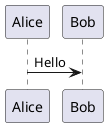

# Quickstart

This page gets you from an empty directory to a rendered diagram, a CI check, and a
Markdown embed. It assumes `puml` is installed; see [install.md](install.md) first if
`puml --version` does not work.

```bash
puml --version
```

---

## 1. Write a diagram

Create `hello.puml`:

```bash
cat > hello.puml <<'EOF_DIAGRAM'
@startuml
title First puml diagram

Alice -> Bob: Hello
Bob --> Alice: Ack

note right of Bob
  Rendered locally by puml.
end note
@enduml
EOF_DIAGRAM
```

`@startuml` and `@enduml` delimit the diagram block. The default dialect is `auto`, so
PlantUML-compatible files, PicoUML files, supported Mermaid fences, and Markdown fence
labels can select the frontend automatically.

---

## 2. Render SVG

```bash
puml hello.puml
```

By default, `puml` writes `hello.svg` next to `hello.puml`. SVG is the best default for
documentation because it is vector, deterministic, easy to diff, and renders inline in
most Markdown and static-site workflows.

To choose the output path:

```bash
puml hello.puml -o diagrams/login.svg
```

To write SVG to stdout:

```bash
puml hello.puml -o - > hello.svg
```

For PlantUML-compatible stdin-to-stdout mode, use `--pipe`:

```bash
cat hello.puml | puml --pipe > hello.svg
```

`--pipe` does not accept a positional input file or `-o`; it always reads stdin and
writes stdout.

---

## 3. Render other formats

```bash
puml --format png hello.puml     # writes hello.png
puml --format jpg hello.puml     # writes hello.jpg
puml --format webp hello.puml    # writes hello.webp
puml --format pdf hello.puml     # writes hello.pdf
puml --format html hello.puml    # writes hello.html
puml --format txt hello.puml     # writes hello.txt
puml --format utxt hello.puml    # writes hello.utxt
```

PNG defaults to 96 DPI. Increase it for high-DPI screenshots or docs uploads:

```bash
puml --format png --dpi 192 hello.puml
```

HTML output is self-contained and embeds the SVG inline.

---

## 4. Validate without writing files

Use `--check` when you only want parsing and normalization:

```bash
puml --check hello.puml
```

Exit code `0` means the diagram is valid. Exit code `1` means `puml` found a syntax or
semantic diagnostic. Exit code `2` is an I/O problem, and exit code `3` means an internal
error that should be reported.

Check many files at once:

```bash
find . -name '*.puml' -not -path './target/*' -exec puml --check {} +
```

You can also use explicit lint inputs and globs:

```bash
puml --check --lint-input docs/architecture.puml
puml --check --lint-glob 'docs/**/*.puml' --lint-report json
```

---

## 5. Embed in Markdown

Render the SVG and reference it from Markdown:

```markdown
## Login flow


```

Commit both files:

```bash
git add hello.puml hello.svg
```

The `.puml` source is what humans edit. The SVG is the reviewable artifact that GitHub
and most static sites can display without running a renderer.

---

## 6. Check Markdown fences

If your diagrams live inside Markdown, use fenced blocks:

````markdown

````

Validate every supported diagram fence in a Markdown file:

```bash
puml --from-markdown --check README.md
```

Supported fence labels include `puml`, `plantuml`, `uml`, `picouml`, and selected
Mermaid labels.

---

## 7. Use includes safely

Local file includes work for file inputs. For stdin input, tell `puml` where includes
should resolve from:

```bash
cat hello.puml | puml --include-root . -o - > hello.svg
```

URL includes are disabled by default so a render does not unexpectedly read the network
or local `file://` URLs. Opt in only when your workflow needs it:

```bash
puml --allow-url-includes diagram-with-remote-include.puml
```

---

## 8. Inspect what puml sees

These commands are useful when a diagram does not render the way you expect:

```bash
puml --dump ast hello.puml
puml --dump model hello.puml
puml --dump scene hello.puml
puml stats hello.puml
puml stats --format json hello.puml
puml count --by-kind hello.puml
```

For CI and support reports, capture environment information:

```bash
puml env
puml env --format json
```

---

## Next steps

- [CI integration](ci-integration.md) for GitHub Actions, GitLab CI, and pre-commit.
- [Comparison](comparison.md) for PlantUML and Mermaid tradeoffs.
- [FAQ](faq.md) for compatibility, PDF, includes, and bug reports.
- [Examples gallery](examples/GALLERY.md) for the current rendered corpus.
- [CLI reference](https://alliecatowo.github.io/puml/guide/cli/) for the full flag list.
