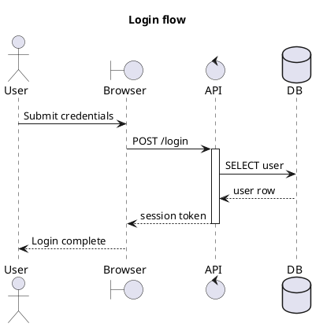

# `puml-agent-pack` Codex / Claude Plugin + MCP Specification

Make agents write correct sequence diagrams by giving them the same compiler, language server, renderer, and repair loop humans use.

This is the agent ecosystem layer for `puml`: Codex plugin, Claude Code plugin, Agent Skill package, MCP server, LSP bundle, diagram authoring skill, diagram review skill, and deterministic tools for parse/render/export.

## Product position

Agents are bad at diagrams when diagrams are treated as prose. They become good when diagrams are treated as source code with a compiler.

`puml-agent-pack` gives agents a strict workflow:

```text
understand request
  -> draft puml source
  -> check with compiler
  -> repair diagnostics
  -> render SVG
  -> inspect output metadata
  -> deliver source + artifact
```

No freehand SVG. No imaginary syntax. No “looks right” without parsing. No final answer containing invalid `puml`.

## Non-negotiables

- Works for Codex.
- Works for Claude Code.
- Ships skills/instructions.
- Ships MCP tools.
- Bundles or configures `puml-lsp` where the host supports LSP plugins.
- Uses the real `puml` compiler and renderer.
- No duplicate parser in prompt text.
- No arbitrary shell execution.
- No remote fetch by default.
- No remote includes.
- No silent file writes.
- No path traversal outside approved workspace roots.
- No generated diagram is considered final until `puml_check` passes.
- 90% coverage for MCP server/tooling code.
- Eval suite covers every supported primitive.

## Architecture religion

Use a deterministic agent-tool architecture.

The architecture is:

```text
Skill instructions
  -> agent reasoning
  -> MCP tool call
  -> puml-core / puml CLI / puml-lsp
  -> structured diagnostics/artifacts
  -> agent repair loop
```

Rules:

- Skills teach workflow and taste.
- MCP tools execute deterministic operations.
- LSP supplies live diagnostics and code intelligence while the agent edits files.
- The compiler is the authority.
- The renderer is the authority for artifacts.
- The agent never claims a diagram is valid unless the tool says it is valid.
- The agent never edits raw SVG to “fix” a diagram.
- The agent edits `.puml` source and re-renders.
- The plugin is an adapter layer, not a source of truth.
- The same skill content should work across Codex and Claude where host formats allow it.
- Host-specific manifests are thin wrappers around shared skills, binaries, and configs.

## Package layout

One source tree ships both host integrations:

```text
agent-pack/
  README.md
  LICENSE
  CHANGELOG.md

  .codex-plugin/
    plugin.json

  .claude-plugin/
    plugin.json

  skills/
    puml-sequence-author/
      SKILL.md
      references/
        syntax.md
        style.md
        examples.md
        repair-loop.md
      scripts/
        validate-output.sh

    puml-sequence-reviewer/
      SKILL.md
      references/
        review-rubric.md
        common-failures.md

    puml-docs-integrator/
      SKILL.md
      references/
        markdown-embedding.md
        mdbook.md
        ci.md

  agents/
    puml-diagram-designer.md
    puml-diagram-reviewer.md

  prompts/
    write-sequence-diagram.md
    review-sequence-diagram.md
    convert-to-puml.md
    explain-sequence-diagram.md

  .mcp.json
  .lsp.json

  bin/
    puml
    puml-lsp
    puml-mcp

  assets/
    icon.png
    logo.png
    screenshot-authoring.png
    screenshot-preview.png

  tests/
    fixtures/
    evals/
    mcp-transcripts/
    snapshots/
```

Only host manifest files live inside `.codex-plugin/` and `.claude-plugin/`. Skills, MCP config, LSP config, agents, assets, and binaries live at plugin root.

## Codex plugin

Codex manifest:

```text
.codex-plugin/plugin.json
```

Required behavior:

- identifies package as `puml-agent-pack`
- exposes shared `skills/`
- exposes `.mcp.json`
- exposes assets
- includes install-surface metadata
- includes default prompts for common workflows
- does not require hooks for core functionality

Required default prompts:

- “Create a sequence diagram for this flow and render it with puml.”
- “Review this `.puml` diagram for correctness and clarity.”
- “Convert this prose/API flow into a puml sequence diagram.”
- “Add a puml diagram to this README and verify it renders.”
- “Find sequence diagrams in this repo and render them.”

Codex plugin behavior:

- Agent skill handles authoring and repair loop.
- MCP server provides parse/check/render/export tools.
- The plugin must work in CLI, IDE extension, and app surfaces where supported by Codex.
- If the host exposes plugin marketplace metadata, the plugin appears as “puml Diagrams”.

## Claude Code plugin

Claude plugin manifest:

```text
.claude-plugin/plugin.json
```

Required behavior:

- exposes shared `skills/`
- exposes shared `agents/`
- exposes `.mcp.json`
- exposes `.lsp.json`
- exposes binaries through `bin/` where supported
- uses plugin-root path variables, not absolute developer-machine paths

Claude plugin behavior:

- `/puml-sequence-author` writes and repairs diagrams.
- `/puml-sequence-reviewer` critiques syntax, layout, naming, and communication quality.
- `puml-diagram-designer` subagent can be invoked for larger diagram tasks.
- `puml-lsp` provides diagnostics while Claude edits `.puml` files.
- `puml-mcp` exposes deterministic tools.

## Skills

### `puml-sequence-author`

Purpose:

Write valid, readable, native `puml` sequence diagrams from prose, code, docs, logs, tests, API specs, architecture notes, and existing broken diagrams.

Hard instructions:

- Always produce `.puml` source first.
- Always run `puml_check` before finalizing when tools are available.
- Always repair diagnostics before finalizing.
- Prefer aliases for long participant names.
- Use explicit participant declarations for non-trivial diagrams.
- Use participant kinds when semantically useful.
- Use notes for context, not for hiding unclear flow.
- Use groups for branching/repetition/concurrency.
- Use lifecycle only when it clarifies control flow.
- Keep message labels short and verb-driven.
- Do not use unsupported PlantUML features.
- Do not emit class/activity/state diagrams.
- Do not emit raw SVG unless asked for the rendered artifact.

Skill workflow:

```text
1. Identify participants.
2. Choose aliases.
3. Determine main flow.
4. Add messages.
5. Add groups/notes/lifecycle only where they clarify.
6. Render/check.
7. Repair diagnostics.
8. Simplify labels.
9. Deliver source and artifact path/SVG if requested.
```

### `puml-sequence-reviewer`

Purpose:

Review existing `.puml` diagrams for correctness, compatibility, readability, layout risk, and maintainability.

Review categories:

- syntax validity
- semantic validity
- participant naming
- alias clarity
- message direction
- group correctness
- lifecycle correctness
- note placement
- overuse of notes
- unsupported syntax
- renderability
- export readiness
- docs embedding readiness

Output format:

```text
Verdict: pass / needs changes / invalid
Blocking issues:
Recommended improvements:
Rendered artifact:
Suggested patch:
```

### `puml-docs-integrator`

Purpose:

Insert rendered diagrams into documentation systems.

Supported targets:

- README Markdown
- mdBook
- MkDocs
- Docusaurus
- plain HTML
- CI-generated artifacts

Rules:

- Keep `.puml` source checked in.
- Put generated SVG in a predictable artifact path.
- Prefer relative links.
- Add render command to docs/CI when appropriate.
- Never inline huge SVG unless requested.

## MCP server

Binary:

```text
puml-mcp
```

Transports:

- stdio required
- streamable HTTP optional only after stdio is complete and tested

The MCP server exposes tools, resources, and prompts.

### MCP security rules

- Validate every input against schema.
- Canonicalize paths.
- Deny path traversal.
- Default allowed root is current project root.
- File writes require explicit `write: true` and target path.
- Tools that write files return a preview/diff when possible.
- No shell interpolation.
- No arbitrary command execution.
- No network.
- No remote include resolution.
- Tool output is sanitized.
- SVG output contains no scripts.
- Large outputs are size-limited and can be returned as resources.
- Tool errors distinguish protocol errors from execution errors.

## MCP tools

### `puml_parse`

Input:

```json
{
  "source": "string"
}
```

Output:

```json
{
  "ok": true,
  "ast": {},
  "diagnostics": []
}
```

Purpose:

Parse source and return AST/diagnostics. Does not normalize or render.

### `puml_check`

Input:

```json
{
  "source": "string",
  "includeRoot": "string?"
}
```

Output:

```json
{
  "ok": true,
  "diagnostics": [],
  "summary": {
    "diagrams": 1,
    "participants": 2,
    "events": 4,
    "pages": 1
  }
}
```

Purpose:

Parse and normalize. This is the mandatory validation tool before final output.

### `puml_render_svg`

Input:

```json
{
  "source": "string",
  "theme": "string?",
  "page": 0,
  "includeRoot": "string?"
}
```

Output:

```json
{
  "ok": true,
  "svg": "string",
  "width": 800,
  "height": 480,
  "diagnostics": []
}
```

Purpose:

Render valid source to SVG.

### `puml_export`

Input:

```json
{
  "source": "string",
  "format": "svg|png|pdf|puml|ast-json|model-json|scene-json",
  "theme": "string?",
  "outputPath": "string?",
  "write": false
}
```

Output:

```json
{
  "ok": true,
  "format": "svg",
  "content": "string?",
  "path": "string?",
  "diagnostics": []
}
```

Purpose:

Export diagrams. Writes only when explicitly requested.

### `puml_normalize`

Input:

```json
{
  "source": "string",
  "addExplicitParticipants": false,
  "format": true
}
```

Output:

```json
{
  "ok": true,
  "source": "string",
  "patch": []
}
```

Purpose:

Return canonical source or a patch.

### `puml_apply_edit`

Input:

```json
{
  "source": "string",
  "edit": {
    "kind": "add_participant|add_message|add_note|wrap_group|rename_participant|change_theme",
    "args": {}
  }
}
```

Output:

```json
{
  "ok": true,
  "source": "string",
  "diagnostics": []
}
```

Purpose:

Let agents perform structural edits without fragile string surgery.

### `puml_explain`

Input:

```json
{
  "source": "string"
}
```

Output:

```json
{
  "ok": true,
  "summary": "string",
  "participants": [],
  "flow": [],
  "diagnostics": []
}
```

Purpose:

Return a structured explanation of a diagram for agents and docs.

### `puml_list_primitives`

Input:

```json
{}
```

Output:

```json
{
  "participants": [],
  "arrows": [],
  "notes": [],
  "groups": [],
  "lifecycle": [],
  "styling": []
}
```

Purpose:

Give agents the supported syntax catalog without burning prompt tokens in the base skill.

### `puml_lint_readability`

Input:

```json
{
  "source": "string"
}
```

Output:

```json
{
  "ok": true,
  "findings": [
    {
      "severity": "warning",
      "message": "Message label is too long",
      "span": {}
    }
  ]
}
```

Purpose:

Non-blocking readability advice separate from compiler diagnostics.

## MCP resources

Resources:

```text
puml://syntax/spec
puml://syntax/arrows
puml://syntax/participants
puml://syntax/notes
puml://syntax/groups
puml://syntax/lifecycle
puml://syntax/styling
puml://examples/hello
puml://examples/login-flow
puml://examples/async-job
puml://examples/lifecycle
puml://themes/default
puml://themes/dark
puml://themes/minimal
puml://project/diagrams
puml://project/diagnostics
```

Rules:

- Resources are read-only.
- Project resources are limited to allowed roots.
- Large resources paginate or summarize.
- Syntax resources reflect the actual compiled primitive catalog.

## MCP prompts

Prompts:

### `write_sequence_diagram`

Arguments:

```json
{
  "description": "string",
  "style": "default|minimal|docs|dark|sand|blueprint",
  "include_lifecycle": "boolean",
  "include_notes": "boolean"
}
```

Prompt behavior:

- Ask the model to draft source.
- Require `puml_check`.
- Require repair loop.
- Require final source.

### `review_sequence_diagram`

Arguments:

```json
{
  "source": "string",
  "strict": "boolean"
}
```

Prompt behavior:

- Check syntax.
- Render if valid.
- Review readability.
- Suggest patch.

### `convert_to_puml`

Arguments:

```json
{
  "input": "string",
  "input_type": "prose|mermaid|plantuml|logs|openapi|code"
}
```

Prompt behavior:

- Convert to supported `puml` sequence syntax.
- Reject non-sequence diagrams unless user explicitly asks to translate the idea into sequence form.

### `explain_sequence_diagram`

Arguments:

```json
{
  "source": "string"
}
```

Prompt behavior:

- Use `puml_explain`.
- Return human summary and flow breakdown.

## LSP bundling

The agent pack ships `.lsp.json` for hosts that can load LSP servers from plugins.

Required config behavior:

- map `.puml`, `.plantuml`, `.iuml`, `.pu` to language ID `puml`
- start bundled `puml-lsp`
- pass include roots through environment/config when host supports it
- avoid absolute paths
- use plugin-root variables where supported

LSP is not optional in Claude Code package if the host supports it. It is the mechanism that lets agents see diagnostics as they edit.

## Agent behavior contract

When writing a new diagram, the agent must:

1. Identify intended diagram as sequence-only.
2. Choose participants and aliases.
3. Draft `.puml` source.
4. Call `puml_check`.
5. Repair all blocking diagnostics.
6. Call `puml_render_svg` when an artifact is requested.
7. Return source and artifact.

When editing an existing diagram, the agent must:

1. Preserve existing intent.
2. Parse/check current source.
3. Apply minimal source edits.
4. Re-check.
5. Re-render when artifact exists or is requested.
6. Explain changes.

When reviewing a diagram, the agent must:

1. Run `puml_check`.
2. Separate compiler errors from readability advice.
3. Provide concrete patches.
4. Avoid vague design criticism.

When the tool is unavailable, the agent must:

- say it could not validate with the compiler
- still follow syntax spec
- avoid claiming render success

## Eval suite

The eval suite is mandatory.

Eval categories:

```text
basic_authoring
participant_aliases
arrows
self_messages
found_lost
notes
refs
groups
lifecycle
styling
includes
docs_integration
repair_invalid
convert_from_prose
convert_from_mermaid
readability_review
security_adversarial
```

Each eval includes:

- task prompt
- expected primitive coverage
- expected source constraints
- required tool calls
- pass/fail checker
- snapshot of final source
- snapshot of diagnostics
- snapshot of SVG when applicable

Pass criteria:

- final source parses
- final source normalizes
- final source renders when render requested
- no unsupported primitives
- output matches requested style/constraints
- no path traversal
- no unapproved writes

## MCP protocol tests

Snapshot protocol transcripts for:

- initialize
- tools/list
- tools/call `puml_parse`
- tools/call `puml_check`
- tools/call `puml_render_svg`
- tools/call `puml_export`
- tools/call `puml_normalize`
- tools/call `puml_apply_edit`
- tools/call `puml_explain`
- tools/call invalid arguments
- tools/call unknown tool
- resources/list
- resources/read
- prompts/list
- prompts/get
- shutdown

Every tool schema is snapshot-tested.

## Plugin validation tests

Codex validation:

- manifest parses
- paths are relative
- skills discovered
- MCP config discovered
- assets exist
- default prompts exist
- marketplace metadata complete

Claude validation:

- manifest parses
- skills discovered
- agents discovered
- MCP config discovered
- LSP config discovered
- plugin-root path variables used
- no components incorrectly placed inside `.claude-plugin/`

Host-specific validation commands should run in CI when available. If a host CLI cannot run in CI, schema tests must cover the manifest shape and path rules.

## Security tests

Required adversarial cases:

- `../` path traversal
- absolute path outside workspace
- symlink escape if testable
- remote include
- huge source input
- decompression/large output pressure
- SVG script injection through message text
- XML escape attack
- prompt requesting shell execution
- prompt requesting secret exfiltration
- write without `write: true`
- output path overwrite attempt
- invalid JSON schema inputs

The MCP server must fail closed.

## Coverage

Minimum:

```text
90% line coverage for puml-mcp
90% line coverage for shared plugin tooling scripts
all MCP tools covered
all resources covered
all prompts covered by evals
all skills covered by evals
all security cases covered
```

Commands:

```console
cargo test -p puml-mcp
cargo llvm-cov -p puml-mcp --fail-under-lines 90
cargo test -p puml-agent-evals
```

Do not lower coverage to pass. Add tests.

## Distribution

Release artifacts:

- Codex plugin package
- Claude Code plugin package
- standalone `puml-mcp` binary
- standalone `puml-lsp` binary
- platform-specific bundles for macOS, Linux, Windows
- checksums
- SBOM if release automation supports it

Binary rules:

- Binaries are signed or checksummed.
- Plugin manifests reference bundled binaries with relative paths.
- No install script downloads arbitrary code at activation time.
- Optional post-install dependency setup must be explicit and documented.

## README requirements

The agent-pack README includes:

- one-line pitch
- supported hosts
- install for Codex
- install for Claude Code
- what the skills do
- MCP tools table
- examples
- security model
- eval strategy
- troubleshooting
- development commands
- release commands

Tone:

- confident
- direct
- no “experimental” framing for core workflows
- no apology section
- no “phase 1” language

## Example successful flow

User asks:

```text
Create a sequence diagram for login with browser, API, and database. Render it.
```

Agent must do:

```text
1. Draft puml source.
2. Call puml_check.
3. Fix diagnostics if any.
4. Call puml_render_svg.
5. Return source and SVG/artifact.
```

Expected source shape:



The exact content can vary. Validity cannot.

## Definition of done

`puml-agent-pack` is done when:

- Codex plugin manifest is valid.
- Claude plugin manifest is valid.
- Shared skills load in both host packages.
- MCP server starts over stdio.
- MCP tools list and call successfully.
- MCP resources list and read successfully.
- MCP prompts list and get successfully.
- `puml_check` is mandatory in authoring skill workflow.
- `puml_render_svg` returns valid SVG.
- `puml_apply_edit` supports core structural edits.
- `puml-lsp` is bundled/configured for hosts that support LSP plugin config.
- Eval suite covers every sequence primitive.
- Security tests pass.
- Coverage is at least 90%.
- Release bundles include binaries, manifests, skills, MCP config, LSP config, assets, README, LICENSE, and checksums.
- Agents using the pack reliably produce valid sequence diagrams instead of plausible-looking invalid syntax.

## v0.0.1 implementation profile (historical baseline)

`v0.0.1` originally shipped a constrained plugin/MCP profile that was immediately usable for deterministic authoring and validation loops before LSP support landed in-repo.

Scope for `v0.0.1`:

- Codex plugin manifest and Claude plugin manifest are included in the spec as concrete templates.
- MCP server contract is scoped to check/render/export workflows that can run on top of the existing `puml` CLI.
- LSP integration is explicitly deferred for this profile.
- Skills are authored to require `puml_check` and never claim success without a passing check.

### Deferred in `v0.0.1`

- live diagnostics and completions from LSP
- rename/hover/code-action style editing affordances
- LSP-backed editor integrations inside host IDE surfaces

### Required plugin manifests for `v0.0.1`

#### Codex manifest template

```json
{
  "name": "puml-agent-pack",
  "version": "0.0.1",
  "description": "Deterministic sequence diagram authoring for puml via skills + MCP.",
  "skills": ["skills/puml-sequence-author", "skills/puml-sequence-reviewer"],
  "mcp": ".mcp.json",
  "prompts": [
    "Create a sequence diagram for this flow and render it with puml.",
    "Review this .puml diagram for correctness and clarity.",
    "Convert this prose/API flow into a puml sequence diagram.",
    "Add a puml diagram to this README and verify it renders.",
    "Find sequence diagrams in this repo and render them."
  ]
}
```

#### Claude plugin manifest template

```json
{
  "$schema": "https://json.schemastore.org/claude-code-plugin-manifest.json",
  "name": "puml-agent-pack",
  "version": "0.0.1",
  "description": "Deterministic puml sequence diagram workflow via skills + MCP.",
  "skills": ["skills/puml-sequence-author", "skills/puml-sequence-reviewer"],
  "agents": ["agents/puml-diagram-designer.md", "agents/puml-diagram-reviewer.md"],
  "mcp": ".mcp.json"
}
```

`v0.0.1` intentionally omits `.lsp.json` from required runtime wiring because the binary does not exist yet.

### MCP tool contract for `v0.0.1`

Minimum required tools:

- `puml_check`
  - input: diagram text or file path in workspace root
  - output: `{ ok, diagnostics[] }`
  - exits non-zero when `ok=false`
- `puml_render_svg`
  - input: diagram text or file path
  - output: `{ ok, svg, width, height, diagnostics[] }`
- `puml_render_file`
  - input: diagram text or file path + output path
  - output: `{ ok, output_path, diagnostics[] }`

Optional (recommended):

- `puml_dump_ast`
- `puml_dump_model`
- `puml_dump_scene`

### Deterministic repair loop requirement (`v0.0.1`)

Every authoring flow in Codex and Claude must enforce:

1. draft/update `.puml`
2. run `puml_check`
3. repair until diagnostics are empty
4. render SVG only after a passing check
5. return source plus render artifact/path

If check fails, the workflow cannot claim completion.

## Reference anchors

- Codex plugins: https://developers.openai.com/codex/plugins
- Codex build plugins: https://developers.openai.com/codex/plugins/build
- Codex skills: https://developers.openai.com/codex/skills
- Codex MCP: https://developers.openai.com/codex/mcp
- Claude Code plugins reference: https://code.claude.com/docs/en/plugins-reference
- Claude Code skills: https://code.claude.com/docs/en/skills
- MCP specification: https://modelcontextprotocol.io/specification/2025-06-18
- MCP tools: https://modelcontextprotocol.io/specification/2025-06-18/server/tools
- MCP resources: https://modelcontextprotocol.io/specification/2025-06-18/server/resources
- MCP prompts: https://modelcontextprotocol.io/specification/2025-06-18/server/prompts
