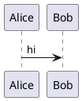

# `puml-markdown` Code Fence Renderer Specification

Render `puml` diagrams directly inside Markdown wherever the code fence appears: docs, previews, websites, VS Code Markdown preview, mdBook, VitePress, Docusaurus, Astro, GitHub Pages, and local build pipelines.

This is not syntax highlighting. This is Markdown-native diagram rendering.

## Runtime contract snapshot (Current, audited in issue #24)

This spec describes a target package and host-adapter surface. The current shipped/runtime-safe markdown contract in this repository today is CLI-level fence extraction, not a published `@puml/markdown` package.

Current executable surface:

- CLI supports markdown extraction via `--from-markdown` and auto-detect for `.md`/`.markdown`/`.mdown` file inputs.
- Supported fence language tags in runtime extraction:
  - `puml`, `pumlx`, `picouml`, `plantuml`, `uml`, `puml-sequence`, `uml-sequence`, `mermaid`
- Multi-fence/multi-page markdown inputs require explicit `--multi` for output expansion.
- Markdown extraction routes through existing CLI parse/normalize/render contracts and diagnostics schema (`puml.diagnostics`).

Current non-shipped scope in this repo:

- no implemented `@puml/markdown` package
- no implemented `puml-md` standalone CLI helper
- no host-adapter implementations (`markdown-it`/remark/rehype/custom-element) under source control yet

Contract boundary:

- Sections below are target-state design unless explicitly marked as current runtime.
- Do not market target APIs as shipped until implementation + contract tests land.

## Name

Package family:

- NPM package: `@puml/markdown`
- CLI helper: `puml-md`
- Rust/WASM dependency: `puml-wasm`
- VS Code consumer: `puml-vscode`
- Website consumer: `puml-studio`

Canonical rendered fence:

````markdown

````

Compatibility fences:

````markdown
```plantuml
```uml
```pumlx
```picouml
```puml-sequence
```uml-sequence
```mermaid
````

## Product position

Markdown is where diagrams actually live.

`puml-markdown` makes sequence diagrams render inline in documentation without Java, Graphviz, server calls, or a separate image-generation step.

The promise:

- paste a `puml` fence
- get an inline SVG diagram
- preserve the source
- show errors at the fence location
- download SVG/PNG/PDF/source when enabled
- run the same renderer as the CLI and SPA
- work statically on GitHub Pages and local docs builds

## Relationship to Tree-sitter

Tree-sitter is for syntax highlighting.

`puml-markdown` is for turning a Markdown code fence into rendered diagram HTML/SVG.

They integrate, but they are separate:

```text
Markdown fence
  -> syntax highlighter from puml-syntax
  -> renderer from puml-wasm or puml CLI
  -> safe HTML/SVG output
```

A fence can be highlighted even if rendering fails. A fence can render even if the host has no syntax highlighting.

## Non-negotiables

- No JVM.
- No Graphviz.
- No server required.
- No remote render API.
- No duplicate parser in JavaScript.
- No duplicate layout in JavaScript.
- No implicit Mermaid fallback.
- No hidden telemetry.
- No unescaped user text in HTML or SVG.
- No script execution from rendered diagrams.
- No remote includes by default.
- No filesystem includes in browser runtime.
- No network fetches unless the user explicitly enables a documented extension mode.
- SVG is the canonical render artifact.
- Source text remains available unless explicitly hidden.
- Error output is inline, precise, and source-linked.
- Build-time rendering and runtime rendering share fixtures.
- 90% test coverage minimum for renderer glue and option parsing.

## Architecture religion

Use a two-mode Markdown rendering architecture and treat it as law.

```text
Markdown source
  -> Markdown parser
  -> puml fence collector
  -> puml render request
  -> puml-wasm or puml CLI
  -> sanitized render result
  -> HTML node at original fence position
```

Two supported modes:

1. **Static build mode**: render fences during the documentation build.
2. **Runtime browser mode**: render fences client-side with WASM after page load.

Rules:

- The Markdown plugin never parses `puml` itself.
- The Markdown plugin never computes layout.
- The Markdown plugin never writes SVG by hand.
- The Markdown plugin calls the same renderer used by the CLI or WASM package.
- Static mode is preferred for published docs.
- Runtime mode is preferred for live editors and previews.
- A Markdown host can choose either mode, but the output contract is identical.
- Errors are render artifacts, not console-only logs.
- Every generated element gets deterministic IDs.
- Every option is explicit and serializable.
- No plugin-specific diagram semantics.

## Supported hosts

Required host adapters:

```text
markdown-it
remark / rehype
MDX component
standalone browser custom element
Node build CLI
VS Code Markdown preview adapter
```

Explicit docs targets:

```text
GitHub Pages
mdBook
Docusaurus
VitePress
Astro
Eleventy
Next.js static export
local README preview
```

GitHub README limitation:

- GitHub repository READMEs do not execute arbitrary client JavaScript.
- For GitHub READMEs, support a build-time/action workflow that replaces or accompanies fences with checked-in SVG files.
- For GitHub Pages, runtime WASM or static pre-rendering are both allowed.

## Public API

NPM exports:

```ts
export type PumlMarkdownOptions = {
  mode?: 'static' | 'runtime';
  theme?: string;
  source?: 'hidden' | 'above' | 'below' | 'collapsible';
  controls?: boolean;
  exports?: Array<'svg' | 'png' | 'pdf' | 'puml' | 'json'>;
  errorMode?: 'inline' | 'throw' | 'silent';
  includeMode?: 'off' | 'workspace';
  allowRemoteIncludes?: false;
  deterministicIds?: boolean;
  className?: string;
};

export function markdownItPuml(options?: PumlMarkdownOptions): MarkdownIt.PluginSimple;
export function remarkPuml(options?: PumlMarkdownOptions): any;
export function rehypePuml(options?: PumlMarkdownOptions): any;
export function renderFence(source: string, attrs?: FenceAttrs, options?: PumlMarkdownOptions): Promise<RenderedFence>;
export function hydratePumlDiagrams(root?: ParentNode, options?: PumlMarkdownOptions): Promise<void>;
```

CLI:

```console
puml-md input.md -o output.md
puml-md input.md --html -o output.html
puml-md input.md --assets-dir diagrams/
puml-md input.md --mode static
puml-md input.md --check
```

## Fence syntax

Minimal:

````markdown

````

With attributes:

````markdown
```puml theme="slate" source="collapsible" controls="true" exports="svg,png,pdf,puml"
@startuml
Alice -> Bob: hi
@enduml
```
````

Supported attributes:

```text
theme="default|classic|minimal|slate|dark|mono|<custom>"
source="hidden|above|below|collapsible"
controls="true|false"
exports="svg,png,pdf,puml,json"
caption="Login flow"
id="login-flow"
width="auto|number"
height="auto|number"
scale="number"
autofit="true|false"
error="inline|throw|silent"
include="off|workspace"
footbox="show|hide"
style="default|compact|spacious"
```

Rules:

- Unknown attributes produce warnings in check mode.
- Unknown attributes are ignored in render mode unless `strict=true`.
- Attribute values are escaped before entering HTML.
- `id` is sanitized and de-duplicated.
- `theme` maps to renderer theme tokens, not CSS post-processing.
- `include="workspace"` is unavailable in browser runtime unless the host provides an explicit virtual filesystem.

## Output HTML contract

Default rendered block:

```html
<figure class="puml-diagram" data-puml-id="...">
  <div class="puml-diagram__svg">...</div>
  <figcaption>...</figcaption>
</figure>
```

With source enabled:

```html
<figure class="puml-diagram" data-puml-id="...">
  <details class="puml-diagram__source">
    <summary>Source</summary>
    <pre><code class="language-puml">...</code></pre>
  </details>
  <div class="puml-diagram__svg">...</div>
</figure>
```

With controls enabled:

```html
<div class="puml-diagram__controls">
  <button data-puml-action="copy-svg">Copy SVG</button>
  <button data-puml-action="download-svg">Download SVG</button>
  <button data-puml-action="download-png">Download PNG</button>
  <button data-puml-action="download-pdf">Download PDF</button>
  <button data-puml-action="copy-source">Copy source</button>
</div>
```

Rules:

- SVG is embedded inline for fast docs rendering.
- Controls are optional and disabled by default in static prose docs.
- Controls are enabled by default in interactive previews and SPA contexts.
- HTML output is deterministic for the same source and options.
- The source code block keeps `language-puml` for host syntax highlighting.

## Runtime custom element

Required element:

```html
<puml-diagram theme="slate" source="collapsible">
  <script type="text/plain">
@startuml
Alice -> Bob: hi
@enduml
  </script>
</puml-diagram>
```

Rules:

- The element renders with `puml-wasm`.
- The text payload is treated as plain text, never executed.
- The element supports the same options as code fence attributes.
- The element dispatches events:
  - `puml:rendered`
  - `puml:error`
  - `puml:export`

## Static rendering mode

Static mode converts Markdown before publishing.

Pipeline:

```text
input.md
  -> parse Markdown
  -> render puml fences with native puml CLI or puml-wasm in Node
  -> emit transformed Markdown/HTML
  -> optionally emit external SVG assets
```

Modes:

```text
inline-svg      embed SVG in resulting HTML/Markdown
asset-svg       write SVG files and replace fence with image/link
hybrid          keep source fence plus rendered asset
check-only      validate fences and fail build on error
```

Required for GitHub Actions:

```yaml
name: Render puml diagrams
on: [push, pull_request]
jobs:
  render:
    runs-on: ubuntu-latest
    steps:
      - uses: actions/checkout@v4
      - uses: puml/render-markdown-action@v1
        with:
          input: docs/**/*.md
          mode: asset-svg
          fail-on-error: true
```

Rules:

- The action never commits by default.
- The action can optionally upload generated SVGs as artifacts.
- A separate documented workflow may commit generated assets, but only when explicitly configured.
- Pull request mode reports changed/missing rendered assets.

## Runtime rendering mode

Runtime mode renders in the browser.

Pipeline:

```text
page loads
  -> find puml fences or custom elements
  -> load puml-wasm once
  -> render each diagram in a worker
  -> replace placeholder with SVG or error block
```

Rules:

- Rendering happens in a Web Worker when the host allows it.
- Main thread never blocks on large diagrams.
- WASM is lazy-loaded.
- Multiple diagrams render with bounded concurrency.
- Failed diagrams do not prevent other diagrams from rendering.
- Runtime mode respects reduced-motion and accessibility settings.

## Error rendering

Inline error block:

```html
<div class="puml-diagram-error" role="alert">
  <strong>puml render error</strong>
  <pre>error: expected participant name
  --> diagram.md:12:13
   |
12 | participant
   |             ^</pre>
</div>
```

Rules:

- Parse and semantic errors show line and column relative to the fence body.
- Host adapters may also map errors back to Markdown file positions.
- `error="throw"` fails the Markdown build.
- `error="inline"` keeps the document readable.
- `error="silent"` is only allowed when explicitly configured.

## Export formats

Required exports:

```text
SVG
PNG
PDF
PUML source
JSON model
```

Rules:

- SVG comes directly from `puml` renderer.
- PNG is produced from SVG using browser canvas in runtime mode or a documented build tool in static mode.
- PDF is produced through browser print/export or a documented build tool in static mode.
- PNG/PDF export must fail clearly if the host cannot provide required APIs.
- Exported files use deterministic names from diagram id, caption, or file/fence index.
- Export never mutates source.

## Styling

Themes are renderer themes, not CSS hacks.

Required themes:

```text
default
classic
minimal
slate
dark
mono
```

Theme tokens:

```text
background
participantBackground
participantBorder
participantText
lifeline
arrow
messageText
noteBackground
noteBorder
groupBackground
groupBorder
fontFamily
fontSize
```

Rules:

- Host CSS may style wrapper chrome.
- Host CSS must not be required for the SVG to be correct.
- SVG remains standalone when downloaded.
- Dark mode can default to `dark` only if the user did not explicitly choose a theme.

## Accessibility

Required:

- `<figure>` wrapper for rendered diagrams.
- `<figcaption>` when caption or title exists.
- SVG `<title>` and `<desc>` from renderer.
- Keyboard-accessible controls.
- Buttons have accessible names.
- Error blocks use `role="alert"`.
- Source toggle uses native `<details>` unless host requires custom UI.
- No color-only diagnostics.

## Security

Markdown renderers run on hostile content.

Rules:

- Escape all source text.
- Sanitize all attribute values.
- Generated SVG contains no JavaScript.
- Generated SVG contains no external images.
- Generated SVG contains no external stylesheets.
- No `innerHTML` with untrusted source except sanitized renderer output from `puml`.
- No `eval`.
- No remote includes by default.
- No remote theme fetches.
- No path traversal in static include mode.
- Web Worker messages are structured and validated.
- Browser runtime does not read local files.
- Build-time mode only reads paths under configured roots.

## Markdown host adapters

### markdown-it

Required:

```ts
import MarkdownIt from 'markdown-it';
import { markdownItPuml } from '@puml/markdown';

const md = new MarkdownIt().use(markdownItPuml({ mode: 'static' }));
```

### remark / rehype

Required:

```ts
import { remarkPuml, rehypePuml } from '@puml/markdown';
```

Rules:

- `remarkPuml` identifies fences and stores metadata.
- `rehypePuml` renders HTML/SVG.
- Source maps are preserved where the host supports positions.

### MDX

Required component:

```tsx
<PumlDiagram theme="slate" source="collapsible">
{`@startuml
Alice -> Bob: hi
@enduml`}
</PumlDiagram>
```

### VS Code Markdown preview

The VS Code adapter is implemented in `puml-vscode`, but uses the same renderer core and options.

Rules:

- The adapter registers a Markdown preview plugin.
- It renders `puml` and `plantuml` fences.
- It supports live update on Markdown edit.
- It honors workspace trust and extension settings.

## Testing contract

Every fixture renders in both static and runtime modes.

Valid fixture snapshots:

1. Parsed Markdown AST position metadata.
2. Extracted fence metadata.
3. Render request.
4. Rendered SVG.
5. Rendered HTML wrapper.
6. Hydrated runtime DOM.

Invalid fixture snapshots:

1. Render request.
2. Diagnostic struct.
3. Inline error HTML.
4. Build failure output for `error="throw"`.

Required fixtures:

```text
basic_single_fence.md
multiple_fences.md
plantuml_alias_fence.md
attributes_theme_controls.md
source_hidden.md
source_above.md
source_below.md
source_collapsible.md
exports_all.md
inline_error.md
throw_error.md
malicious_html_in_message.md
malicious_attribute.md
markdown_inside_note.md
large_100_fences.md
github_pages_static.md
vscode_preview.md
mdx_component.md
```

E2E tests:

- Browser renders runtime fences.
- Static renderer produces deterministic output.
- SVG download contains standalone SVG.
- PNG download is non-empty.
- PDF download is non-empty or fails with supported-host diagnostic.
- Copy SVG writes SVG text.
- Copy source writes original source.
- Malicious text is escaped.
- Runtime renderer does not execute scripts in source.
- Build mode fails on invalid fences when configured.

## Coverage

Commands:

```console
npm test --workspace @puml/markdown
npm run test:e2e --workspace @puml/markdown
npm run test:coverage --workspace @puml/markdown -- --coverage.threshold.lines=90
cargo llvm-cov --package puml-wasm --fail-under-lines 90
```

Do not lower coverage. Add tests.

## Performance

Targets:

- First runtime render after WASM load: under 50ms for small diagrams.
- 100 Markdown fences render with bounded concurrency and no main-thread freeze.
- Static render is linear in number of fences plus diagram size.
- Re-render in live preview only recompiles changed fences.

Benchmarks:

```text
scripts/bench-markdown.sh
```

Benchmark scenarios:

- one small fence
- ten small fences
- one 1,000-message fence
- 100 mixed fences
- invalid-heavy Markdown file
- runtime hydration in browser

## Packaging

NPM package contents:

```text
dist/
  index.js
  index.d.ts
  browser.js
  worker.js
  style.css
  puml_wasm_bg.wasm
README.md
LICENSE
```

Rules:

- ESM first.
- CommonJS wrapper allowed only if cheap.
- Tree-shakable exports.
- No mandatory heavy PNG/PDF dependency in the base package.
- Optional export helpers may live in `@puml/markdown-export` if they require heavier dependencies.

## Definition of done

- `puml`, `plantuml`, `uml`, `pumlx`, `picouml`, `puml-sequence`, and `uml-sequence` Markdown fences render inline.
- `mermaid` Markdown fences are supported through the explicit Mermaid frontend adapter (sequence subset only).
- Static mode works in Node build pipelines.
- Runtime mode works in browsers with WASM.
- markdown-it adapter works.
- remark/rehype adapter works.
- MDX component works.
- VS Code adapter consumes the same renderer core.
- GitHub Actions render workflow exists.
- GitHub Pages docs can render without a server.
- Source toggle works.
- Export controls work for SVG and source.
- PNG/PDF export works where host APIs support it and fails clearly elsewhere.
- Inline diagnostics report fence-relative line and column.
- Malicious source and attributes are escaped.
- No remote render service is used.
- No Java or Graphviz path exists.
- No undocumented or implicit Mermaid fallback path exists.
- Every fixture snapshots static and runtime output.
- 90% coverage passes.

## Reference docs checked

- VS Code Markdown preview can be extended with markdown-it plugins, styles, and preview scripts.
- GitHub Pages can host static apps; GitHub README rendering is not a JavaScript runtime surface, so build-time rendering is required for repository README diagrams.

Reference URLs:

- https://code.visualstudio.com/api/extension-guides/markdown-extension
- https://code.visualstudio.com/docs/languages/markdown
- https://docs.github.com/pages
