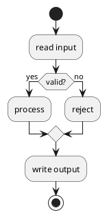

+++
title = "Activity diagrams"
description = "Modern beta-style activity diagrams with if/while/repeat/fork."
weight = 60
+++

`puml` supports both the modern beta activity syntax (recommended) and the legacy `(*)` syntax. The two corpora live side-by-side in [`docs/examples/activity_new/`](https://github.com/alliecatowo/puml/tree/main/docs/examples/activity_new) and [`docs/examples/activity_old/`](https://github.com/alliecatowo/puml/tree/main/docs/examples/activity_old).

## Modern syntax



Activities are statements terminated with `;`. Control flow keywords:

```text
start            stop            end
if/elseif/else/endif
repeat / repeat while (...)
while (...) / endwhile
fork / fork again / end fork
partition Name { ... }
```

## Branches

```puml
if (x > 0) then (positive)
  :emit positive;
elseif (x < 0) then (negative)
  :emit negative;
else (zero)
  :emit zero;
endif
```

## Loops

```puml
repeat
  :step;
repeat while (more?)

while (queue not empty)
  :pop;
endwhile
```

## Concurrency

```puml
fork
  :branch A;
fork again
  :branch B;
end fork
```

## Partitions and swimlanes

```puml
partition "Auth" {
  :sign in;
  :issue token;
}

|Client|
:request;
|Server|
:respond;
```

## Browse

Open the [activity examples](@/gallery.md) for branch/loop/fork/partition coverage.
