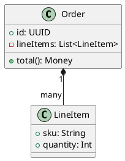

+++
title = "Class diagrams"
description = "Classes, members, stereotypes, and relationships."
weight = 50
+++



## Declarations

```puml
class    Foo
abstract Bar
interface Baz
enum     Status { ACTIVE, ARCHIVED }
```

## Members

Bodies use `{ ... }`:

```puml
class Account {
  +id: UUID
  -balance: Money
  +deposit(amount: Money)
  +withdraw(amount: Money): Result
}
```

Visibility prefixes: `+` public, `-` private, `#` protected, `~` package.

## Relationships

| Notation     | Meaning            |
|--------------|--------------------|
| `--`         | association        |
| `<\|--`      | inheritance        |
| `<\|..`      | realization        |
| `*--`        | composition        |
| `o--`        | aggregation        |
| `..>`        | dependency         |

Multiplicities are quoted strings on each end:

```puml
Order "1" *-- "many" LineItem
Customer "1" o-- "many" Order
```

## Stereotypes

```puml
class Foo <<Service>>
class Bar <<(D,#orange) Data>>
```

## Browse

The [class examples in the gallery](@/gallery.md) cover inheritance trees, generics, stereotypes, package nesting, and dependency arrows.
