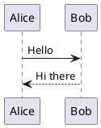

+++
title = "Getting started"
description = "Install puml, render your first diagram, and wire it into your editor."
weight = 10
+++

## Install

`puml` ships as a single static Rust binary. The fastest path today is `cargo install` from source:

```bash
cargo install --git https://github.com/alliecatowo/puml --bin puml
```

That gives you the `puml` CLI on your `$PATH`. There is also a separate language-server binary, `puml-lsp`, used by the VS Code extension.

> No JVM, no Graphviz, no runtime services. The browser editor on this site doesn't need any of them either &mdash; everything runs locally.

## Your first diagram

Create a file `hello.puml`:



Render it:

```bash
puml hello.puml
# wrote hello.svg
```

Open `hello.svg` in any browser or image viewer. You can also pipe through stdin and stream the result:

```bash
cat hello.puml | puml - > hello.svg
```

Or render PNG (rasterized from the canonical SVG):

```bash
puml --format png --dpi 192 hello.puml -o hello@2x.png
```

## Validate without rendering

The `--check` mode parses and normalizes without emitting SVG. Use it as a CI lint:

```bash
puml --check hello.puml
echo $?         # 0 if valid, 1 if validation failed
```

Add `--diagnostics json` for machine-readable output, perfect for editor integrations and bots.

## Try it in the browser

You can skip the install entirely and use the [studio editor](@/editor.md) on this site. It loads CodeMirror with `.puml` syntax highlighting and renders diagrams live in your browser via the puml WASM bundle &mdash; see [In-browser renderer](@/developer/renderer.md) for how that bridge works.

## Wire it into your editor

### VS Code

A first-party extension lives in [`extensions/vscode/`](https://github.com/alliecatowo/puml/tree/main/extensions/vscode) in the repo. It speaks to the `puml-lsp` binary for diagnostics, hover, and semantic tokens. See the [VS Code extension spec](@/developer/specs/vscode-extension.md) for the contract.

### Anything with LSP support

Run `puml-lsp` over stdio and point your editor at it. The [LSP spec](@/developer/specs/lsp.md) documents capabilities, message shapes, and semantic-token taxonomy.

### Markdown documents

If your docs are full of fenced code blocks, you can render them directly:

```bash
puml --from-markdown --check docs/sequence-notes.md
```

See [Markdown fences](@/guide/markdown-fences.md) for the full set of supported fence languages.

## Next

- Learn the language: [Syntax primer](@/guide/syntax.md).
- Browse what's possible: [Gallery](@/gallery.md).
- Drill into a family: [Sequence diagrams](@/guide/sequence.md).
