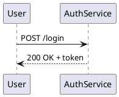

+++
title = "Markdown fences"
description = "Render diagrams embedded in Markdown documents."
weight = 100
+++

`puml` natively understands fenced code blocks in Markdown. This means you can keep prose and diagrams in the same source file and lint or render them in one pass.

## Supported fence languages

| Fence            | Routed to                          |
|------------------|------------------------------------|
| `puml`           | PlantUML/PicoUML auto              |
| `pumlx`          | PlantUML extended                  |
| `picouml`        | PicoUML (first-class)              |
| `plantuml`       | PlantUML                           |
| `uml`            | PlantUML auto                      |
| `puml-sequence`  | PlantUML sequence family           |
| `uml-sequence`   | PlantUML sequence family           |
| `mermaid`        | Mermaid adaptation                 |

## Example

````markdown
# Sign-in flow


````

Render the document:

```bash
puml --from-markdown notes.md          # renders each fenced block
puml --from-markdown --check notes.md  # lint only, exit code on validation failure
```

`--from-markdown` is automatically enabled for `.md`, `.markdown`, and `.mdown` files.

## Output naming

When rendering markdown with `--multi`, output paths are deterministic:

- File input: `<markdown-stem>_snippet_<n>.svg` (or `_snippet_<n>-<page>.svg` for multi-page fences).
- Stdin input: `snippet-<n>.svg` (or `snippet-<n>-<page>.svg` for multi-page fences).

## Deep dive

See the [Markdown fence renderer spec](@/developer/specs/markdown-fence-renderer.md) for the full extraction protocol, edge cases, and CI integration patterns.
