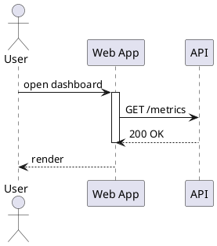

+++
title = "Sequence diagrams"
description = "Participants, messages, lifelines, groups, and notes."
weight = 40
+++

Sequence is `puml`'s flagship family. It's the most fully exercised in the parity audit and the natural starting point if you're new to UML.

## Anatomy



Three things are happening:

1. **Participants** declared up front (`actor`, `participant`, `boundary`, `control`, `entity`, `database`, `collections`).
2. **Messages** with arrows: synchronous (`->`), reply (`-->`), async (`->>`), lost (`-x`).
3. **Lifelines** managed with `activate` / `deactivate` blocks.

## Aliases

Use `as` to give a participant a short alias:

```puml
participant "Order Service" as Order
participant "Payments" as Pay
Order -> Pay: charge(amount)
```

## Groups: alt / opt / loop / par / critical / break

```puml
alt success
    Order -> Pay: charge
else declined
    Order -> User: ask for another card
end

opt promo applied
    Order -> Order: recompute total
end

loop 1..n line items
    Order -> Cart: read item
end

par
    Order -> Email: confirmation
and
    Order -> SMS: confirmation
end
```

Each block has structural keywords (`alt`/`else`/`end`, `opt`/`end`, `loop`/`end`, `par`/`and`/`end`, `critical`/`option`/`end`, `break`) that the parser recognizes as first-class.

## Notes

```puml
note left of User: starts here
note over Order, Pay: cross-service handshake
hnote right of Pay: highlighted
rnote over User: rectangular
end note
```

## Auto-numbering

```puml
autonumber 10 5 "<b>[%03d]</b>"
User -> Web: open
Web -> API: query
```

This emits `[010]` and `[015]` prefixes &mdash; deterministic and round-trippable.

## Browse the gallery

The [sequence family in the gallery](@/gallery.md) holds dozens of examples covering every primitive, color, arrow style, and group nesting combination. Open one in the [editor](@/editor.md) to tinker.

## Limitations

PlantUML 1:1 parity is the roadmap goal, not the current claim. See [`docs/audits/plantuml_parity_source_of_truth.md`](https://github.com/alliecatowo/puml/blob/main/docs/audits/plantuml_parity_source_of_truth.md) for the canonical implemented / partial / missing status per row.
