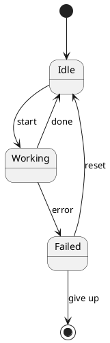
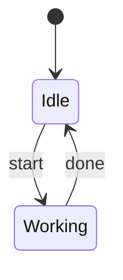

+++
title = "State diagrams"
description = "States, transitions, composite states, and history."
weight = 70
+++



## Pseudo-states

- `[*]` initial and final states (context-dependent).
- `<<choice>>`, `<<fork>>`, `<<join>>` for branching pseudo-states.
- `[H]` shallow history, `[H*]` deep history.

## Composite states

```puml
state Working {
  [*] --> Loading
  Loading --> Ready
  Ready --> [*]
}
```

## Transitions with guards / actions

```puml
Idle --> Working : start [hasWork] / log
```

The text after `:` is parsed as a transition label; the colon-and-everything-after pattern is consistent with other families.

## Mermaid `stateDiagram` adaptation

If you prefer Mermaid syntax:



`puml --dialect mermaid` adapts this into the same shared state model.

## Browse

State examples are organized in [`docs/examples/state/`](https://github.com/alliecatowo/puml/tree/main/docs/examples/state) and surface in the [gallery](@/gallery.md).
