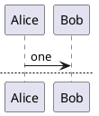

+++
title = "Syntax primer"
description = "The shared core syntax that all three frontends normalize into."
weight = 30
+++

`puml` accepts three frontend dialects &mdash; PicoUML, PlantUML, and Mermaid &mdash; but they all normalize into one shared semantic model. This page is the smallest mental model you need to read and write any of them.

## Block markers

Every PlantUML / PicoUML diagram lives between block markers:

```puml
@startuml
... diagram body ...
@enduml
```

Family-specific markers select the family up front:

```puml
@startsequence   ... @endsequence
@startclass      ... @endclass
@startactivity   ... @endactivity
@startstate      ... @endstate
@startgantt      ... @endgantt
@startmindmap    ... @endmindmap
@startwbs        ... @endwbs
```

PicoUML adds canonical block markers that are converted internally:


> Mixing PicoUML and PlantUML markers in one input is a deterministic error: `E_PICOUML_MARKER_MIXED`.

## Comments

```puml
' single-line comment

/'
multi-line
comment
'/
```

Comments never produce semantic tokens and never affect rendering.

## Directives

Directives start with `!`:

```puml
!theme spacelab
!include shared/header.iuml
!define BG_OK #DEFABE
```

- `!include` resolves relative to the input file by default. For stdin, set `--include-root DIR` (strict) or `--compat extended` to fall back to CWD.
- `!theme` and unsupported `skinparam` keys emit non-fatal warnings &mdash; they're recognized as styling intent, not parser errors.

## Skinparams

`skinparam` blocks tune visual tokens (colors, fonts, spacing):

```puml
skinparam backgroundColor #fafafa
skinparam sequence {
    ParticipantBorderColor #444
    ArrowColor             #111
}
```

See the [themes and styling guide](@/guide/themes.md) for the full token reference.

## Arrows (sequence flavour)

| Arrow      | Meaning                          |
|------------|----------------------------------|
| `->`       | synchronous request              |
| `-->`      | synchronous response (dashed)    |
| `->>`      | asynchronous                     |
| `-x`       | lost message                     |
| `<-`, `<--`| same, reversed direction         |
| `o->`      | "open" arrowhead                 |

Color and style can be embedded:

```puml
Alice -[#blue,dashed]-> Bob: queued
```

## Labels and notes

```puml
Alice -> Bob : Hello\nworld         ' multi-line label
note over Alice, Bob: handshake
hnote right of Bob: highlighted note
rnote left of Alice: rectangular note
```

## Groups

```puml
alt success
    Alice -> Bob: ok
else failure
    Alice -> Bob: nope
end

opt only when relevant
    Alice -> Bob: maybe
end

loop 1..3
    Alice -> Bob: ping
end

par
    Alice -> Bob: a
and
    Alice -> Bob: b
end

critical save
option commit
    Alice -> Bob: commit
end
```

## Lifecycle

```puml
activate Bob
Bob -> Carol: query
deactivate Bob

create Dave
Alice -> Dave: hi
destroy Dave
```

## Auto-numbering

```puml
autonumber 10 5 "<b>[%03d]</b>"
Alice -> Bob: one
Alice -> Bob: two       ' renders as [010] and [015]
```

## Pages

`newpage` splits a single source into multiple deterministic outputs:



Use `--multi` when piping multi-page input through stdin.

## What the parser actually does

Every input goes through the same five stages: **source &rarr; AST &rarr; normalized model &rarr; scene &rarr; SVG**. You can dump any of the middle stages:

```bash
puml --dump ast    input.puml | jq .
puml --dump model  input.puml | jq .
puml --dump scene  input.puml | jq .
```

If you want to understand the engine, dumping `model` is usually the best place to start &mdash; it's the canonical, dialect-independent representation. The [Compile pipeline](@/developer/pipeline.md) page covers the full chain.
