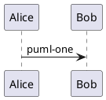
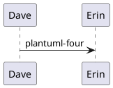
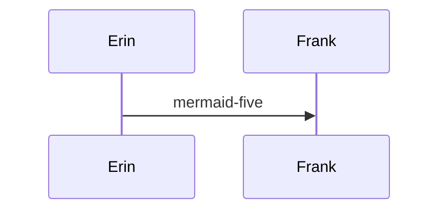

# Mixed fenced diagrams


```puml
@startuml
Alice -> Bob: puml-one
@enduml
```

```pumlx
@startuml
Bob -> Carol: pumlx-two
@enduml
```

```picouml
@startuml
Carol -> Dave: picouml-three
@enduml
```


```plantuml
@startuml
Dave -> Erin: plantuml-four
@enduml
```


```mermaid
sequenceDiagram
participant Erin
participant Frank
Erin->>Frank: mermaid-five
```
